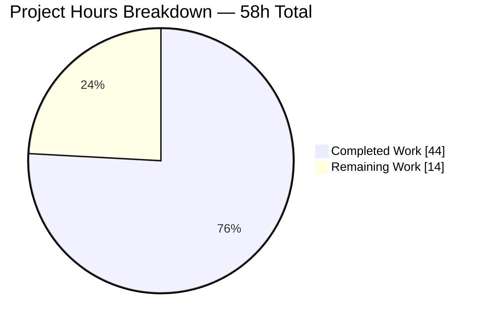
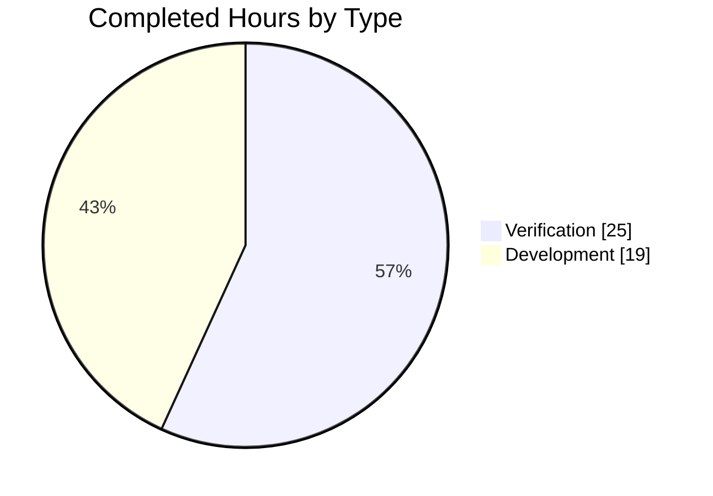
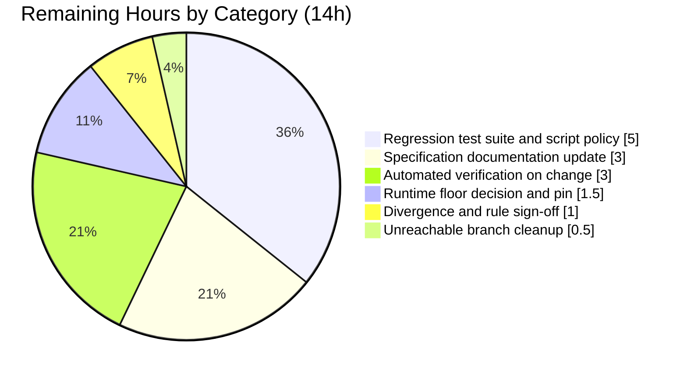
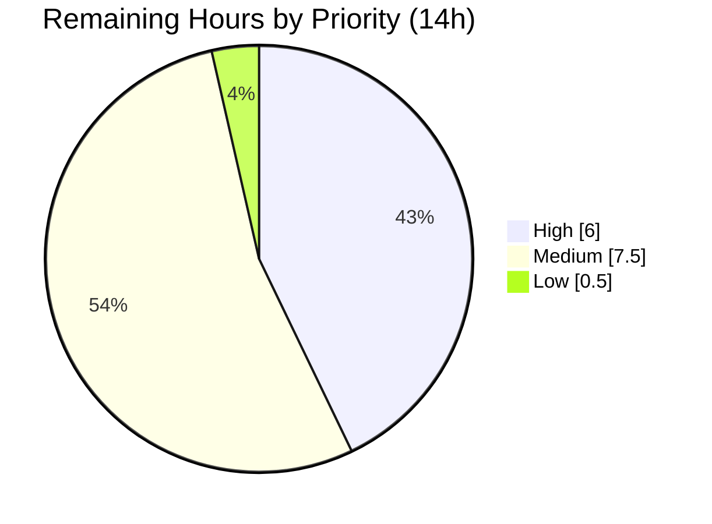
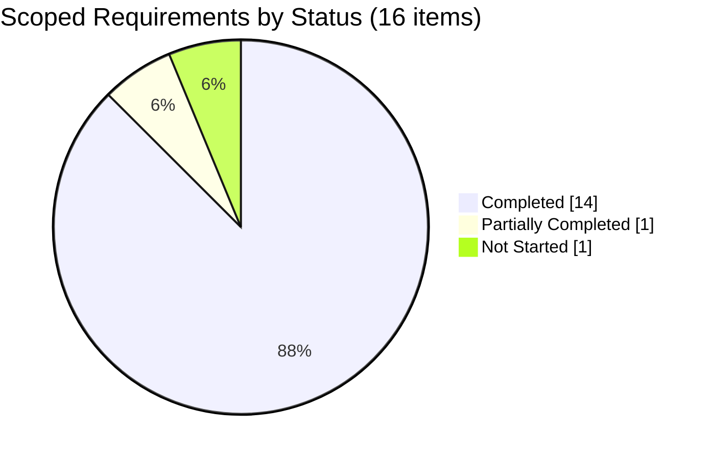

# 1. Executive Summary

## 1.1 Project Overview

This project converts a single-endpoint Node.js tutorial server to Express.js and adds a second endpoint. `server.js` now builds its HTTP layer on an Express 5.2.1 application and router instead of the Node core `http` module: `GET /` still returns the original greeting byte for byte, and a new `GET /good-evening` returns exactly `Good evening`. `express` is the project's first and only runtime dependency, pinned exactly, with a regenerated lockfile. It remains teaching material — one readable file, loopback-bound, with no configuration layer, database, interface or authentication.

## 1.2 Completion Status


Chart colours follow the Blitzy palette: Completed = Dark Blue `#5B39F3`, Remaining = White `#FFFFFF`.

| Metric | Value |
|--------|-------|
| **Total Hours** | **58.0** |
| Completed Hours (AI) | 44.0 |
| Completed Hours (Manual) | 0.0 |
| **Completed Hours (AI + Manual)** | **44.0** |
| **Remaining Hours** | **14.0** |
| **Percent Complete** | **75.9%** |

Calculation: 44.0 ÷ 58.0 × 100 = **75.9%**. Both requested capabilities are delivered and verified; the remainder is regression-suite, documentation and runtime-floor work on the path to production.

## 1.3 Key Accomplishments

- ✅ Express 5.2.1 is genuinely the HTTP layer; the core `http` module is gone from the file.
- ✅ `GET /` returns the original greeting byte for byte: 200, `text/plain; charset=utf-8`, 14 bytes.
- ✅ `GET /good-evening` returns exactly `Good evening` — 12 bytes, no punctuation or newline.
- ✅ Revalidating clients always receive the full 200; no bodyless `304` on either route.
- ✅ Unknown paths and unsupported methods answer 404, `CONNECT` included.
- ✅ The listener binds `127.0.0.1:3000` only, confirmed from the kernel TCP table.
- ✅ A failed bind exits non-zero with one sanitized line — no stack trace, no false success.
- ✅ `npm ci` reproduces the 68-package tree leaving both manifests byte-identical.

## 1.4 Critical Unresolved Issues

Both capabilities the request asked for are complete and verified, so **0 of 2 requested capabilities are open**, and no defect in delivered behaviour is outstanding. What remains is release-readiness work: **6 of 6 remaining items are open**.

| Issue | Impact | Owner | ETA |
|-------|--------|-------|-----|
| No regression suite in the repository; `npm test` exits 1 by design and no test file exists | The byte-exact response contracts are unprotected against future edits | Repository owner | 5.0h |
| Governing specification contradicts the delivered system in eight places | Anyone integrating from the document builds against wrong facts | Repository owner | 3.0h |
| No automated execution of any verification on change | Regressions and new dependency advisories surface only if someone checks manually | Repository owner | 3.0h |
| Runtime floor admits end-of-life Node lines (18 and 20 both past EOL) | A deployment could select a runtime that receives no security patches | Repository owner | 1.5h |
| Two accepted departures from the plan await an explicit owner decision (§5.2 rows 1 and 3) | Both are well-evidenced and working; acceptance should be recorded, not assumed | Repository owner | 1.0h |
| One defensive branch in the listener callback is unreachable at runtime and unverified | Dead-code ambiguity in the only error path | Repository owner | 0.5h |

## 1.5 Access Issues

No access issues block build, verification or deployment.

| System/Resource | Type of Access | Issue Description | Resolution Status | Owner |
|-----------------|----------------|-------------------|-------------------|-------|
| npm registry (`registry.npmjs.org`) | Package install | None — `npm ci` completes in ~3s and installs 68 packages | ✅ No issue | — |
| Application credentials / environment | Runtime configuration | None required — `server.js` reads no environment variable and uses no secret, token or credential | ✅ Not applicable | — |
| Loopback network `127.0.0.1:3000` | HTTP probing | None — the endpoint is reachable locally; non-loopback addresses refuse by design | ✅ No issue | — |
| Advisory data sources | Dependency security data | Reachable by API. General web search is not available here, so advisory conclusions rest on per-version API data from the npm registry, the GHSA bulk endpoint, OSV.dev and the GitHub Advisory Database — which is the more precise source in any case | ✅ No issue | — |

## 1.6 Recommended Next Steps

1. **[High]** Commit a zero-dependency regression suite for both endpoint contracts and settle the test-script policy — 5.0h.
2. **[High]** Record acceptance of the two departures in §5.2 rows 1 and 3, and confirm the user-rule position — 1.0h.
3. **[Medium]** Update the governing specification for the eight statements this change made stale — 3.0h.
4. **[Medium]** Wire that suite plus a dependency audit into automated execution on every change — 3.0h.
5. **[Medium]** Choose and pin a supported Node line (22 or later) as the runtime floor — 1.5h.

# 2. Project Hours Breakdown

## 2.1 Completed Work Detail

Every row traces to a scoped requirement and to evidence in the repository. Development accounts for 19.0h and verification for 25.0h.

| Component | Hours | Description |
|-----------|-------|-------------|
| Express dependency declaration and lockfile | 2.5 | `express` added as the sole direct dependency at exact pin `5.2.1`; `package-lock.json` regenerated at `lockfileVersion 3` with 69 entries and sha512 integrity; every pre-existing manifest field preserved |
| Express HTTP layer migration | 4.0 | `server.js` rebuilt on an Express application and router; the core `http` import removed; host, port, listener signature and startup log carried over unchanged |
| `GET /` greeting preservation | 1.5 | Original response re-expressed as a route: 200, media type declared before send, body byte-identical at 14 bytes |
| `GET /good-evening` endpoint | 1.0 | Second route registered independently, returning exactly 12 bytes with no punctuation or trailing newline |
| Response hardening and conditional-request guarantee | 3.0 | `x-powered-by` and `etag` disabled; incoming wildcard validators neutralised so a revalidating client always receives the full 200 rather than a bodyless `304` |
| Startup and bind-failure lifecycle | 2.5 | Listener callback distinguishes a successful bind from a failed one: unchanged success line, or one sanitized failure line with a non-zero exit and no stack or path disclosure |
| `CONNECT` method contract | 2.5 | Returned server captured and its `connect` event answered with the contracted 404, plus a socket error handler so an aborted peer cannot kill the process |
| Single-file code discipline | 1.5 | Handler bodies reduced to their load-bearing statements, and comments to accurate, timeless wording inside the file's 80-column convention |
| Repository hygiene and scope boundary | 0.5 | `.gitignore` created with the single rule `node_modules/`; changed-path set held to exactly the four writable paths |
| Acceptance gate authoring and execution | 5.0 | 43 assertions across nine groups covering both endpoints' status, media type and exact bytes, HEAD semantics, response settings, the 404 policy, binding, manifest, lockfile and hygiene |
| Runtime functional, API and observability verification | 4.0 | Endpoint contracts, HEAD wire-byte counting, conditional-request matrix, query-string routing, startup log and stream cleanliness exercised against a live server |
| Adversarial and security runtime testing | 3.5 | Injection-style queries, traversal and encoded paths, CRLF probes, hostile headers, oversized headers and bodies, malformed HTTP, pipelining and concurrency, with process-health checks after each |
| Performance and concurrency measurement | 2.0 | 500 warm sequential timed samples per route with every body byte-validated, plus concurrency and resource-trend runs |
| Dependency supply-chain verification | 3.5 | All 66 unique package/version rows concluded against four authoritative sources with positive controls; registry integrity, signatures and install hooks checked |
| Static code review across seven dimensions | 5.0 | Endpoint and lifecycle behaviour, configuration, element-by-element completeness, security, rule compliance, comment quality, and a final review of the whole tree |
| Continuity verification of pre-existing artifacts | 1.0 | `README.md` and seven unrelated fixtures confirmed byte-unchanged by blob identity, reconciled against line-ending normalisation |
| Install determinism verification | 1.0 | `npm ci` reproducibility proven with manifest hashes compared before and after, and a repeat install shown idempotent |
| **Total** | **44.0** | Matches Completed Hours in §1.2 |

## 2.2 Remaining Work Detail

| Category | Hours | Priority |
|----------|-------|----------|
| Regression test suite in the repository, plus the `scripts.test` and fifth-path policy decision that currently blocks it | 5.0 | High |
| Specification documentation update for the eight statements this change made stale | 3.0 | Medium |
| Automated verification on every change, including a dependency audit step | 3.0 | Medium |
| Runtime floor decision and pin on a supported Node line | 1.5 | Medium |
| Owner sign-off on the two accepted plan departures and on the user-rule position | 1.0 | High |
| Unreachable errno fallback branch in the listener callback: exercise or remove | 0.5 | Low |
| **Total** | **14.0** | Matches Remaining Hours in §1.2 and §7 |

## 2.3 Hours Reconciliation

| Check | Value |
|-------|-------|
| §2.1 completed total | 44.0 |
| §2.2 remaining total | 14.0 |
| Sum (= §1.2 Total Hours) | 58.0 |
| Completion (44.0 ÷ 58.0 × 100) | 75.9% |

Confidence: **High** on all completed rows — each is backed by an assertion that was executed and observed. **High** on the regression-suite, runtime-floor, sign-off and dead-branch estimates. **Medium** on the specification update and automated-execution estimates, since both depend on how far the owner wants to take them.

# 3. Test Results

This project contains **no automated test suite and no test framework, by design** — `scripts.test` is the intentionally failing `echo "Error: no test specified" && exit 1`, which the plan requires to stay untouched. Verification is therefore an external acceptance gate executed against a live server: **57 checks executed, 57 passed, 0 failed** (43 contracted assertions across nine groups plus 14 additional probes). Every figure below was executed and observed directly on the current branch tip. No coverage percentage is reported anywhere, because no coverage instrumentation exists in this project and none can be configured without adding a dependency the plan bars.

| Area / Category | Framework | Tests | Passed | Failed | Coverage | What This Proves |
|-----------------|-----------|-------|--------|--------|----------|------------------|
| Repository test script | None configured | 0 | 0 | 0 | n/a — no instrumentation | `npm test` still exits 1 with "Error: no test specified", so the intentionally failing fixture was preserved rather than repaired |
| Endpoint response contracts (`GET`, both routes) | Node built-in `http`/`net` raw-socket harness | 6 | 6 | 0 | n/a — no instrumentation | Both endpoints answer 200 with `text/plain; charset=utf-8` and bodies compared byte for byte — 14 bytes on `/`, 12 on `/good-evening` |
| `HEAD` semantics | Node raw-socket harness with wire-byte counting | 8 | 8 | 0 | n/a — no instrumentation | `HEAD` is answered from the declared `GET` routes with correct `Content-Length` and zero body bytes on the wire |
| Response settings and revalidation | Node raw-socket harness | 6 | 6 | 0 | n/a — no instrumentation | No fingerprint or entity-tag header is emitted, and a revalidating client still receives the complete 200 response rather than an empty `304` |
| Unmatched path and method policy | Node raw-socket harness | 12 | 12 | 0 | n/a — no instrumentation | Every unknown path and every unsupported method answers 404 — including `CONNECT`, `PATCH`, `TRACE` and traversal-style paths — with no greeting leakage |
| Binding, startup and failure observability | Kernel TCP table plus process stream capture | 4 | 4 | 0 | n/a — no instrumentation | The listener exists only on `127.0.0.1:3000`, the startup line is unchanged, and a failed bind exits 1 with one sanitized message and no false success |
| Dependency, manifest, lockfile and hygiene invariants | npm CLI plus JSON assertions | 12 | 12 | 0 | n/a — no instrumentation | `express` is the sole exact-pinned dependency, `npm ci` reproduces the tree without touching either manifest, and the ignore rule is the single line intended |
| Framework layer and inherited routing behaviour | Node harness and `curl` | 9 | 9 | 0 | n/a — no instrumentation | Express is genuinely the HTTP layer (no core `http` import), and query strings, case and trailing-slash aliases, automatic `OPTIONS` and injection-style queries all behave as recorded |
| **Total** | | **57** | **57** | **0** | — | |

Supporting measurements taken during the same runs: `GET /` p50 0.27 ms / p95 0.41 ms and `GET /good-evening` p50 0.27 ms / p95 0.51 ms over 500 warm sequential body-validated samples each; 40 concurrent mixed requests all correct; the process stayed healthy through oversized headers, pipelining and repeated mid-write socket aborts; and all 66 unique package/version rows in the dependency graph concluded free of advisories against four authoritative sources, with `npm audit --omit=dev` independently reporting zero vulnerabilities.

**Not Covered.** Nothing delivered is unverified, but two gaps matter before release:

- **No test is repeatable inside the repository.** Every check above lives outside it, so a developer who clones this project has nothing to run: `npm test` exits 1 and reports nothing about the endpoints. A human should port the endpoint contracts, `HEAD` semantics, response settings, the 404 policy and the loopback binding into a committed suite — Node's built-in test runner and assertion module make that possible without adding a dependency.
- **The defensive errno fallback in the listener callback is never reached.** `typeof error.code === 'string' ? error.code : 'UNKNOWN'` cannot take its fallback branch at runtime, because every real Node bind error carries a string code. A human should either exercise it by extracting the callback, or remove it as unreachable.

Deliberately not asserted, and recorded rather than treated as coverage: the body, headers and media type of the framework's built-in 404 page, the exact `Allow` header on automatic `OPTIONS`, and the specific case and trailing-slash aliases. These are stock framework behaviour that the plan records as inherited rather than contracted, so pinning them would convert defaults into promises this feature never made.

# 4. Runtime Validation & UI Verification

The application was started with `node server.js` and driven end to end against the live listener on `127.0.0.1:3000`. Statuses below reflect observed behaviour on the current branch tip.

- ✅ **Operational — Startup.** `node server.js` binds and logs exactly `Server running at http://127.0.0.1:3000/` on stdout, with stderr at zero bytes.
- ✅ **Operational — `GET /`.** 200, `Content-Type: text/plain; charset=utf-8`, `Content-Length: 14`, body byte-identical to the original greeting including its trailing newline.
- ✅ **Operational — `GET /good-evening`.** 200, same media type, `Content-Length: 12`, body exactly `Good evening` with no punctuation or trailing newline.
- ✅ **Operational — `HEAD` on both routes.** 200 with `Content-Length` 14 and 12 respectively and zero body bytes transmitted, measured on a raw socket.
- ✅ **Operational — Conditional requests.** `If-None-Match` (wildcard and concrete) and `If-Modified-Since` all return the full 200 response; no `304` was observed in any run.
- ✅ **Operational — Unmatched requests.** Unknown paths and unsupported methods answer 404, `CONNECT` included; a query string never changes which route answers.
- ✅ **Operational — Network exposure.** The kernel TCP table shows a single listener on `127.0.0.1:3000` owned by the server process; every non-loopback local address refuses the connection.
- ✅ **Operational — Failure path.** With the port held by another process, startup exits 1, writes nothing to stdout, and emits one line naming the host, port and error code — no stack trace and no filesystem path.
- ✅ **Operational — Dependency install.** `npm ci` completes in about three seconds installing 68 packages and leaves both manifests byte-identical; a repeat install is idempotent.
- ⚠ **Partial — Repeatable verification.** `npm test` exits 1 by design and exercises nothing, so none of the above is reproducible from inside the repository (see §3 "Not Covered").

**No user interface exists**, so there is nothing to verify visually: both endpoints serve fixed plain-text bodies, no view engine or static asset is served, and no browser-rendered surface was built. There is likewise **no authentication, session, cookie or credential anywhere in the application** and **no external integration** — `server.js` reads no environment variable and opens no outbound connection — so there is no login flow or third-party integration to drive. Never exercised at runtime: the defensive errno fallback branch in the listener callback, which no real bind error can reach.

# 5. Compliance & Quality Review

## 5.1 Compliance Matrix

Each row records where the deliverable stands now, against the benchmark it was scoped to meet.

| # | Deliverable / Benchmark | Status | Progress | Verified Position |
|---|-------------------------|--------|----------|-------------------|
| 1 | FR-1 — Express is the HTTP layer, core `http` removed | ✅ PASS | 100% | Sole `require('express')` in `server.js`; zero core-`http` references; app, router and listener all framework-owned |
| 2 | FR-2 — second endpoint returning `Good evening` | ✅ PASS | 100% | `GET /good-evening` → 200, 12 bytes, exact |
| 3 | Backward compatibility of the existing greeting | ✅ PASS | 100% | `GET /` → 200, `text/plain; charset=utf-8`, 14 bytes byte-identical; `HEAD /` → 200 with no body |
| 4 | Response settings — no fingerprint header, no entity tags | ✅ PASS | 100% | Neither header present on either route or in any probe; revalidation never degrades to a bodyless `304` |
| 5 | Routing policy — declared routes only, everything else 404 | ✅ PASS | 100% | Six contracted cases plus `CONNECT`, `PATCH`, `TRACE` and traversal paths all 404 |
| 6 | C-001 — dependency displacement bounded to `express` | ✅ PASS | 100% | `dependencies` is `{"express":"5.2.1"}`; no dev, peer, optional, bundled, overrides or resolutions key exists |
| 7 | C-002 — loopback-only binding | ✅ PASS | 100% | Kernel TCP table shows one listener on `127.0.0.1:3000`; non-loopback addresses refuse |
| 8 | C-003 — exactly four writable paths | ✅ PASS | 100% | Changed set is `A .gitignore`, `M package-lock.json`, `M package.json`, `M server.js`; `README.md` and seven fixtures byte-unchanged by blob identity |
| 9 | C-004 — single-file server | ✅ PASS | 100% | The whole feature is 29 executable lines in `server.js`; no routes, controllers or config module exists |
| 10 | C-005 — intentionally failing test script preserved | ✅ PASS | 100% | `npm test` exits 1 with the original message; the `scripts` block is byte-identical to the pre-change manifest |
| 11 | Lockfile determinism and dependency safety | ✅ PASS | 100% | `lockfileVersion 3` with integrity for every entry; `npm ci` reproduces the tree leaving both manifests byte-identical; all 66 package/version rows free of advisories, 68/68 registry signatures verified, zero install hooks |
| 12 | Route coverage committed to the repository | ⚠ PARTIAL | 50% | The coverage exists and passes 57/57, but no test artifact is in the repository and `npm test` reports nothing — see §5.2 row 4 |

Code-quality position across the four changed paths: zero TODO, FIXME, HACK or placeholder markers; no stub, dummy return or empty catch; no `process.env` read, no `module.exports`, no `try`/`catch`, no `eval`; no credential, token or secret; two-space indentation and LF-only committed content preserved.

## 5.2 AAP & Rule Divergences and Gaps

Six divergences were identified. **No user-specified rule was violated** — see the note following the table.

| # | What the AAP/Rule Required | What Was Delivered Instead | Why It Diverged | Impact | Remediation |
|---|----------------------------|---------------------------|-----------------|--------|-------------|
| 1 | Listener as `app.listen(port, hostname, callback)` with the same log statement and no error parameter; logging listed out of scope | Callback takes `(error)` and, on a bind failure, writes one sanitized line, sets a non-zero exit status and returns before the success log | Express registers that same callback as the server's error listener, so the prescribed shape announces success on a failed bind | None on the contracted surface; only the failure path differs, and it changes from silent to visible | Record acceptance (§2.2 sign-off, 1.0h) |
| 2 | Each handler as a single `res.type('text/plain').send(...)`, with disabled entity tags credited for the revalidation guarantee | Each handler additionally drops the incoming `if-none-match` validator before sending | Disabling entity tags does not disable freshness evaluation, so the prescribed code returns an empty `304` to a wildcard validator | Positive — makes the plan's own guarantee achievable | Correct the specification claim (§2.2 documentation, part of 3.0h) |
| 3 | The listener's return value discarded, since nothing in the file referenced it | `const server` captured and one `connect` listener attached | Node dispatches `CONNECT` to that server object, bypassing the router entirely, so the 404 contract is otherwise unreachable | None negative; still one file, one dependency, no middleware | Record acceptance (§2.2 sign-off, 1.0h) |
| 4 | Route coverage, newly applicable once a second endpoint exists | Coverage executed externally; no test artifact committed and `npm test` unchanged | Committing it would add a fifth writable path and require changing the protected test script | No regression protection for anyone who clones the repository | Commit a suite and settle the script policy (§2.2, 5.0h) |
| 5 | Supported Node floor of 18, with no `engines` field or `.nvmrc` added | No `engines` field; the only machine-readable floor is the dependency's own `node >= 18` | The plan forbids duplicating the floor, but Node 18 and 20 have both since reached end of life | None today (runs on Node 22); a future deployment could pick an unpatched runtime | Choose and pin a supported line (§2.2, 1.5h) |
| 6 | Specification amendment named as a consequence but placed outside the code scope | Specification left unchanged | Not carried out in this run — deliberately deferred by the plan's own scope boundary | Eight statements now contradict the delivered system | Update the specification (§2.2, 3.0h) |

**Row 1 — listener error guard.** The plan describes the listener as retained with the same arguments and log statement, and lists logging out of scope. The delivered callback in `server.js` accepts an `error` argument and, on a bind failure, logs `Server failed to bind 127.0.0.1:3000 (EADDRINUSE)`, sets `process.exitCode = 1` and returns. The reason is a framework fact the plan did not anticipate: Express registers the trailing callback as the server's `error` listener, so the parameterless shape prints the readiness line and exits 0 while nothing is listening — measured against an occupied port. The guard costs nothing on the success path, where the log line is byte-identical. A human owes only a recorded acceptance.

**Row 2 — conditional-validator deletion.** The plan asserts that disabling entity tags keeps the `GET /` guarantee unconditionally true, and shows each handler as one `res.type('text/plain').send(...)` line. That premise does not hold for this dependency pair: a wildcard `If-None-Match` is reported fresh before any entity-tag check, so the prescribed code answers a revalidating client with an empty `304` — contradicting the guarantee it was meant to protect. Each handler therefore drops that validator before sending, which is why no `304` appears in any run. Route paths, body bytes, media type and settings are as specified. The human action is documentary: correct the specification's claim about entity tags.

**Row 3 — captured server and `CONNECT` handling.** The plan states the listener's return value simply disappears, because nothing in the file referenced it. The delivered file captures it as `const server` and attaches one `connect` listener that writes a minimal 404 and closes, with its own socket error handler. The reason is structural: Node routes `CONNECT` to that event rather than through the request pipeline, so the Express router never sees one and the connection previously closed with no response at all. Since the plan contracts a 404 for every method other than `GET`, `HEAD` and `OPTIONS`, the reference is the only way to honour it. Only acceptance needs recording.

**Row 4 — route coverage not committed.** The plan recognises that a second endpoint makes route coverage applicable, then specifies that coverage as an acceptance gate run against a live server and deliberately kept out of the repository: committing it would mean a fifth writable path, and the protected `scripts.test` cannot be pointed at it. The consequence is concrete rather than theoretical — `npm test` exits 1 and asserts nothing, so the byte-exact contracts in `server.js` have no guard inside the repository, and a future edit could break them silently. A human must decide whether to sanction a test file and a script change. Node's built-in test runner makes a zero-dependency suite feasible, so the blocker is policy, not tooling.

**Row 5 — runtime floor.** The plan sets the supported floor at Node 18 and declines both an `engines` field and `.nvmrc`, on the grounds that the dependency's own declaration is authoritative. `package.json` accordingly carries no `engines` key, leaving `express`'s `node >= 18` as the only machine-readable floor. That floor has aged badly: Node 18 reached end of life in April 2025 and Node 20 in April 2026, so a deployment reading it could legitimately select a runtime receiving no security patches. Nothing is wrong today — the application runs on Node v22.23.2 — but the recorded floor no longer means what it did. A human should choose a supported line and pin it.

**Row 6 — specification left stale.** The plan names this consequence itself and places the amendment outside the code scope, so it was not carried out in this run. Eight statements in the governing specification now contradict the delivered system: the zero-dependency and eight-file success criteria, the two tables that exclude Express by name, the interface row describing an all-paths/any-method surface, four rows of the request/response matrix, the bare `text/plain` header expectation now carrying a charset suffix, and the Node 14.x minimum. Anyone integrating from the document rather than the code will build against wrong facts, which makes this the highest-value documentation task remaining.

**User-specified rules — no divergence.** Both rules were read in full. The first has an empty body; the second's entire body is the single token `hfgsfghfgj`. Neither names a standard, a file, a prohibited pattern or any checkable condition, so neither could be followed or broken, and none of the four changed paths references either rule's name or token. No meaning was inferred for either: inventing a directive would impose a constraint nobody wrote and would be unverifiable in both directions. Enterprise-standard Node and Express practice governed in their place. If either rule was meant to carry a directive, its text needs supplying.

# 6. Risk Assessment

Forward-looking risks only — what could still go wrong in production or in the next change.

| Risk | Category | Severity | Probability | Mitigation | Status |
|------|----------|----------|-------------|------------|--------|
| No regression suite in the repository, so the byte-exact response contracts have no guard against a future edit | Technical | High | High | Commit a zero-dependency suite covering both endpoints, `HEAD`, response settings, the 404 policy and the loopback binding; then run it automatically | Open — §2.2, 5.0h |
| Dependency graph drifts out of its verified-clean state with nothing re-checking it | Security | Medium | Medium | Add `npm audit` to automated execution; the graph is clean today across four authoritative sources and 68/68 verified signatures | Open — §2.2, 3.0h |
| Runtime floor admits end-of-life Node lines, so a deployment could run without security patches | Security | Medium | Medium | Pin a supported line (Node 22 or later) wherever the deployment reads it | Open — §2.2, 1.5h |
| Governing specification contradicts the delivered system in eight places | Integration | Medium | High | Update the specification; the code is authoritative in every case of disagreement | Open — §2.2, 3.0h |
| No health check, process supervision or restart policy, so a crash or failed bind leaves nothing to recover the service | Operational | Medium | Medium | Run under a supervisor if the service is ever hosted; failure is at least loud today (non-zero exit with a sanitized message) | Open — outside the plan's scope |
| Both endpoints are unauthenticated plain HTTP, safe only because the listener is loopback-bound | Security | Medium | Low | Keep the binding at `127.0.0.1:3000` — it is asserted from the kernel TCP table — and treat any widening as a security review requiring authentication and TLS | Accepted by design |
| `npm start` and `require('.')` do not work, so tooling that assumes either will fail to launch the application | Integration | Low | Medium | `node server.js` is the only entry point; documented in §9 and §10 | Accepted by design |
| Uncontracted framework behaviour could shift on upgrade — case-insensitive and non-strict path matching, automatic `OPTIONS`, the HTML 404 body — and one defensive errno branch is unreachable and unverified | Technical | Low | Medium | Re-run the acceptance gate on every Express or Node upgrade; exercise or remove the unreachable branch | Open — §2.2, 0.5h |

# 7. Visual Project Status

**Overall progress.**



Colours: Completed Work = Dark Blue `#5B39F3`; Remaining Work = White `#FFFFFF`.

**Completed effort by type.**



**Remaining work by category.**



**Remaining work by priority.**



**Scoped requirements by status.**



The "Remaining Work" value of **14** hours is identical to the Remaining Hours in §1.2 and to the sum of the §2.2 Hours column. The category chart sums to 14.0 (5 + 3 + 3 + 1.5 + 1 + 0.5) and the priority chart sums to 14.0 (6 + 7.5 + 0.5).

# 8. Summary & Recommendations

Both things this project set out to do are done. `server.js` now builds its HTTP layer on an Express 5.2.1 application and router with the core `http` module gone from the file, and a second endpoint answers `GET /good-evening` with exactly `Good evening` — 12 bytes, no punctuation, no trailing newline. The endpoint that existed before still returns its original greeting byte for byte, including the trailing newline the request's own paraphrase omitted, and it does so for revalidating clients too. `express` is the project's only runtime dependency at an exact pin, with a regenerated lockfile that reproduces its 68-package tree without touching either manifest, and a single ignore rule keeping that tree out of version control. Nothing outside the four sanctioned paths moved: the governance note and all seven unrelated fixtures are byte-identical to their pre-change state. Against the scope defined for this work, the project is **75.9% complete — 44.0 of 58.0 hours**.

The verification behind that claim was executed against a running server rather than inferred from the source. Fifty-seven checks passed with none failing: both endpoints' status, media type and exact bytes; `HEAD` answered with correct lengths and zero body bytes on the wire; no fingerprint or entity-tag header anywhere; every unknown path and unsupported method answering 404, `CONNECT` included, which needed handling outside the router because Node never routes it there; a listener that exists on `127.0.0.1:3000` and nowhere else, read from the kernel rather than assumed; and a bind failure that exits non-zero with one sanitized line instead of a stack trace or a false readiness message. Response latency sits around a quarter of a millisecond at the median on both routes, far inside the budget this system was scoped against, and the dependency graph is free of advisories across four authoritative sources.

One gap dominates what remains, and it is worth stating plainly: **none of that verification lives in the repository.** `npm test` exits 1 by design — correctly, since the plan protects that fixture — so a developer who clones this project has nothing to run and no signal if a future edit breaks a contract. Two of the delivered behaviours are subtle enough to be broken by a well-intentioned simplification: sending a body without first declaring its media type silently switches the response to HTML, and removing the incoming-validator deletion silently reintroduces empty `304` responses. Both are exactly the kind of change a reviewer waves through. Committing a suite that pins the two bodies, the media type, the `304` behaviour and the loopback binding is the single highest-value action available, and it needs no new dependency — only a decision about whether a test file and a test script are now permitted.

The rest of the critical path is short. The governing specification now contradicts the delivered system in eight places and should be corrected so future work reads accurate facts; the runtime floor still points at Node lines that have reached end of life and should be repinned to a supported one; and two deliberate departures from the plan — the listener's error guard and the captured server object behind `CONNECT` handling — are working, evidenced and waiting only for an owner to record acceptance. None of these is a defect. Neither user-specified rule carried an actionable directive, so nothing was inferred from them; if either was meant to say something, its text needs supplying.

**Production readiness: ready for the local, loopback-bound purpose it was built for; not yet ready for a hosted deployment.** The feature itself is complete and behaves correctly under adversarial input, concurrency and repeated load. What is missing is everything around it — repeatable tests, automated execution, a pinned runtime, and process supervision — plus the recognition that two unauthenticated plain-HTTP endpoints are safe only while the listener stays on loopback. Treat any change to that binding as a security review rather than a configuration tweak. Success at the next milestone looks like this: `npm test` runs a real suite and passes, that suite runs automatically on every change alongside a dependency audit, the specification matches the code, and the runtime floor names a Node line that still receives patches.

# 9. Development Guide

Every command below was executed against this repository and produced the output shown.

## 9.1 System Prerequisites

| Requirement | Version | Notes |
|-------------|---------|-------|
| Node.js | v22.23.2 (verified) | `express@5.2.1` declares `engines.node >= 18`. Node 18 and 20 have both reached end of life — use Node 22 or later |
| npm | 10.9.8 (verified) | Ships with Node 22 |
| OS | Any Node-supported platform | Verified on Windows Server; no platform-specific code exists |
| Hardware | Negligible | One process, no database, no build step |

There is **no virtual environment** to create — isolation for a Node project is the per-checkout `node_modules/` directory. There is **no build step**: no transpiler, bundler, `tsc`, webpack, Makefile, Dockerfile or CI configuration exists in this project.

```bash
node --version    # -> v22.23.2
npm --version     # -> 10.9.8
```

## 9.2 Environment Setup

**No environment variables and no secrets are required.** `server.js` contains zero `process.env` references, and the repository has no `.env`, `.env.example`, `.npmrc` or `.nvmrc`. Host and port are hardcoded constants (`127.0.0.1` and `3000`) — configuring them means editing the source, which the project's scope deliberately excludes.

No database, cache, message queue or external service is needed. There is no authentication, session or credential anywhere in the application, so there is nothing to log into.

## 9.3 Dependency Installation

Run from the repository root:

```bash
npm ci --no-fund --no-audit
```

Expected output — exit code 0 in roughly three seconds:

```
added 68 packages in 3s
```

`npm ci` installs strictly from `package-lock.json` and leaves `package.json` and `package-lock.json` byte-identical. Confirm the dependency resolved as pinned:

```bash
npm ls express --depth=0
```

```
hello_world@1.0.0 <repository root>
`-- express@5.2.1
```

Re-establish the pin only if it is ever lost:

```bash
npm install express@5.2.1 --save-exact --no-fund --no-audit
```

## 9.4 Static Checks

There is no compiler and no linter — none is configured, and adding one is out of scope. The equivalent gates are:

```bash
node --check server.js
node -e "JSON.parse(require('fs').readFileSync('package.json','utf8'))"
node -e "JSON.parse(require('fs').readFileSync('package-lock.json','utf8'))"
```

Each exits 0 with no output.

## 9.5 Running the Test Script

```bash
npm test
```

Expected output — **exit code 1, and that is the correct result**:

```
> hello_world@1.0.0 test
> echo "Error: no test specified" && exit 1

"Error: no test specified"
```

This script is intentionally left failing and must not be repaired, replaced or pointed at a test file. A non-zero exit here is success, not a broken build. Zero test files exist in this project.

## 9.6 Application Startup

Check first that nothing already holds the port — the port is not configurable without editing source, so a listener you did not start belongs to someone else:

```powershell
Get-NetTCPConnection -LocalPort 3000 -State Listen -ErrorAction SilentlyContinue
```

No output means the port is free. Then, from the repository root:

```bash
node server.js
```

Expected output on stdout, with stderr empty:

```
Server running at http://127.0.0.1:3000/
```

`npm start` and `require('.')` **do not work**, by design: the manifest's `main` field points at an `index.js` that deliberately does not exist. `node server.js` is the only run command.

## 9.7 Verification Steps

With the server running, in a second shell:

```bash
curl -s -i http://127.0.0.1:3000/
```

```
HTTP/1.1 200 OK
Content-Type: text/plain; charset=utf-8
Content-Length: 14
Date: ...
Connection: keep-alive
Keep-Alive: timeout=5

Hello, World!
```

```bash
curl -s -i http://127.0.0.1:3000/good-evening
```

```
HTTP/1.1 200 OK
Content-Type: text/plain; charset=utf-8
Content-Length: 12
Date: ...
Connection: keep-alive
Keep-Alive: timeout=5

Good evening
```

What to look for: `Content-Length: 14` with a trailing newline on the greeting, `Content-Length: 12` with no trailing newline on `Good evening`, `charset=utf-8` on both, and the absence of any `ETag`, `X-Powered-By` or `Server` header.

Further checks:

```bash
curl -s -o /dev/null -w "%{http_code}\n" http://127.0.0.1:3000/nope
curl -s -o /dev/null -w "%{http_code}\n" -X POST http://127.0.0.1:3000/good-evening
curl -s -i -H "If-None-Match: *" http://127.0.0.1:3000/
curl -s -I http://127.0.0.1:3000/
npm audit --omit=dev
```

Expected in order: `404`; `404`; a full 200 with all 14 bytes rather than an empty `304`; a 200 carrying `Content-Length: 14` with no body; and `found 0 vulnerabilities`. A request to this host's non-loopback address should be refused, confirming the loopback-only binding.

Stop the server with `Ctrl+C`, or by the process id you started, and confirm the port is released.

## 9.8 Example Usage

```bash
$ curl http://127.0.0.1:3000/
Hello, World!
$ curl http://127.0.0.1:3000/good-evening
Good evening
$ curl "http://127.0.0.1:3000/good-evening?greeting=1"
Good evening
$ curl -i http://127.0.0.1:3000/anything-else | head -1
HTTP/1.1 404 Not Found
```

## 9.9 Troubleshooting

| Symptom | Cause | Resolution |
|---------|-------|------------|
| Startup exits 1 with `Server failed to bind 127.0.0.1:3000 (EADDRINUSE)` | Port 3000 is already held | Free the port or wait for the other process. The message is deliberately terse — no stack trace or filesystem path is printed. The exit status is the signal |
| `npm start` fails, or `require('.')` throws `MODULE_NOT_FOUND` | `main` points at an `index.js` that intentionally does not exist | Use `node server.js`. Do not create `index.js` — its absence is deliberate |
| `npm test` exits 1 | Intended behaviour of the placeholder script | Nothing to fix. Do not repair or redirect this script |
| A response comes back as `text/html; charset=utf-8` | A handler was changed to `res.send(body)` without declaring the type first — Express treats bare strings as HTML | Restore `res.type('text/plain').send(body)`. This is the single most likely regression when editing a handler |
| A revalidating client receives an empty `304` | The incoming-validator deletion was removed from a handler | Restore it. A wildcard `If-None-Match` is reported fresh even with entity tags disabled, so without that line both endpoints answer revalidating clients with an empty `304` |
| The endpoint is unreachable from another machine | The listener binds `127.0.0.1` only, by design | Expected. Widening the binding exposes two unauthenticated plain-HTTP endpoints and should be treated as a security change, not a configuration tweak |
| `npm ci` fails on integrity or engine errors | Node version below the dependency floor, or a corrupted cache | Confirm `node --version` is 22 or later, then re-run `npm ci`. Do not delete or hand-edit `package-lock.json` |
| An untracked file appears in `git status` | Tooling wrote output inside the checkout | Move it outside the repository. Do **not** add an ignore rule — `.gitignore` is required to hold `node_modules/` as its only rule |

# 10. Appendices

## A. Command Reference

| Purpose | Command | Expected Result |
|---------|---------|-----------------|
| Install dependencies | `npm ci --no-fund --no-audit` | exit 0, "added 68 packages in 3s", manifests untouched |
| Syntax check (no compiler exists) | `node --check server.js` | exit 0, no output |
| Validate manifests | `node -e "JSON.parse(require('fs').readFileSync('package.json','utf8'))"` | exit 0 |
| Run the test script | `npm test` | **exit 1** — the intended result |
| Start the server | `node server.js` | `Server running at http://127.0.0.1:3000/` |
| Probe the greeting | `curl -s -i http://127.0.0.1:3000/` | 200, `text/plain; charset=utf-8`, 14 bytes |
| Probe the new endpoint | `curl -s -i http://127.0.0.1:3000/good-evening` | 200, `text/plain; charset=utf-8`, 12 bytes |
| Confirm the 404 policy | `curl -s -o /dev/null -w "%{http_code}\n" http://127.0.0.1:3000/nope` | `404` |
| Confirm the dependency pin | `npm ls express --depth=0` | `express@5.2.1` |
| Audit the dependency graph | `npm audit --omit=dev` | "found 0 vulnerabilities" |
| Verify registry signatures | `npm audit signatures` | 68 packages verified |
| Check the listening socket | `Get-NetTCPConnection -LocalPort 3000 -State Listen` | one entry, `127.0.0.1:3000` |
| Confirm scope of changes | `git diff --name-status c82e433..HEAD` | exactly four paths |

## B. Port Reference

| Port | Protocol | Bound Address | Purpose | Configurable |
|------|----------|---------------|---------|--------------|
| 3000 | HTTP | `127.0.0.1` (loopback only) | Both application endpoints | No — hardcoded in `server.js`; no environment variable is read |

No other port is opened. There is no database, cache, message broker or admin interface.

## C. Key File Locations

| Path | Role | State |
|------|------|-------|
| `server.js` | The entire application — 52 lines, 29 executable: Express app, two routes, listener, `connect` handler | Modified by this work |
| `package.json` | Manifest; declares `express` at exact `5.2.1` as the sole dependency | Modified by this work |
| `package-lock.json` | Resolved dependency graph, `lockfileVersion 3`, 69 entries | Modified by this work |
| `.gitignore` | Single rule `node_modules/` | Created by this work |
| `README.md` | Project governance note | Unchanged, deliberately |
| `industry.csv`, `LoginTest.java`, `test.py.txt`, `test.txt.txt`, `100Pages.pdf`, `demo.jpg`, `sample.doc` | Pre-existing fixture artifacts, unrelated to the application | Unchanged, deliberately |
| `node_modules/` | 68 installed packages | Generated, ignored |

The repository is flat — no source, test, config, migrations or docs directory exists. `server.js` is the only JavaScript file tracked.

## D. Technology Versions

| Component | Version | Notes |
|-----------|---------|-------|
| Node.js | v22.23.2 | Verified runtime; Node 18 and 20 are past end of life |
| npm | 10.9.8 | Bundled with Node 22 |
| express | 5.2.1 | MIT; exact pin, no caret or tilde; declares `engines.node >= 18` |
| Installed packages | 68 | Full transitive closure of `express` |
| Lockfile format | `lockfileVersion 3` | Unchanged format; the file grew, it did not migrate |
| Module system | CommonJS (`require`) | No ESM, no transpilation step |
| Build tooling | None | No transpiler, bundler, linter, formatter or CI configuration |
| Test tooling | None | `scripts.test` is an intentionally failing placeholder |

## E. Environment Variable Reference

**None.** `server.js` contains zero `process.env` references, and no `.env`, `.env.example`, `.npmrc` or `.nvmrc` exists in the repository. Host (`127.0.0.1`) and port (`3000`) are hardcoded constants. No secret, token, API key or credential appears anywhere in the application or its manifests.

## F. Developer Tools Guide

| Tool | Use | Command |
|------|-----|---------|
| `node --check` | Syntax gate in place of a compiler | `node --check server.js` |
| `npm ls` | Confirm the resolved dependency tree | `npm ls --all` |
| `npm audit` / `npm audit signatures` | Advisory and provenance checks on the graph | `npm audit --omit=dev` |
| `curl` | Endpoint probing, including exact headers with `-i` and status-only with `-w "%{http_code}"` | see Appendix A |
| Node `http`/`net` modules | Byte-exact body comparison and wire-byte counting on `HEAD`, which `curl` cannot show directly | write a short script outside the repository |
| `Get-NetTCPConnection` / `netstat -ano` | Read the listening address from the kernel rather than inferring it | `Get-NetTCPConnection -LocalPort 3000 -State Listen` |
| `git diff --name-status` | Confirm only the four sanctioned paths changed | `git diff --name-status c82e433..HEAD` |

## G. Glossary

| Term | Meaning in this project |
|------|-------------------------|
| **Byte-exact contract** | The requirement that `GET /` return the original greeting unchanged — 14 bytes including the trailing newline — and that `GET /good-evening` return exactly 12 bytes with no punctuation or newline |
| **Charset suffix** | The `; charset=utf-8` that Express appends to `text/plain`. A deliberate, accepted change from the original bare `text/plain` |
| **Conditional request** | A request carrying `If-None-Match` or `If-Modified-Since`. Both endpoints answer these with the full 200 response rather than an empty `304` |
| **Entity tag (ETag)** | A response validator, disabled here so caching clients always receive the full body |
| **Freshness evaluation** | The framework check that decides whether to answer `304`. Disabling entity tags does not disable it, which is why the incoming validator is dropped in each handler |
| **Loopback-only binding** | The listener exists on `127.0.0.1` and no other address; every other local address refuses the connection |
| **`CONNECT` handling** | Node dispatches `CONNECT` to the server's `connect` event, bypassing the router, so the contracted 404 for that method is written directly on the socket |
| **Inherited default** | Framework behaviour recorded but not promised — case-insensitive and non-strict path matching, automatic `OPTIONS`, and the HTML body of the built-in 404 page |
| **Intentionally failing test script** | `scripts.test` exits 1 by design. A non-zero exit is the correct outcome and the script must not be repaired |
| **Writable path** | One of the four files this work was permitted to change: `server.js`, `package.json`, `package-lock.json`, `.gitignore` |
