# Technical Specification

# 1. Introduction

## 1.1 Executive Summary

### 1.1.1 Project Overview

The **hao-backprop-test** repository is a deliberately minimal test project designed to serve as an integration testbed for Backprop—a tool ecosystem utilized for machine learning operations, code analysis, or AI-assisted development workflows. This repository embodies the simplest possible implementation of a Node.js HTTP server, providing a controlled, predictable surface for validating external tool integrations without the complexity of production systems.

| Attribute | Value |
|-----------|-------|
| Project Name | hao-backprop-test |
| Package Name | hello_world |
| Version | 1.0.0 |
| License | MIT |
| Author | hxu |

The repository explicitly carries a "Do not touch!" warning in its documentation, reinforcing its nature as a protected test artifact rather than a collaborative development project.

### 1.1.2 Core Problem Statement

This project addresses the fundamental challenge of **integration validation** for AI-assisted development and code analysis tools. When testing sophisticated tools like Backprop—which makes it simple to use, finetune, and deploy state-of-the-art ML models to solve a variety of tasks with pre-trained models—developers require minimal, predictable codebases that:

- Produce deterministic, well-understood outputs
- Contain a limited attack surface for debugging integration issues
- Represent common technology stacks (Node.js, JavaScript)
- Avoid external dependencies that could introduce variability

By providing an isolated "Hello, World!" implementation, the repository enables tool developers and integration engineers to validate parsing, analysis, and processing capabilities without confounding variables.

### 1.1.3 Key Stakeholders

| Stakeholder | Role | Interest |
|-------------|------|----------|
| hxu (Author) | Primary Developer | Repository owner and test coordinator |
| Backprop Tool Team | Integration Partner | Validating tool compatibility with Node.js projects |
| Integration Engineers | Consumers | Testing code analysis and AI-assisted development workflows |

### 1.1.4 Value Proposition

The repository's value lies not in its functionality, but in its **controlled simplicity**. For tool integration testing, the project provides:

- **Predictability**: Static, unchanging code producing consistent outputs
- **Isolation**: Zero external dependencies eliminating third-party interference
- **Traceability**: Simple enough to manually verify all tool analysis results
- **Multi-Language Surface**: Includes Node.js, Java stubs, and static data files for comprehensive parser testing

---

## 1.2 System Overview

### 1.2.1 Project Context

#### Business Context and Positioning

This repository occupies a unique position as a **test fixture** rather than a business application. It exists to support the development and validation of Backprop tool integrations—enabling practical AI with no experience needed, where entrance to practical AI should be simple. The minimal codebase ensures that any issues discovered during integration testing originate from the tool under test, not from application complexity.

#### Current System Limitations

As an intentionally minimal test project, the system has deliberate limitations:

| Limitation | Rationale |
|------------|-----------|
| Single HTTP endpoint | Reduces complexity for testing |
| No routing logic | Ensures predictable request/response behavior |
| Localhost-only binding | Prevents external access during testing |
| No test framework | Test script deliberately fails (exit code 1) |
| No external dependencies | Eliminates third-party version conflicts |

#### Enterprise Landscape Integration

The project is **standalone by design** and does not integrate with enterprise systems. Its isolation is a feature, not a limitation, ensuring clean boundaries for integration testing scenarios.

### 1.2.2 High-Level System Description

#### Primary System Capabilities

The system implements a single core capability:

**HTTP Server**: A Node.js HTTP server that responds to all requests with a plain-text "Hello, World!" message on `127.0.0.1:3000`.

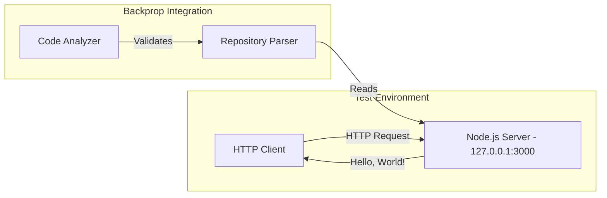

#### Major System Components

The repository consists of eight files at the root level with no subdirectory structure:

| Component | Type | Status | Purpose |
|-----------|------|--------|---------|
| `server.js` | Node.js | Functional | HTTP server implementation |
| `package.json` | npm manifest | Configured | Package metadata and scripts |
| `package-lock.json` | npm lockfile | Present | Dependency locking (v3) |
| `README.md` | Documentation | Present | Project description and warning |
| `LoginTest.java` | Java stub | Non-compilable | Placeholder for test expansion |
| `industry.csv` | Static data | Present | Reference data (44 industries) |
| `test.py.txt` | Placeholder | Empty | Future test expansion |
| `test.txt.txt` | Placeholder | Empty | Future test expansion |

#### Core Technical Approach

The technical approach follows the **minimal viable test surface** pattern:

1. **Technology Stack**: Node.js with built-in `http` module only (CommonJS syntax)
2. **Architecture Pattern**: Single-file, single-responsibility implementation
3. **Dependency Strategy**: Zero external packages to ensure reproducibility
4. **Configuration**: Standard npm package structure with intentionally minimal configuration

### 1.2.3 Success Criteria

#### Measurable Objectives

Given the test project nature, success criteria focus on **integration validation** rather than business metrics:

| Objective | Measurement | Target |
|-----------|-------------|--------|
| Tool Compatibility | Backprop successfully parses repository | 100% file parsing |
| Server Functionality | HTTP response verification | Returns "Hello, World!" |
| Build Reproducibility | Consistent npm install across environments | Zero dependency conflicts |

#### Critical Success Factors

1. **Repository Parsability**: All source files must be readable and analyzable by the Backprop tool
2. **Predictable Output**: Server must consistently return the expected response
3. **Isolation Integrity**: No external dependencies or network calls beyond localhost

#### Key Performance Indicators

| KPI | Description | Expected Value |
|-----|-------------|----------------|
| File Count | Total files in repository | 8 |
| Dependency Count | External npm packages | 0 |
| Server Response Time | Localhost request latency | < 10ms |
| Parse Success Rate | Files successfully analyzed | 100% |

---

## 1.3 Scope

### 1.3.1 In-Scope Elements

#### Core Features and Functionalities

**Must-Have Capabilities**

| Capability | Implementation | Evidence |
|------------|----------------|----------|
| HTTP Server | Node.js `http` module implementation | `server.js` |
| Hello World Response | Text/plain response with HTTP 200 | `server.js` line 5-8 |
| Package Metadata | npm package configuration | `package.json` |
| Reference Data | Industry categories dataset | `industry.csv` (44 entries) |

**Primary User Workflows**

1. **Server Startup Workflow**
   - Execute `node server.js`
   - Server binds to `127.0.0.1:3000`
   - Console logs: "Server running at http://127.0.0.1:3000/"

2. **Request/Response Workflow**
   - Client sends HTTP request to localhost:3000
   - Server responds with "Hello, World!\n"
   - HTTP status code: 200
   - Content-Type: text/plain

**Essential Integrations**

| Integration Point | Type | Status |
|-------------------|------|--------|
| Backprop Tool | Code Analysis | Primary target |
| npm Ecosystem | Package Management | Configured |
| Node.js Runtime | Execution Environment | Required |

**Key Technical Requirements**

- Node.js runtime (version compatible with npm lockfileVersion 3)
- Access to localhost network interface
- Port 3000 availability

#### Implementation Boundaries

**System Boundaries**

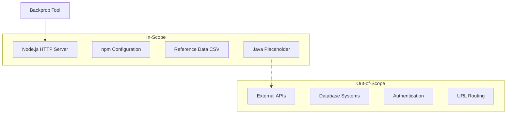

**User Groups Covered**

| User Group | Access Level | Supported Actions |
|------------|--------------|-------------------|
| Developers | Full | Run server, analyze code |
| Backprop Tool | Read | Parse and analyze repository |

**Geographic/Market Coverage**

- Localhost only (127.0.0.1)
- No external network access
- No geographic restrictions (local development)

**Data Domains Included**

| Domain | File | Content |
|--------|------|---------|
| Industry Reference | `industry.csv` | 44 industry categories (Accounting/Finance through Other) |
| Application Response | `server.js` | Static "Hello, World!" string |

### 1.3.2 Out-of-Scope Elements

#### Explicitly Excluded Features

| Feature | Rationale |
|---------|-----------|
| URL Routing | Intentionally minimal—all requests return same response |
| Authentication/Authorization | Not required for test fixture |
| Database Connectivity | No persistence needed |
| External API Integration | Isolation by design |
| Error Handling | Minimal implementation for simplicity |
| Logging Infrastructure | Console output only |
| Configuration Management | Hardcoded values for predictability |
| HTTPS/TLS | Localhost testing only |
| Load Balancing | Single-instance test server |
| Containerization | Not implemented |

#### Future Phase Considerations

The following items exist as placeholders for potential future expansion:

| Placeholder | Current State | Potential Future Use |
|-------------|---------------|---------------------|
| `LoginTest.java` | Non-compilable stub | Java-based test scenarios |
| `test.py.txt` | Empty file | Python test scripts |
| `test.txt.txt` | Empty file | Additional test data |
| `index.js` | Declared but missing | Alternative entry point |

#### Integration Points Not Covered

| Integration | Status | Notes |
|-------------|--------|-------|
| CI/CD Pipelines | Not configured | No automated builds |
| Container Registries | Not implemented | No Docker support |
| Cloud Deployment | Not supported | Localhost only |
| Monitoring Services | Not integrated | No telemetry |
| Version Control Hooks | Not configured | No pre-commit hooks |

#### Unsupported Use Cases

| Use Case | Reason for Exclusion |
|----------|---------------------|
| Production Deployment | Explicitly marked as test project only |
| Multi-user Access | Localhost binding prevents external access |
| Data Persistence | No database or file storage |
| API Development | No routing or endpoint configuration |
| Java Functionality | `LoginTest.java` will not compile in current state |
| Automated Testing | npm test script intentionally fails with exit code 1 |

---

#### References

#### Repository Files Examined

- `README.md` - Project identification, purpose statement, and warning notice
- `package.json` - Package metadata, version, author, license, and npm scripts configuration
- `package-lock.json` - npm lockfile version (v3), zero dependencies confirmation
- `server.js` - Complete HTTP server implementation using Node.js http module
- `LoginTest.java` - Java stub with incomplete class definition (package: com.blitzyTest)
- `industry.csv` - Reference data containing 44 industry category entries

#### Repository Structure

- Root directory (`/`) - All 8 project files, no subdirectories exist

#### External Resources Consulted

- Backprop GitHub Repository (backprop-ai/backprop) - Context on Backprop ML tool capabilities

# 2. Product Requirements

## 2.1 Feature Catalog

### 2.1.1 Feature Overview

The hao-backprop-test repository implements a minimal set of features designed specifically for Backprop tool integration testing. Each feature serves the overarching goal of providing a predictable, analyzable codebase surface with zero external dependencies.

| Feature ID | Feature Name | Category | Priority | Status |
|------------|--------------|----------|----------|--------|
| F-001 | HTTP Server | Core Functionality | Critical | Completed |
| F-002 | Package Configuration | Build/Deployment | Critical | Completed |
| F-003 | Reference Data Storage | Static Data | Medium | Completed |
| F-004 | Multi-Language Test Surface | Test Infrastructure | Low | Proposed |
| F-005 | Project Documentation | Documentation | High | Completed |

---

### 2.1.2 Feature Specifications

#### F-001: HTTP Server

| Attribute | Details |
|-----------|---------|
| **Feature ID** | F-001 |
| **Feature Name** | HTTP Server |
| **Category** | Core Functionality |
| **Priority Level** | Critical |
| **Status** | Completed |

**Description**

| Aspect | Details |
|--------|---------|
| **Overview** | Node.js HTTP server that responds to all incoming requests with a static "Hello, World!" message on localhost port 3000 |
| **Business Value** | Provides a deterministic, testable endpoint for validating Backprop tool integration with server-side JavaScript applications |
| **User Benefits** | Integration engineers can verify tool parsing and analysis against a predictable HTTP server implementation |
| **Technical Context** | Implemented using Node.js built-in `http` module with CommonJS require syntax; no routing, middleware, or external frameworks |

**Dependencies**

| Dependency Type | Details |
|-----------------|---------|
| Prerequisite Features | None |
| System Dependencies | Node.js runtime (npm lockfileVersion 3 compatible) |
| External Dependencies | None (uses only built-in `http` module) |
| Integration Requirements | Port 3000 availability, localhost network interface access |

**Implementation Evidence**

- Primary implementation file: `server.js` (lines 1-14)
- Configuration: Hardcoded hostname (`127.0.0.1`), port (`3000`)
- Response: HTTP 200, `Content-Type: text/plain`, body: `Hello, World!\n`

---

#### F-002: Package Configuration

| Attribute | Details |
|-----------|---------|
| **Feature ID** | F-002 |
| **Feature Name** | Package Configuration |
| **Category** | Build/Deployment |
| **Priority Level** | Critical |
| **Status** | Completed |

**Description**

| Aspect | Details |
|--------|---------|
| **Overview** | npm package configuration providing project metadata, version control, and script definitions for the Node.js project |
| **Business Value** | Enables consistent project identification and reproducible installation workflows for tool integration testing |
| **User Benefits** | Developers can reliably set up the project using standard `npm install` commands with deterministic results |
| **Technical Context** | Uses npm lockfileVersion 3 format requiring npm 7+; intentionally declares zero dependencies |

**Dependencies**

| Dependency Type | Details |
|-----------------|---------|
| Prerequisite Features | None |
| System Dependencies | npm package manager (version 7+) |
| External Dependencies | None declared |
| Integration Requirements | npm ecosystem access for package management |

**Implementation Evidence**

| File | Purpose |
|------|---------|
| `package.json` | Package metadata (name: `hello_world`, version: `1.0.0`, license: MIT, author: hxu) |
| `package-lock.json` | Lockfile with version 3 format, zero resolved dependencies |

**Configuration Details**

| Property | Value | Notes |
|----------|-------|-------|
| name | `hello_world` | Package identifier |
| version | `1.0.0` | Semantic versioning |
| main | `index.js` | Entry point (file does not exist) |
| test script | Exits with code 1 | Intentionally fails |

---

#### F-003: Reference Data Storage

| Attribute | Details |
|-----------|---------|
| **Feature ID** | F-003 |
| **Feature Name** | Reference Data Storage |
| **Category** | Static Data |
| **Priority Level** | Medium |
| **Status** | Completed |

**Description**

| Aspect | Details |
|--------|---------|
| **Overview** | Static CSV file containing 44 industry category entries for reference or test data purposes |
| **Business Value** | Provides structured static data for validating file parsing and data extraction capabilities in analysis tools |
| **User Benefits** | Enables testing of CSV parsing, data validation, and reference data handling scenarios |
| **Technical Context** | Single-column CSV format with "Industry" header; no processing logic implemented |

**Dependencies**

| Dependency Type | Details |
|-----------------|---------|
| Prerequisite Features | None |
| System Dependencies | None (static file) |
| External Dependencies | None |
| Integration Requirements | File system read access |

**Implementation Evidence**

- File: `industry.csv` (45 lines including header)
- Format: Single-column CSV with header "Industry"
- Content: 44 industry categories from "Accounting/Finance" through "Other"
- Usage: Reference data for validation, seeding, or UI option lists

---

#### F-004: Multi-Language Test Surface

| Attribute | Details |
|-----------|---------|
| **Feature ID** | F-004 |
| **Feature Name** | Multi-Language Test Surface |
| **Category** | Test Infrastructure |
| **Priority Level** | Low |
| **Status** | Proposed |

**Description**

| Aspect | Details |
|--------|---------|
| **Overview** | Placeholder files in multiple languages/formats to expand the code analysis test surface for Backprop integration |
| **Business Value** | Allows testing of parser capabilities across diverse file types and programming languages |
| **User Benefits** | Integration engineers can validate multi-language support in code analysis tools |
| **Technical Context** | Currently includes non-compilable Java stub and empty Python/text placeholders |

**Dependencies**

| Dependency Type | Details |
|-----------------|---------|
| Prerequisite Features | None |
| System Dependencies | None (placeholder files) |
| External Dependencies | None |
| Integration Requirements | File system read access |

**Implementation Evidence**

| File | Type | Status |
|------|------|--------|
| `LoginTest.java` | Java stub | Non-compilable (invalid "Web" statement) |
| `test.py.txt` | Python placeholder | Empty file |
| `test.txt.txt` | Text placeholder | Empty file |

---

#### F-005: Project Documentation

| Attribute | Details |
|-----------|---------|
| **Feature ID** | F-005 |
| **Feature Name** | Project Documentation |
| **Category** | Documentation |
| **Priority Level** | High |
| **Status** | Completed |

**Description**

| Aspect | Details |
|--------|---------|
| **Overview** | README documentation identifying the project purpose and providing usage guidance |
| **Business Value** | Clearly communicates the repository's role as a protected test artifact for Backprop integration |
| **User Benefits** | Prevents accidental modifications to the test fixture through explicit warnings |
| **Technical Context** | Minimal markdown documentation following standard GitHub conventions |

**Dependencies**

| Dependency Type | Details |
|-----------------|---------|
| Prerequisite Features | None |
| System Dependencies | None |
| External Dependencies | None |
| Integration Requirements | None |

**Implementation Evidence**

- File: `README.md` (2 lines)
- Title: `hao-backprop-test`
- Content: "test project for backprop integration. Do not touch!"

---

## 2.2 Functional Requirements

### 2.2.1 HTTP Server Requirements (F-001)

#### Requirements Table

| Req ID | Description | Priority |
|--------|-------------|----------|
| F-001-RQ-001 | Server Initialization | Must-Have |
| F-001-RQ-002 | Request Handling | Must-Have |
| F-001-RQ-003 | Response Generation | Must-Have |
| F-001-RQ-004 | Startup Notification | Should-Have |

---

**F-001-RQ-001: Server Initialization**

| Attribute | Specification |
|-----------|---------------|
| **Requirement ID** | F-001-RQ-001 |
| **Description** | The HTTP server shall initialize and bind to localhost (127.0.0.1) on port 3000 upon execution |
| **Priority** | Must-Have |
| **Complexity** | Low |

| Technical Specification | Details |
|------------------------|---------|
| **Input Parameters** | None (hardcoded configuration) |
| **Output/Response** | Server listening state on 127.0.0.1:3000 |
| **Performance Criteria** | Server binding completes within 1 second |
| **Data Requirements** | None |

| Acceptance Criteria | Validation |
|--------------------|------------|
| AC-1 | Server successfully binds to port 3000 |
| AC-2 | Server listens only on localhost (127.0.0.1) |
| AC-3 | No external network interfaces are exposed |

| Validation Rules | Details |
|-----------------|---------|
| **Business Rules** | Server must bind to localhost only for isolation |
| **Data Validation** | N/A |
| **Security Requirements** | Localhost binding prevents external access |
| **Compliance Requirements** | None |

---

**F-001-RQ-002: Request Handling**

| Attribute | Specification |
|-----------|---------------|
| **Requirement ID** | F-001-RQ-002 |
| **Description** | The server shall accept HTTP requests on all paths and methods without discrimination |
| **Priority** | Must-Have |
| **Complexity** | Low |

| Technical Specification | Details |
|------------------------|---------|
| **Input Parameters** | Any HTTP request (method, path, headers, body) |
| **Output/Response** | Request passed to response handler |
| **Performance Criteria** | Request processing initiates within 1ms |
| **Data Requirements** | None (requests not parsed or validated) |

| Acceptance Criteria | Validation |
|--------------------|------------|
| AC-1 | GET requests are accepted |
| AC-2 | POST requests are accepted |
| AC-3 | All URL paths are accepted |
| AC-4 | No request validation errors occur |

| Validation Rules | Details |
|-----------------|---------|
| **Business Rules** | All requests treated identically (no routing) |
| **Data Validation** | None implemented |
| **Security Requirements** | Localhost-only access provides isolation |
| **Compliance Requirements** | None |

---

**F-001-RQ-003: Response Generation**

| Attribute | Specification |
|-----------|---------------|
| **Requirement ID** | F-001-RQ-003 |
| **Description** | The server shall respond to all requests with HTTP 200 status, text/plain content type, and "Hello, World!\n" body |
| **Priority** | Must-Have |
| **Complexity** | Low |

| Technical Specification | Details |
|------------------------|---------|
| **Input Parameters** | HTTP request object |
| **Output/Response** | HTTP 200, Content-Type: text/plain, Body: "Hello, World!\n" |
| **Performance Criteria** | Response generated within 5ms |
| **Data Requirements** | Static string constant |

| Acceptance Criteria | Validation |
|--------------------|------------|
| AC-1 | Response status code is 200 |
| AC-2 | Response Content-Type header is "text/plain" |
| AC-3 | Response body is exactly "Hello, World!\n" |
| AC-4 | Response is identical for all requests |

| Validation Rules | Details |
|-----------------|---------|
| **Business Rules** | Response must be deterministic and unchanging |
| **Data Validation** | N/A (static response) |
| **Security Requirements** | No sensitive data in response |
| **Compliance Requirements** | None |

---

**F-001-RQ-004: Startup Notification**

| Attribute | Specification |
|-----------|---------------|
| **Requirement ID** | F-001-RQ-004 |
| **Description** | The server shall log a startup message to console indicating the listening address |
| **Priority** | Should-Have |
| **Complexity** | Low |

| Technical Specification | Details |
|------------------------|---------|
| **Input Parameters** | Server hostname and port values |
| **Output/Response** | Console log: "Server running at http://127.0.0.1:3000/" |
| **Performance Criteria** | Log output within 100ms of server start |
| **Data Requirements** | Hostname and port configuration values |

| Acceptance Criteria | Validation |
|--------------------|------------|
| AC-1 | Console displays server URL after successful startup |
| AC-2 | URL in message matches actual binding address |

---

### 2.2.2 Package Configuration Requirements (F-002)

#### Requirements Table

| Req ID | Description | Priority |
|--------|-------------|----------|
| F-002-RQ-001 | Package Identification | Must-Have |
| F-002-RQ-002 | Dependency Isolation | Must-Have |
| F-002-RQ-003 | Lockfile Integrity | Should-Have |

---

**F-002-RQ-001: Package Identification**

| Attribute | Specification |
|-----------|---------------|
| **Requirement ID** | F-002-RQ-001 |
| **Description** | The package.json shall provide complete package metadata including name, version, description, author, and license |
| **Priority** | Must-Have |
| **Complexity** | Low |

| Technical Specification | Details |
|------------------------|---------|
| **Input Parameters** | N/A (static configuration) |
| **Output/Response** | Valid npm package metadata |
| **Performance Criteria** | N/A |
| **Data Requirements** | Package name, version, description, author, license fields |

| Acceptance Criteria | Validation |
|--------------------|------------|
| AC-1 | Package name is "hello_world" |
| AC-2 | Version follows semantic versioning (1.0.0) |
| AC-3 | License is MIT |
| AC-4 | Author field is populated (hxu) |

---

**F-002-RQ-002: Dependency Isolation**

| Attribute | Specification |
|-----------|---------------|
| **Requirement ID** | F-002-RQ-002 |
| **Description** | The package configuration shall declare zero external dependencies to ensure isolation and reproducibility |
| **Priority** | Must-Have |
| **Complexity** | Low |

| Technical Specification | Details |
|------------------------|---------|
| **Input Parameters** | N/A |
| **Output/Response** | Empty or absent dependencies/devDependencies objects |
| **Performance Criteria** | N/A |
| **Data Requirements** | None |

| Acceptance Criteria | Validation |
|--------------------|------------|
| AC-1 | No "dependencies" object in package.json |
| AC-2 | No "devDependencies" object in package.json |
| AC-3 | npm install produces no node_modules entries from external packages |

| Validation Rules | Details |
|-----------------|---------|
| **Business Rules** | Zero dependencies required for predictable testing |
| **Security Requirements** | No third-party code attack surface |

---

**F-002-RQ-003: Lockfile Integrity**

| Attribute | Specification |
|-----------|---------------|
| **Requirement ID** | F-002-RQ-003 |
| **Description** | The package-lock.json shall use lockfileVersion 3 format with zero resolved dependencies |
| **Priority** | Should-Have |
| **Complexity** | Low |

| Technical Specification | Details |
|------------------------|---------|
| **Input Parameters** | N/A |
| **Output/Response** | Valid npm lockfile v3 format |
| **Performance Criteria** | Enables deterministic npm ci installation |
| **Data Requirements** | lockfileVersion: 3 |

| Acceptance Criteria | Validation |
|--------------------|------------|
| AC-1 | lockfileVersion property equals 3 |
| AC-2 | packages object contains only root package entry |
| AC-3 | npm ci completes without errors |

---

### 2.2.3 Reference Data Requirements (F-003)

#### Requirements Table

| Req ID | Description | Priority |
|--------|-------------|----------|
| F-003-RQ-001 | Data Format Compliance | Must-Have |
| F-003-RQ-002 | Data Completeness | Should-Have |

---

**F-003-RQ-001: Data Format Compliance**

| Attribute | Specification |
|-----------|---------------|
| **Requirement ID** | F-003-RQ-001 |
| **Description** | The industry.csv file shall conform to standard CSV format with a header row |
| **Priority** | Must-Have |
| **Complexity** | Low |

| Technical Specification | Details |
|------------------------|---------|
| **Input Parameters** | N/A (static file) |
| **Output/Response** | Parseable CSV data |
| **Performance Criteria** | N/A |
| **Data Requirements** | Header row with "Industry" column |

| Acceptance Criteria | Validation |
|--------------------|------------|
| AC-1 | First row contains "Industry" header |
| AC-2 | File is parseable by standard CSV parsers |
| AC-3 | Single-column format is maintained |

---

**F-003-RQ-002: Data Completeness**

| Attribute | Specification |
|-----------|---------------|
| **Requirement ID** | F-003-RQ-002 |
| **Description** | The reference data shall contain a comprehensive set of industry categories |
| **Priority** | Should-Have |
| **Complexity** | Low |

| Technical Specification | Details |
|------------------------|---------|
| **Input Parameters** | N/A |
| **Output/Response** | 44 industry category entries |
| **Performance Criteria** | N/A |
| **Data Requirements** | Industry categories from diverse sectors |

| Acceptance Criteria | Validation |
|--------------------|------------|
| AC-1 | File contains exactly 44 industry entries |
| AC-2 | Entries cover diverse industry sectors |
| AC-3 | "Other" category is included as catch-all |

---

### 2.2.4 Multi-Language Test Surface Requirements (F-004)

#### Requirements Table

| Req ID | Description | Priority |
|--------|-------------|----------|
| F-004-RQ-001 | File Presence | Could-Have |
| F-004-RQ-002 | Parser Test Coverage | Could-Have |

---

**F-004-RQ-001: File Presence**

| Attribute | Specification |
|-----------|---------------|
| **Requirement ID** | F-004-RQ-001 |
| **Description** | Placeholder files in various formats shall exist for parser testing purposes |
| **Priority** | Could-Have |
| **Complexity** | Low |

| Acceptance Criteria | Validation |
|--------------------|------------|
| AC-1 | Java file exists (LoginTest.java) |
| AC-2 | Python placeholder exists (test.py.txt) |
| AC-3 | Text placeholder exists (test.txt.txt) |

---

### 2.2.5 Documentation Requirements (F-005)

#### Requirements Table

| Req ID | Description | Priority |
|--------|-------------|----------|
| F-005-RQ-001 | Project Identification | Must-Have |
| F-005-RQ-002 | Usage Warning | Must-Have |

---

**F-005-RQ-001: Project Identification**

| Attribute | Specification |
|-----------|---------------|
| **Requirement ID** | F-005-RQ-001 |
| **Description** | The README shall clearly identify the project name and purpose |
| **Priority** | Must-Have |
| **Complexity** | Low |

| Acceptance Criteria | Validation |
|--------------------|------------|
| AC-1 | Project name "hao-backprop-test" is stated |
| AC-2 | Purpose as Backprop integration test is mentioned |

---

**F-005-RQ-002: Usage Warning**

| Attribute | Specification |
|-----------|---------------|
| **Requirement ID** | F-005-RQ-002 |
| **Description** | The documentation shall include an explicit warning against modifications |
| **Priority** | Must-Have |
| **Complexity** | Low |

| Acceptance Criteria | Validation |
|--------------------|------------|
| AC-1 | "Do not touch!" warning is present |
| AC-2 | Warning is prominently displayed in README |

---

## 2.3 Feature Relationships

### 2.3.1 Feature Dependencies Map

The feature relationships in this minimal test project are intentionally simple, with most features operating independently.

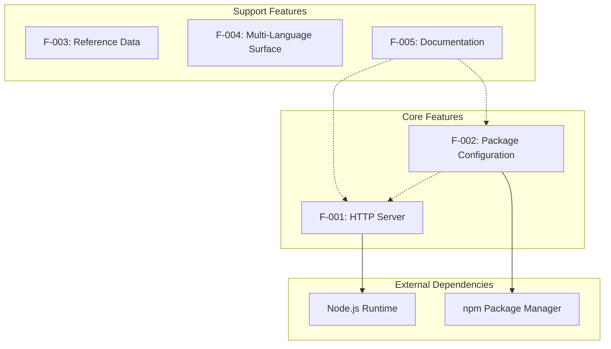

### 2.3.2 Dependency Matrix

| Feature | Depends On | Depended By |
|---------|------------|-------------|
| F-001: HTTP Server | Node.js Runtime, F-002 (package metadata) | None |
| F-002: Package Configuration | npm Package Manager | F-001 (project context) |
| F-003: Reference Data | None | None |
| F-004: Multi-Language Surface | None | None |
| F-005: Documentation | None | None |

### 2.3.3 Integration Points

| Integration Point | Features Involved | Type |
|-------------------|-------------------|------|
| Node.js Runtime | F-001, F-002 | System Dependency |
| npm Ecosystem | F-002 | Build/Package Management |
| Backprop Tool | All features | External Analysis Target |
| File System | F-003, F-004, F-005 | Resource Access |

### 2.3.4 Shared Components

| Component | Used By | Purpose |
|-----------|---------|---------|
| File System Access | F-003, F-004, F-005 | Reading static files |
| Console Output | F-001 | Startup notification |
| localhost Network | F-001 | HTTP binding |

---

## 2.4 Implementation Considerations

### 2.4.1 Technical Constraints

| Constraint | Applicable Features | Impact |
|------------|---------------------|--------|
| Single-file implementation | F-001 | All server logic in `server.js` |
| CommonJS module system | F-001 | Uses `require()` syntax |
| Hardcoded configuration | F-001 | No environment variable support |
| No module exports | F-001 | Side-effect only execution |
| Intentionally failing test | F-002 | npm test exits with code 1 |
| Missing entry point | F-002 | `index.js` declared but absent |

### 2.4.2 Performance Requirements

| Requirement | Feature | Target | Rationale |
|-------------|---------|--------|-----------|
| Server Response Time | F-001 | < 10ms | Localhost latency target |
| Server Binding Time | F-001 | < 1 second | Startup performance |
| Parse Success Rate | All | 100% | Tool integration validation |
| npm Install Time | F-002 | < 1 second | Zero dependencies |

### 2.4.3 Scalability Considerations

| Consideration | Assessment | Notes |
|---------------|------------|-------|
| Horizontal Scaling | Not applicable | Single-instance test server |
| Vertical Scaling | Not applicable | Minimal resource requirements |
| Load Handling | Not designed | No concurrent request optimization |
| Data Growth | Not applicable | Static reference data only |

**Note**: Scalability is intentionally not a design goal for this test fixture. The system's value lies in its predictable, minimal nature rather than production scalability.

### 2.4.4 Security Implications

| Security Aspect | Implementation | Risk Level |
|-----------------|----------------|------------|
| Network Exposure | Localhost-only binding (127.0.0.1) | Low |
| Authentication | None implemented | N/A (test fixture) |
| Input Validation | None implemented | Low (localhost isolation) |
| Dependency Vulnerabilities | Zero external dependencies | Minimal |
| Data Protection | No sensitive data present | N/A |

**Security by Design**: The localhost-only binding provides inherent isolation, preventing external network access and eliminating most attack vectors.

### 2.4.5 Maintenance Requirements

| Maintenance Aspect | Current State | Recommendation |
|--------------------|---------------|----------------|
| Dependency Updates | None required | Maintain zero-dependency state |
| Security Patching | Node.js runtime only | Update runtime as needed |
| Documentation Updates | Minimal required | Keep README warning current |
| Test Maintenance | No tests implemented | Intentional—validates tool testing |
| Code Changes | "Do not touch!" policy | Avoid modifications |

---

## 2.5 Traceability Matrix

### 2.5.1 Feature-to-Requirement Traceability

| Feature ID | Requirements | Evidence Files |
|------------|--------------|----------------|
| F-001 | F-001-RQ-001, F-001-RQ-002, F-001-RQ-003, F-001-RQ-004 | `server.js` |
| F-002 | F-002-RQ-001, F-002-RQ-002, F-002-RQ-003 | `package.json`, `package-lock.json` |
| F-003 | F-003-RQ-001, F-003-RQ-002 | `industry.csv` |
| F-004 | F-004-RQ-001, F-004-RQ-002 | `LoginTest.java`, `test.py.txt`, `test.txt.txt` |
| F-005 | F-005-RQ-001, F-005-RQ-002 | `README.md` |

### 2.5.2 Requirement-to-Test Mapping

| Requirement ID | Test Approach | Validation Method |
|----------------|---------------|-------------------|
| F-001-RQ-001 | Execute `node server.js` | Verify server binds to port 3000 |
| F-001-RQ-002 | Send HTTP requests | Confirm all requests accepted |
| F-001-RQ-003 | Inspect HTTP response | Verify status, headers, body |
| F-001-RQ-004 | Check console output | Confirm startup message |
| F-002-RQ-001 | Parse package.json | Validate metadata fields |
| F-002-RQ-002 | Run npm install | Confirm zero dependencies |
| F-002-RQ-003 | Inspect lockfile | Verify version 3 format |
| F-003-RQ-001 | Parse CSV file | Validate format compliance |
| F-003-RQ-002 | Count rows | Confirm 44 entries |
| F-005-RQ-001 | Read README | Verify project name |
| F-005-RQ-002 | Read README | Confirm warning present |

### 2.5.3 KPI Alignment

| KPI | Related Features | Target |
|-----|------------------|--------|
| File Count | All | 8 files |
| Dependency Count | F-002 | 0 dependencies |
| Server Response Time | F-001 | < 10ms |
| Parse Success Rate | All | 100% |

---

## 2.6 Assumptions and Constraints

### 2.6.1 Assumptions

| ID | Assumption | Impact |
|----|------------|--------|
| A-001 | Node.js runtime is available on target system | Required for F-001 execution |
| A-002 | Port 3000 is available on localhost | Required for server binding |
| A-003 | npm 7+ is available for lockfile compatibility | Required for F-002 |
| A-004 | Repository is used solely for testing purposes | All features designed for test scenarios |
| A-005 | Backprop tool requires file system access | All files accessible for analysis |

### 2.6.2 Constraints

| ID | Constraint | Rationale |
|----|------------|-----------|
| C-001 | Zero external dependencies | Ensures reproducibility and isolation |
| C-002 | Localhost-only binding | Prevents external access during testing |
| C-003 | No modifications policy | Maintains test fixture integrity |
| C-004 | Single-file server implementation | Simplifies analysis for tool testing |
| C-005 | Intentionally failing test script | Validates tool handling of test failures |

---

#### References

#### Repository Files Examined

- `server.js` - HTTP server implementation with request handling and response generation
- `package.json` - npm package metadata, scripts configuration, and dependency declarations
- `package-lock.json` - npm lockfile version 3 with zero dependencies confirmation
- `README.md` - Project identification and "Do not touch!" warning
- `industry.csv` - Reference data containing 44 industry category entries
- `LoginTest.java` - Non-compilable Java stub (package: com.blitzyTest)
- `test.py.txt` - Empty Python placeholder file
- `test.txt.txt` - Empty text placeholder file

#### Technical Specification Sections Referenced

- Section 1.1 Executive Summary - Project overview, stakeholders, value proposition
- Section 1.2 System Overview - Architecture, components, success criteria, KPIs
- Section 1.3 Scope - In-scope elements, exclusions, future placeholders

#### Related Process Flowcharts

- Section 1.2 System Overview - Test Environment flow diagram
- Section 1.3 Scope - System boundaries diagram

# 3. Technology Stack

## 3.1 Overview

This section documents the technology stack for the Hello World Node.js test project—a minimal test fixture designed for Backprop tool integration testing. The technology choices reflect the project's core design philosophy: **deliberate minimalism** to ensure reproducibility, isolation, and predictable behavior during tool validation.

> **Important Note**: The default enterprise technology stack (AWS, Docker, Flask, React, MongoDB, etc.) does not apply to this repository. The intentionally constrained stack documented below represents the actual implementation, optimized for its role as a test fixture rather than a production application.

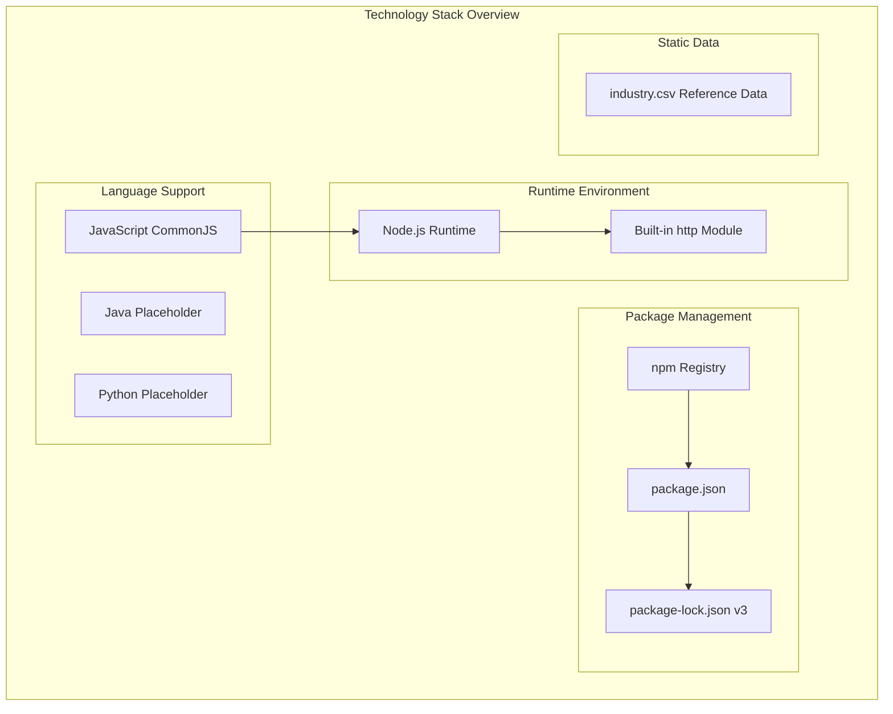

---

## 3.2 Programming Languages

### 3.2.1 Primary Language: JavaScript (Node.js)

| Attribute | Value | Evidence |
|-----------|-------|----------|
| **Language** | JavaScript | `server.js` |
| **Module System** | CommonJS | `require()` syntax in `server.js` line 1 |
| **Runtime** | Node.js | Required for `http` module execution |
| **Execution Pattern** | Side-effect only | No module exports defined |

#### Selection Criteria

JavaScript with Node.js was selected as the primary language for the following reasons:

1. **Native HTTP Support**: Node.js provides a built-in `http` module, eliminating external dependencies
2. **Minimal Footprint**: Single-file implementation aligns with test fixture requirements
3. **Ubiquitous Runtime**: Node.js availability across development environments ensures broad compatibility
4. **Tool Compatibility**: JavaScript is a primary target language for code analysis tools like Backprop

#### Implementation Details

The `server.js` file implements the entire application using CommonJS module syntax:

```
const http = require('http');
```

This single import represents the complete dependency chain for the functional server, leveraging Node.js's built-in capabilities without external packages.

### 3.2.2 Placeholder Languages

| Language | File | Status | Purpose |
|----------|------|--------|---------|
| **Java** | `LoginTest.java` | Non-compilable stub | Future test scenario expansion |
| **Python** | `test.py.txt` | Empty placeholder | Future test script development |

#### Java Placeholder

The `LoginTest.java` file exists as a non-functional placeholder:

| Attribute | Value |
|-----------|-------|
| Package | `com.blitzyTest` |
| Compilation Status | **Will not compile** (invalid syntax on line 7) |
| Purpose | Demonstrates multi-language repository parsing |

#### Python Placeholder

The `test.py.txt` file is an empty placeholder reserved for potential Python-based test scripts in future iterations.

### 3.2.3 Language Constraints

| Constraint ID | Description | Impact |
|---------------|-------------|--------|
| C-004 | Single-file server implementation | All JavaScript logic contained in `server.js` |
| - | CommonJS required | Uses `require()` not ES modules `import` |
| - | No transpilation | Source JavaScript executed directly |

---

## 3.3 Frameworks & Libraries

### 3.3.1 Core Framework: Node.js Built-in HTTP Module

| Component | Type | Version | Source |
|-----------|------|---------|--------|
| `http` | Built-in Module | Node.js native | `server.js` line 1 |

The project deliberately avoids external frameworks, relying exclusively on Node.js's built-in `http` module for HTTP server functionality.

#### Justification for Built-in Module Only

| Consideration | Rationale |
|---------------|-----------|
| **Zero Dependencies** | Eliminates version conflicts and supply chain risks |
| **Reproducibility** | Guarantees consistent behavior across environments |
| **Isolation** | Ensures test failures originate from the tool under test, not framework issues |
| **Simplicity** | Reduces cognitive overhead for developers analyzing the test fixture |

### 3.3.2 Explicitly Excluded Frameworks

The following frameworks, while common in Node.js applications, are intentionally not used:

| Framework | Typical Purpose | Exclusion Rationale |
|-----------|-----------------|---------------------|
| Express.js | Web application framework | Adds routing complexity unnecessary for single-endpoint test |
| Fastify | High-performance web framework | Over-engineered for Hello World response |
| Koa | Middleware framework | No middleware requirements in test fixture |
| Hapi | Enterprise framework | Enterprise features not needed |

### 3.3.3 Compatibility Requirements

| Requirement | Specification | Evidence |
|-------------|---------------|----------|
| Node.js Runtime | Compatible with npm v7+ | `package-lock.json` lockfileVersion 3 |
| npm Version | v7 or higher (v9 recommended) | lockfileVersion 3 compatibility |
| Module System | CommonJS support required | `require()` syntax in `server.js` |

---

## 3.4 Open Source Dependencies

### 3.4.1 Dependency Strategy: Zero External Packages

| Metric | Value | Evidence |
|--------|-------|----------|
| External Dependencies | **0** | `package.json` - no `dependencies` object |
| Dev Dependencies | **0** | `package.json` - no `devDependencies` object |
| Peer Dependencies | **0** | `package.json` - no `peerDependencies` object |

This zero-dependency architecture is a **deliberate design constraint** (C-001) that ensures:

1. **Complete Isolation**: No third-party code interference during tool testing
2. **Reproducibility**: Identical behavior regardless of npm registry state
3. **Security**: Zero supply chain attack surface from external packages
4. **Speed**: Sub-second installation time (`npm install` completes in < 1 second)

### 3.4.2 Package Configuration

## package.json

| Field | Value | Notes |
|-------|-------|-------|
| `name` | `hello_world` | npm package identifier |
| `version` | `1.0.0` | Semantic versioning |
| `description` | `Hello world in Node.js` | Human-readable description |
| `main` | `index.js` | Declared entry point (file does not exist) |
| `author` | `hxu` | Repository owner |
| `license` | `MIT` | Open source license |

## package-lock.json

| Field | Value | Significance |
|-------|-------|--------------|
| `lockfileVersion` | `3` | Requires npm v7+ (optimally npm v9) |
| `requires` | `true` | Dependency resolution enabled |
| `packages` | Root project only | Confirms zero external dependencies |

### 3.4.3 Package Registry Configuration

| Attribute | Value |
|-----------|-------|
| Registry | npm (default: registry.npmjs.org) |
| Status | Configured but unused |
| Package Resolution | Not applicable (no dependencies) |

### 3.4.4 npm Version Compatibility Matrix

Based on the lockfileVersion 3 in the repository, the following npm compatibility applies:

| npm Version | lockfileVersion Support | Compatibility |
|-------------|------------------------|---------------|
| v5, v6 | 1 | ❌ Not compatible |
| v7 | 2 (can read 3) | ⚠️ May work with warnings |
| v8 | 2 (can read 3) | ⚠️ May work with warnings |
| v9+ | 3 (native) | ✅ Fully compatible |

---

## 3.5 Third-Party Services

### 3.5.1 External Service Integration: None

The project operates in complete isolation with no external service dependencies:

| Service Category | Status | Rationale |
|------------------|--------|-----------|
| External APIs | Not used | Localhost-only design |
| Authentication Services | Not implemented | No user management required |
| Monitoring Tools | Not integrated | No telemetry by design |
| Cloud Services | Not supported | Local development only |
| CDN Services | Not used | No static asset delivery |
| Email Services | Not used | No notification requirements |

### 3.5.2 Integration Target: Backprop Tool

While not a third-party service in the traditional sense, the primary integration point is the Backprop tool:

| Integration Aspect | Details |
|--------------------|---------|
| **Tool Type** | Code analysis and AI-assisted development |
| **Integration Method** | File system access (read-only) |
| **Repository Parsing** | All 8 files accessible for analysis |
| **Expected Behavior** | 100% parse success rate |

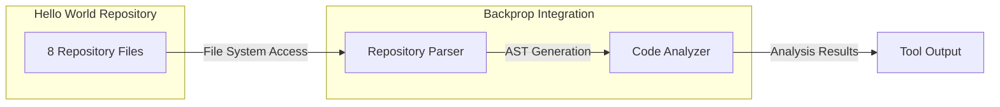

### 3.5.3 Explicitly Excluded Services

Per Section 1.3.2 (Out-of-Scope Elements), the following services are explicitly not supported:

| Service Type | Exclusion Status | Documentation Reference |
|--------------|------------------|------------------------|
| CI/CD Pipelines | Not configured | "No automated builds" |
| Container Registries | Not implemented | "No Docker support" |
| Cloud Deployment | Not supported | "Localhost only" |
| Monitoring Services | Not integrated | "No telemetry" |

---

## 3.6 Databases & Storage

### 3.6.1 Database Implementation: None

| Category | Status | Rationale |
|----------|--------|-----------|
| Primary Database | Not implemented | No persistence required |
| Secondary Database | Not implemented | Single-purpose test fixture |
| Caching Layer | Not implemented | Stateless operation |
| Search Engine | Not implemented | No search functionality |

The absence of database connectivity is intentional, as documented in Section 1.3.2: "Database Connectivity - No persistence needed."

### 3.6.2 Static Data Files

The repository contains one static data file serving as reference data:

| File | Format | Content | Record Count |
|------|--------|---------|--------------|
| `industry.csv` | CSV (single column) | Industry category names | 44 entries |

## industry.csv Structure

| Attribute | Value |
|-----------|-------|
| Format | Plain text CSV |
| Columns | 1 (industry name) |
| Header | None |
| Entries | 44 industry categories |
| Range | "Accounting/Finance" through "Other" |

#### Use Cases for Static Data

| Use Case | Description |
|----------|-------------|
| Test Data Source | Provides realistic sample data for tool validation |
| Reference Validation | Industry taxonomy for categorization testing |
| Parser Verification | CSV parsing capability testing |

### 3.6.3 Data Persistence Strategy

| Aspect | Implementation |
|--------|----------------|
| Runtime State | In-memory only (process lifecycle) |
| Configuration | Hardcoded values (no external config) |
| Session Management | Not applicable |
| Data Durability | None required |

---

## 3.7 Development & Deployment

### 3.7.1 Development Tools

#### Required Tools

| Tool | Version Requirement | Purpose |
|------|---------------------|---------|
| **Node.js** | Compatible with npm 7+ | Runtime environment |
| **npm** | v7+ (v9 recommended) | Package management |
| **Text Editor** | Any | Source code viewing/editing |

#### Recommended Development Environment

| Component | Recommendation | Notes |
|-----------|----------------|-------|
| Node Version Manager | nvm | Facilitates Node.js version switching |
| IDE/Editor | VS Code, WebStorm, or similar | JavaScript syntax support |
| Terminal | Any POSIX-compatible | Command execution |

### 3.7.2 Build System

| Aspect | Implementation |
|--------|----------------|
| Build Process | **None** - Direct execution |
| Transpilation | Not required |
| Bundling | Not required |
| Minification | Not applicable |
| Asset Processing | Not applicable |

The project requires no build step. The JavaScript source executes directly via Node.js:

```
node server.js
```

### 3.7.3 npm Scripts Configuration

| Script | Command | Behavior |
|--------|---------|----------|
| `test` | `echo "Error: no test specified" && exit 1` | **Intentionally fails** with exit code 1 |

The failing test script is a deliberate design choice (Constraint C-005) to validate tool handling of test failures.

### 3.7.4 Containerization

| Technology | Status | Rationale |
|------------|--------|-----------|
| Docker | **Not implemented** | Out of scope per Section 1.3.2 |
| Docker Compose | Not implemented | No multi-container requirements |
| Kubernetes | Not implemented | No orchestration needs |
| Container Registry | Not configured | No image publishing |

### 3.7.5 CI/CD Pipeline

| Component | Status | Rationale |
|-----------|--------|-----------|
| GitHub Actions | Not configured | No automated builds required |
| Jenkins | Not configured | Out of scope |
| GitLab CI | Not configured | Out of scope |
| Pre-commit Hooks | Not configured | "Do not touch!" policy |

The absence of CI/CD infrastructure aligns with the project's role as a static test fixture that should remain unchanged.

### 3.7.6 Deployment Architecture

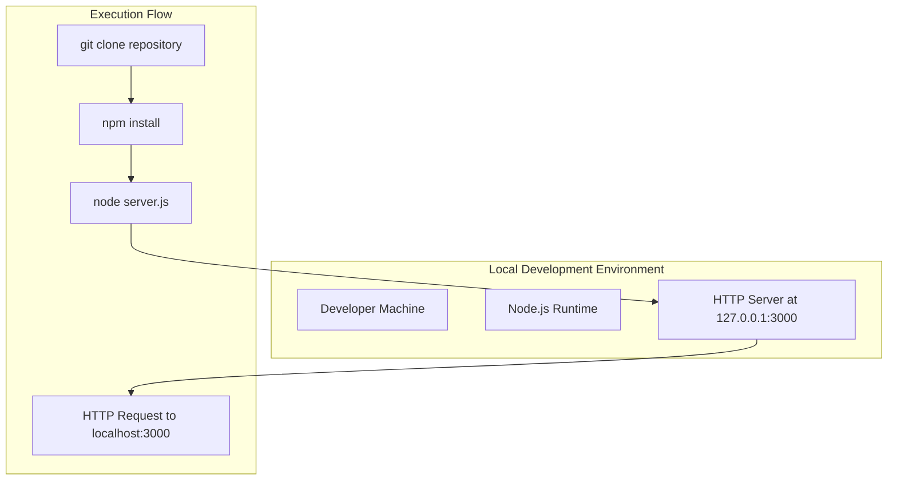

#### Deployment Steps

| Step | Command | Expected Duration |
|------|---------|-------------------|
| 1. Clone | `git clone <repository>` | Varies by network |
| 2. Install | `npm install` | < 1 second |
| 3. Execute | `node server.js` | < 1 second to bind |
| 4. Verify | `curl http://127.0.0.1:3000` | < 10ms response |

### 3.7.7 Runtime Configuration

| Parameter | Value | Configurability |
|-----------|-------|-----------------|
| Hostname | `127.0.0.1` | Hardcoded (not configurable) |
| Port | `3000` | Hardcoded (not configurable) |
| Protocol | HTTP | Fixed (no HTTPS) |
| Response | `Hello, World!\n` | Static |

---

## 3.8 Security Considerations

### 3.8.1 Technology Stack Security Profile

| Security Aspect | Risk Level | Justification |
|-----------------|------------|---------------|
| **Dependency Vulnerabilities** | Minimal | Zero external dependencies eliminates supply chain risk |
| **Network Exposure** | Low | Localhost-only binding (127.0.0.1) |
| **Authentication** | N/A | Not implemented (test fixture) |
| **Data Protection** | N/A | No sensitive data present |
| **Input Validation** | Low risk | Localhost isolation mitigates attack vectors |

### 3.8.2 Security by Design

The technology stack implements security through deliberate constraints:

| Constraint | Security Benefit |
|------------|------------------|
| Zero dependencies | No third-party vulnerability exposure |
| Localhost binding | Network isolation |
| Read-only integration | Backprop tool access is non-destructive |
| Static response | No dynamic content injection risks |

### 3.8.3 Maintenance Requirements

| Maintenance Aspect | Requirement | Frequency |
|--------------------|-------------|-----------|
| Dependency Updates | None required | N/A |
| Security Patches | Node.js runtime only | As needed |
| Version Upgrades | npm compatibility | Rare |

---

## 3.9 Technology Stack Summary

### 3.9.1 Complete Technology Inventory

| Category | Technology | Version/Specification |
|----------|------------|----------------------|
| **Primary Language** | JavaScript | ES5+ (CommonJS) |
| **Runtime** | Node.js | npm v7+/v9 compatible |
| **Core Module** | http (built-in) | Node.js native |
| **Package Manager** | npm | v7+ required, v9 recommended |
| **Lockfile Version** | 3 | npm v9 native format |
| **External Dependencies** | None | Zero by design |
| **Database** | None | No persistence |
| **Containerization** | None | Not implemented |
| **CI/CD** | None | Not configured |
| **Cloud Services** | None | Localhost only |

### 3.9.2 Technology Decision Matrix

| Decision Area | Choice | Alternative Considered | Selection Rationale |
|---------------|--------|------------------------|---------------------|
| Language | JavaScript (Node.js) | Python, Go | Native HTTP module, broad tool compatibility |
| Module System | CommonJS | ES Modules | Universal Node.js support |
| HTTP Server | Built-in `http` | Express.js | Zero dependencies requirement |
| Package Format | npm | yarn, pnpm | Standard Node.js tooling |
| Deployment | Local only | Docker, Cloud | Test fixture simplicity |

### 3.9.3 Deviation from Default Stack

The following table documents how this project's technology stack differs from the enterprise default:

| Default Component | This Project | Rationale |
|-------------------|--------------|-----------|
| AWS Cloud | Localhost only | Test fixture isolation |
| Docker | Not used | No containerization needed |
| Terraform | Not used | No infrastructure provisioning |
| GitHub Actions | Not configured | No CI/CD requirements |
| Python/Flask | JavaScript/Node.js | Native HTTP module simplicity |
| Auth0 | Not implemented | No authentication required |
| MongoDB | Not used | No persistence needed |
| React/TypeScript | Not used | No frontend component |
| TailwindCSS | Not used | No styling requirements |

---

#### References

#### Repository Files Examined

- `server.js` - HTTP server implementation using Node.js built-in http module (CommonJS syntax)
- `package.json` - npm package configuration with zero dependencies, scripts, and metadata
- `package-lock.json` - npm lockfile version 3 confirming zero external dependencies
- `README.md` - Project identification and "Do not touch!" maintenance policy
- `LoginTest.java` - Non-compilable Java placeholder (package: com.blitzyTest)
- `test.py.txt` - Empty Python placeholder file
- `industry.csv` - Static reference data containing 44 industry category entries

#### Technical Specification Sections Referenced

- Section 1.2 System Overview - Architecture, components, and technical approach
- Section 1.3 Scope - In-scope elements, exclusions, and integration boundaries
- Section 2.4 Implementation Considerations - Technical constraints, performance requirements, security
- Section 2.6 Assumptions and Constraints - Runtime assumptions (A-001 through A-005), project constraints (C-001 through C-005)

#### External Resources Consulted

- npm Documentation - lockfileVersion compatibility (registry.npmjs.org)
- Node.js lockfile version compatibility research (npm v7+/v9 requirements for lockfileVersion 3)

# 4. Process Flowchart

This section provides comprehensive process flow documentation for the Hello World Node.js test project—a minimal test fixture designed for Backprop tool integration testing. Given the intentionally simple nature of this repository, the workflows documented here reflect the system's design philosophy of **deliberate minimalism** while still capturing all operational flows, decision points, and state transitions.

## 4.1 System Workflow Overview

### 4.1.1 High-Level System Workflow

The system operates within two primary contexts: the **Test Environment** where the HTTP server runs, and the **Backprop Integration** context where the code analysis tool examines repository files. The following diagram illustrates the complete system workflow encompassing both contexts.

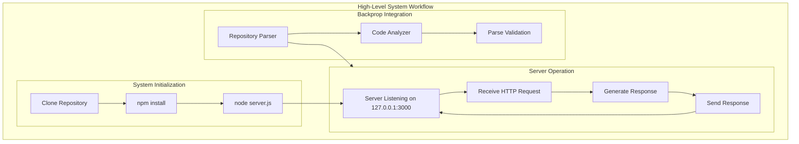

### 4.1.2 Workflow Summary Table

| Workflow | Purpose | Primary Actor | SLA Target |
|----------|---------|---------------|------------|
| Server Startup | Initialize HTTP server | Developer | < 1 second |
| HTTP Request/Response | Handle client requests | HTTP Client | < 10ms |
| Development/Deployment | Set up local environment | Developer | < 5 seconds total |
| Backprop Integration | Analyze repository files | Backprop Tool | 100% parse rate |

## 4.2 Core Business Processes

### 4.2.1 Server Startup Workflow

The server startup workflow represents the primary initialization sequence for the HTTP server. This process transitions the system from an idle state to an active listening state, ready to handle incoming HTTP requests.

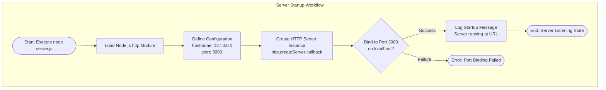

#### Startup Process Steps

| Step | Action | Technical Details | Duration |
|------|--------|-------------------|----------|
| 1 | Execute server | `node server.js` command | Immediate |
| 2 | Load http module | `require('http')` - built-in module | < 10ms |
| 3 | Define configuration | Hardcoded values: hostname, port | Immediate |
| 4 | Create server | `http.createServer()` with callback | < 10ms |
| 5 | Bind to port | `server.listen(3000, '127.0.0.1')` | < 100ms |
| 6 | Log notification | Console output with server URL | < 10ms |
| 7 | Enter listening state | Server ready for requests | Continuous |

#### Validation Rules - Server Initialization

| Rule ID | Validation | Requirement Ref |
|---------|------------|-----------------|
| VR-001 | Server must bind to 127.0.0.1 only | F-001-RQ-001 |
| VR-002 | Server must use port 3000 | F-001-RQ-001 |
| VR-003 | No external network interfaces exposed | F-001-RQ-001 (AC-3) |
| VR-004 | Startup notification must display URL | F-001-RQ-004 |

### 4.2.2 HTTP Request/Response Workflow

The HTTP request/response workflow is the core business process of the system. This workflow is intentionally simplified—all requests receive the identical response regardless of HTTP method, path, headers, or body content.

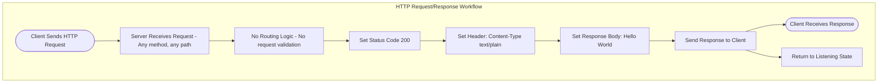

#### Request Processing Decision Points

Unlike typical HTTP servers, this implementation has **no decision points** in request processing. This is a deliberate design choice to ensure deterministic, predictable behavior for tool integration testing.

| Decision Point | Typical Server | This Implementation |
|----------------|----------------|---------------------|
| HTTP Method Check | Route based on GET/POST/etc. | Ignored - all methods accepted |
| URL Path Routing | Match path to handler | Ignored - all paths accepted |
| Content Validation | Validate request body | None - body ignored |
| Authentication | Verify credentials | None implemented |
| Authorization | Check permissions | None implemented |

#### Response Generation Specification

| Component | Value | Requirement |
|-----------|-------|-------------|
| Status Code | 200 (OK) | F-001-RQ-003 |
| Content-Type | text/plain | F-001-RQ-003 |
| Body | `Hello, World!\n` | F-001-RQ-003 |
| Response Timing | < 5ms generation | F-001-RQ-003 (Performance) |

### 4.2.3 End-to-End User Journey

The complete end-to-end user journey encompasses the developer experience from repository acquisition through successful request verification.

```mermaid
flowchart TB
    subgraph UserJourney["End-to-End User Journey"]
        subgraph Setup["Environment Setup"]
            StartJourney(["Developer Begins"])
            CloneRepo["git clone repository"]
            NavToDir["Navigate to directory"]
            RunInstall["npm install"]
        end
        
        subgraph Execution["Server Execution"]
            StartServer["node server.js"]
            WaitBind["Wait for port binding"]
            VerifyLog["Verify console output: Server running"]
        end
        
        subgraph Verification["Request Verification"]
            SendCurl["curl localhost:3000"]
            ReceiveHello["Receive Hello World"]
            VerifySuccess["Verify HTTP 200"]
            JourneyEnd(["Journey Complete"])
        end
    end
    
    StartJourney --> CloneRepo
    CloneRepo --> NavToDir
    NavToDir --> RunInstall
    RunInstall --> StartServer
    StartServer --> WaitBind
    WaitBind --> VerifyLog
    VerifyLog --> SendCurl
    SendCurl --> ReceiveHello
    ReceiveHello --> VerifySuccess
    VerifySuccess --> JourneyEnd
```

#### Journey Timing Constraints

| Phase | Step | Expected Duration | SLA |
|-------|------|-------------------|-----|
| Setup | git clone | Network dependent | Varies |
| Setup | npm install | < 1 second | C-001: Zero deps |
| Execution | node server.js | < 1 second | F-001-RQ-001 |
| Execution | Port binding | < 100ms | Performance target |
| Verification | curl request | < 10ms | F-001-RQ-003 |

## 4.3 Integration Workflows

### 4.3.1 Backprop Tool Integration Workflow

The primary purpose of this repository is to serve as a test fixture for Backprop tool integration. This workflow documents how the Backprop code analysis tool interacts with the repository.

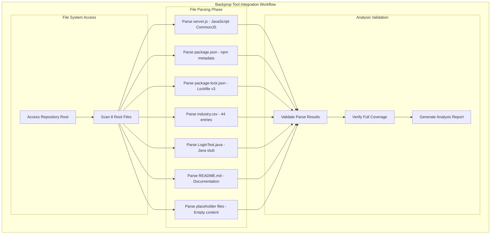

#### File Parsing Requirements

| File | Language/Format | Parse Expectation | Notes |
|------|-----------------|-------------------|-------|
| `server.js` | JavaScript (CommonJS) | Full AST parsing | Primary code file |
| `package.json` | JSON | Complete metadata extraction | npm manifest |
| `package-lock.json` | JSON (v3) | Lockfile structure parsing | Zero dependencies |
| `industry.csv` | CSV | Header + 44 rows | Reference data |
| `LoginTest.java` | Java | Partial (non-compilable) | Stub only |
| `README.md` | Markdown | Text extraction | Documentation |
| `test.py.txt` | Text | Empty file handling | Placeholder |
| `test.txt.txt` | Text | Empty file handling | Placeholder |

### 4.3.2 npm Ecosystem Integration

The package management workflow demonstrates the minimal npm integration required for this project.

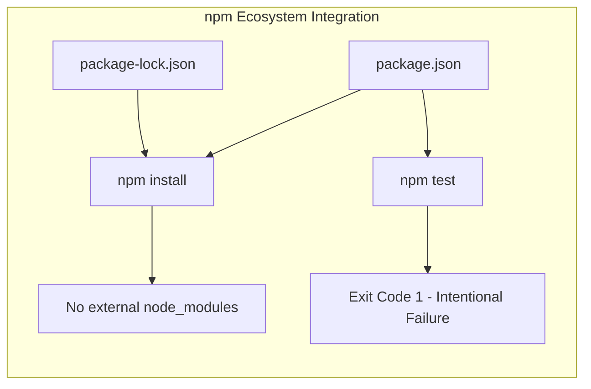

#### npm Script Behavior

| Script | Command | Expected Behavior | Exit Code |
|--------|---------|-------------------|-----------|
| test | `echo "Error: no test specified" && exit 1` | Intentional failure | 1 |

> **Design Note**: The failing test script is a deliberate constraint (C-005) to validate how tools handle test failures.

## 4.4 State Management

### 4.4.1 Server State Transition Diagram

The server operates through a defined set of states from initialization to active request handling. This state machine represents the complete lifecycle of the HTTP server.

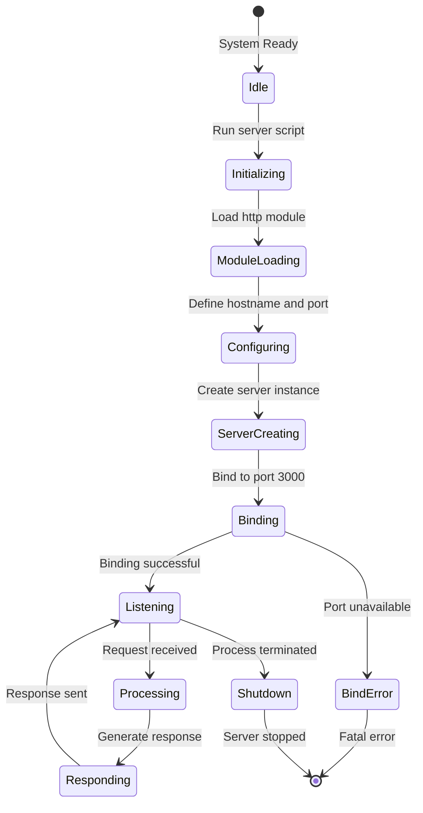

#### State Definitions

| State | Description | Duration |
|-------|-------------|----------|
| Idle | Before server execution | Until command issued |
| Initializing | Node.js process starting | < 100ms |
| ModuleLoading | Loading http built-in module | < 10ms |
| Configuring | Setting hostname/port values | Immediate |
| ServerCreating | Creating HTTP server instance | < 10ms |
| Binding | Attaching to localhost:3000 | < 100ms |
| Listening | Awaiting incoming requests | Continuous |
| Processing | Handling incoming request | < 1ms |
| Responding | Generating/sending response | < 5ms |
| Shutdown | Process termination | < 100ms |
| BindError | Port binding failure | Terminal |

### 4.4.2 Data Persistence Points

This system is **stateless by design**. The following table documents the absence of data persistence:

| Persistence Type | Implementation | Rationale |
|------------------|----------------|-----------|
| Database Storage | None | Out of scope (Section 1.3.2) |
| File System Storage | None | Static files only, no writes |
| Session Management | None | No user sessions |
| Cache Storage | None | No caching layer |
| Memory State | Minimal | Only runtime configuration |

### 4.4.3 Transaction Boundaries

Given the stateless nature of the system, transaction boundaries are simple:

| Transaction | Scope | Atomicity |
|-------------|-------|-----------|
| HTTP Request/Response | Single request cycle | Complete (all-or-nothing response) |
| Server Startup | Initialization sequence | Complete (fail-fast on error) |

## 4.5 Error Handling Flowcharts

### 4.5.1 Error Handling Design Philosophy

Error handling in this repository is **explicitly minimal** by design. As stated in Section 1.3.2 (Out-of-Scope Elements), comprehensive error handling is excluded to maintain the system's role as a predictable test fixture.

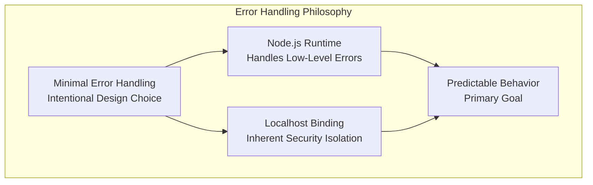

### 4.5.2 Implicit Error States

Although explicit error handling is not implemented in `server.js`, the following error states are handled implicitly by Node.js runtime:

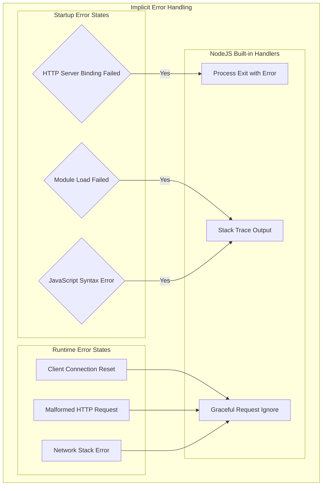

### 4.5.3 Error State Catalog

| Error Category | Trigger | Handler | Recovery |
|----------------|---------|---------|----------|
| Port Binding Failure | Port 3000 in use (A-002 violation) | Node.js runtime | Manual: Free port and restart |
| Module Not Found | Node.js installation issue | Node.js runtime | Reinstall Node.js |
| Syntax Error | Code modification | Node.js parser | Restore original code |
| Network Error | OS-level network issue | Node.js runtime | OS troubleshooting |
| Client Disconnect | Client-side abort | http module | Automatic cleanup |

### 4.5.4 Recovery Procedures

Given the minimal error handling, recovery procedures focus on environmental corrections:

| Issue | Detection | Recovery Action |
|-------|-----------|-----------------|
| Port 3000 occupied | Server fails to start | Terminate conflicting process |
| Node.js not installed | Command not found | Install Node.js runtime |
| Repository corrupted | Parse/syntax errors | Re-clone repository |
| npm lockfile mismatch | npm install warning | Delete lock, reinstall |

## 4.6 Detailed Process Flows

### 4.6.1 Request Handler Internal Flow

This sequence diagram details the internal processing within the request handler callback defined in `server.js`.

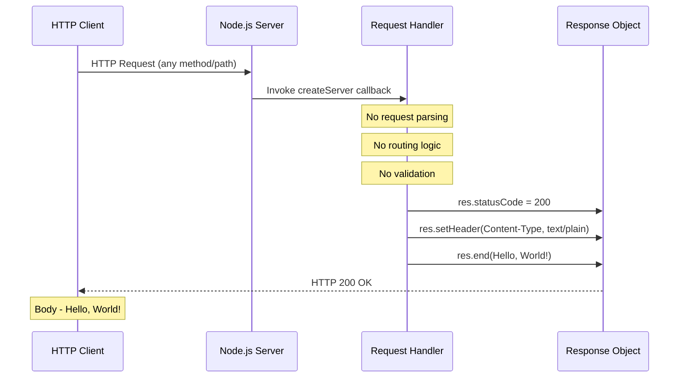

### 4.6.2 Development Environment Setup Flow

This detailed flow documents the complete developer setup process from initial clone to verified operation.

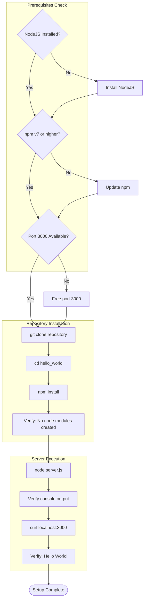

### 4.6.3 Package Configuration Validation Flow

This flow documents the validation process for package configuration files.

```mermaid
flowchart TB
    subgraph PackageValidation["Package Configuration Validation"]
        subgraph PkgJSONCheck["package.json Validation"]
            ReadPkgJSON["Read package.json"]
            ValidateName["name: hello_world"]
            ValidateVersion["version: 1.0.0"]
            ValidateLicense["license: MIT"]
            CheckDeps["dependencies: undefined"]
            CheckDevDeps["devDependencies: undefined"]
        end
        
        subgraph LockFileCheck["package-lock.json Validation"]
            ReadLockFile["Read package-lock.json"]
            ValidateLockVer["lockfileVersion: 3"]
            ValidatePackages["packages: root only"]
        end
        
        subgraph Result["Validation Result"]
            AllValid{"All Checks Passed"}
            ValidationSuccess["Configuration Valid"]
            ValidationFail["Configuration Invalid"]
        end
    end
    
    ReadPkgJSON --> ValidateName
    ValidateName --> ValidateVersion
    ValidateVersion --> ValidateLicense
    ValidateLicense --> CheckDeps
    CheckDeps --> CheckDevDeps
    CheckDevDeps --> ReadLockFile
    ReadLockFile --> ValidateLockVer
    ValidateLockVer --> ValidatePackages
    ValidatePackages --> AllValid
    AllValid -->|Yes| ValidationSuccess
    AllValid -->|No| ValidationFail
```

## 4.7 Business Rules and Validation

### 4.7.1 Authorization Checkpoints

This system has **no authorization checkpoints** by design. The localhost-only binding (127.0.0.1) serves as the sole access control mechanism.

| Checkpoint Type | Implementation | Rationale |
|-----------------|----------------|-----------|
| Authentication | None | Out of scope (test fixture) |
| Authorization | None | All requests permitted |
| Network Access Control | Localhost binding only | Inherent isolation |
| Rate Limiting | None | Not required for testing |

### 4.7.2 Business Rule Summary

| Rule ID | Description | Enforcement Point | Requirement |
|---------|-------------|-------------------|-------------|
| BR-001 | All requests return identical response | Request handler | F-001-RQ-003 |
| BR-002 | Response is always HTTP 200 | Response generation | F-001-RQ-003 |
| BR-003 | Content-Type is always text/plain | Response headers | F-001-RQ-003 |
| BR-004 | Zero external dependencies | npm install | F-002-RQ-002 |
| BR-005 | Localhost-only network binding | Server initialization | F-001-RQ-001 |
| BR-006 | No modifications to repository | Documentation | C-003 |

### 4.7.3 Regulatory Compliance

No regulatory compliance requirements apply to this test fixture. The project operates exclusively in a local development context with no:

- Personal data handling
- Financial transactions
- Healthcare information
- Cross-border data transfer
- Production deployment

## 4.8 Timing and SLA Considerations

### 4.8.1 Performance SLA Summary

| Operation | Target SLA | Measurement Point | Requirement Ref |
|-----------|-----------|-------------------|-----------------|
| Server binding | < 1 second | From execution to listening | F-001-RQ-001 |
| Request processing initiation | < 1ms | From receive to handler | F-001-RQ-002 |
| Response generation | < 5ms | Handler execution | F-001-RQ-003 |
| End-to-end response | < 10ms | Request to response complete | Section 2.4.2 |
| npm install | < 1 second | Command to completion | F-002-RQ-002 |
| Startup notification | < 100ms | Server start to console log | F-001-RQ-004 |

### 4.8.2 Timing Diagram

```mermaid
gantt
    title Server Operation Timing
    dateFormat x
    axisFormat %L

    section Startup
    Module Loading :0, 1000
    Configuration :1000, 2000
    Server Creation :2000, 3000
    Port Binding :3000, 4000
    Console Log :4000, 5000

    section Request
    Receive Request :5000, 6000
    Process Request :6000, 7000
    Send Response :7000, 8000
```

## 4.9 System Boundaries

### 4.9.1 Boundary Diagram

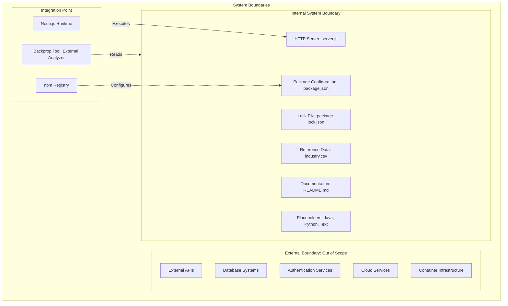

### 4.9.2 User Touchpoints

| Touchpoint | Actor | Interaction | Direction |
|------------|-------|-------------|-----------|
| Command Line | Developer | Execute node server.js | Input |
| Console Output | Developer | View startup message | Output |
| HTTP Request | Client | Send request to localhost:3000 | Input |
| HTTP Response | Client | Receive "Hello, World!" | Output |
| Repository Files | Backprop Tool | Read/parse all files | Input |

---

#### References

#### Repository Files Examined

- `server.js` - HTTP server implementation with request handler, response generation, and startup notification logic
- `package.json` - npm package metadata including name, version, author, license, and intentionally failing test script
- `package-lock.json` - npm lockfile version 3 format with zero external dependencies
- `README.md` - Project identification and "Do not touch!" warning documentation
- `industry.csv` - Reference data file containing 44 industry category entries
- `LoginTest.java` - Non-compilable Java placeholder for multi-language parser testing
- `test.py.txt` - Empty Python placeholder file
- `test.txt.txt` - Empty text placeholder file

#### Technical Specification Sections Referenced

- Section 1.2 System Overview - High-level architecture, components, and success criteria
- Section 1.3 Scope - In-scope elements, out-of-scope exclusions, and system boundaries
- Section 2.2 Functional Requirements - Detailed requirements for all five features (F-001 through F-005)
- Section 2.3 Feature Relationships - Dependency map and integration points
- Section 2.4 Implementation Considerations - Technical constraints, performance requirements, and security implications
- Section 2.5 Traceability Matrix - Feature-to-requirement mapping and KPI alignment
- Section 2.6 Assumptions and Constraints - Runtime assumptions (A-001 through A-005) and project constraints (C-001 through C-005)
- Section 3.1 Overview - Technology stack overview and architecture diagram
- Section 3.7 Development & Deployment - Build system, npm scripts, and deployment architecture

# 5. System Architecture

This section provides comprehensive architectural documentation for the Hello World Node.js test project—a deliberately minimal test fixture designed for Backprop tool integration testing. The architecture documented here reflects the system's core design philosophy: **intentional minimalism** to ensure reproducibility, isolation, and predictable behavior during tool validation.

> **Architectural Context**: This system is explicitly designed as a test fixture, not a production application. The architectural decisions documented below prioritize simplicity and predictability over enterprise patterns, as the primary purpose is to provide a clean, parseable codebase for validating Backprop's code analysis capabilities.

---

## 5.1 High-Level Architecture

### 5.1.1 System Overview

#### Architecture Style and Rationale

The system implements a **Monolithic Single-File Architecture** with the following characteristics:

| Architecture Aspect | Implementation | Rationale |
|---------------------|----------------|-----------|
| **Style** | Monolithic, single-file | Simplifies analysis for Backprop tool testing |
| **Pattern** | Single-responsibility implementation | Ensures predictable, deterministic behavior |
| **Coupling** | Zero external dependencies | Eliminates third-party version conflicts |
| **Cohesion** | All server logic in one file | Reduces complexity for testing scenarios |

The architecture deliberately avoids separation of concerns, layered architecture, or microservices patterns. This is not a limitation but a deliberate choice—the system's value lies in its minimal, predictable nature that provides a clean test surface for tool integration validation.

#### Key Architectural Principles

The following principles govern all architectural decisions:

1. **Minimal Viable Test Surface**: Only implement what is necessary for Backprop tool validation
2. **Zero External Dependencies** (Constraint C-001): Ensures reproducibility and eliminates supply chain risks
3. **Localhost-Only Isolation** (Constraint C-002): Prevents external network access during testing
4. **Single-File Implementation** (Constraint C-004): Simplifies code analysis for tool testing
5. **Stateless By Design**: No persistence, caching, or session management
6. **Deterministic Behavior**: All requests receive identical responses regardless of input

#### System Boundaries and Major Interfaces

```mermaid
flowchart TB
    subgraph ExternalActors["External Actors"]
        Developer["Developer"]
        HTTPClient["HTTP Client"]
        BackpropTool["Backprop Tool"]
    end
    
    subgraph SystemBoundary["Hello World Test Fixture"]
        subgraph CoreSystem["Core System"]
            HTTPServer["HTTP Server: server.js"]
        end
        
        subgraph Configuration["Package Configuration"]
            PackageJSON["package.json"]
            LockFile["package-lock.json"]
        end
        
        subgraph StaticAssets["Static Assets"]
            RefData["industry.csv"]
            Documentation["README.md"]
        end
        
        subgraph Placeholders["Test Placeholders"]
            JavaStub["LoginTest.java"]
            PyStub["test.py.txt"]
            TxtStub["test.txt.txt"]
        end
    end
    
    subgraph RuntimeEnvironment["Runtime Environment"]
        NodeJS["Node.js Runtime"]
        NPMRegistry["npm Registry"]
    end
    
    Developer -->|"node server.js"| HTTPServer
    HTTPClient -->|"HTTP Request"| HTTPServer
    HTTPServer -->|"Hello World"| HTTPClient
    BackpropTool -.->|"Read and Parse"| PackageJSON
    BackpropTool -.->|"Read and Parse"| RefData
    NodeJS -->|"Executes"| HTTPServer
    NPMRegistry -.->|"Configures"| PackageJSON
```

### 5.1.2 Core Components Table

| Component Name | Primary Responsibility | Key Dependencies | Integration Points | Critical Considerations |
|----------------|------------------------|------------------|-------------------|------------------------|
| **HTTP Server** (`server.js`) | Handle all HTTP requests and return static "Hello, World!" response | Node.js built-in `http` module | HTTP clients, Backprop analyzer | Binds to 127.0.0.1:3000 only; no routing logic |
| **Package Configuration** (`package.json`) | Define npm package metadata and scripts | None | npm CLI, Node.js | Contains intentionally failing test script |
| **Dependency Lock** (`package-lock.json`) | Ensure deterministic installs | npm v7+/v9 | npm install command | lockfileVersion 3 format |
| **Reference Data** (`industry.csv`) | Provide static industry category dataset | None | Backprop parser | 44 entries for validation testing |
| **Documentation** (`README.md`) | Project identification and warnings | None | Developers | "Do not touch!" maintenance policy |
| **Java Placeholder** (`LoginTest.java`) | Multi-language parser testing | None (non-compilable) | Backprop Java parser | Intentionally incomplete |
| **Empty Placeholders** (`test.py.txt`, `test.txt.txt`) | Future test expansion | None | File system | Zero bytes each |

### 5.1.3 Data Flow Description

#### Primary Data Flows

The system implements an extremely simple data flow pattern with no transformation, validation, or routing logic:

**Inbound Flow (HTTP Request)**:
1. HTTP client initiates connection to `127.0.0.1:3000`
2. Node.js `http` module accepts the connection
3. Request callback receives request object (method, path, headers ignored)
4. No validation, authentication, or routing performed
5. Request processing completes immediately

**Outbound Flow (HTTP Response)**:
1. Response object created with status code 200
2. Content-Type header set to `text/plain`
3. Response body set to `Hello, World!\n`
4. Response sent to client
5. Server returns to listening state

**Tool Integration Flow (Read-Only)**:
1. Backprop tool accesses repository via file system
2. All source files parsed for code analysis
3. No data modification occurs
4. Analysis results generated externally

#### Data Transformation Points

| Stage | Transformation | Details |
|-------|---------------|---------|
| Request Reception | None | All request data ignored |
| Response Generation | String to Buffer | `Hello, World!\n` converted for HTTP |
| File Parsing | Source to AST | Performed externally by Backprop |

#### Data Stores and Caches

This system is **stateless by design**. The following table documents the absence of persistence:

| Persistence Type | Implementation | Rationale |
|------------------|----------------|-----------|
| Database Storage | None | Out of scope—test fixture only |
| File System Storage | None | Static files only, no writes |
| Session Management | None | No user sessions |
| Cache Storage | None | No caching layer |
| Memory State | Minimal | Only runtime configuration (hostname, port) |

### 5.1.4 External Integration Points

| System Name | Integration Type | Data Exchange Pattern | Protocol/Format | SLA Requirements |
|-------------|-----------------|----------------------|-----------------|------------------|
| **Backprop Tool** | Code Analysis | Read-only file access | File System I/O | 100% parse success rate |
| **Node.js Runtime** | Execution Environment | Process lifecycle | JavaScript/V8 | < 1 second startup |
| **npm Registry** | Configuration Source | Metadata resolution | HTTP/JSON | < 1 second install |
| **HTTP Client** | Request/Response | Synchronous request-response | HTTP/1.1 | < 10ms response time |

---

## 5.2 Component Details

### 5.2.1 HTTP Server Component

#### Purpose and Responsibilities

The HTTP server (`server.js`) is the sole functional component of the system, responsible for:

- Binding to localhost network interface on port 3000
- Accepting incoming HTTP connections (all methods, all paths)
- Generating and returning static "Hello, World!" responses
- Logging startup notification to console

#### Technologies and Frameworks

| Technology | Purpose | Version |
|------------|---------|---------|
| Node.js | Runtime environment | npm v7+/v9 compatible |
| `http` module | HTTP server implementation | Node.js built-in |
| CommonJS | Module system | `require()` syntax |

#### Key Interfaces and APIs

**Exposed Interface**:
| Endpoint | Method | Response Code | Content-Type | Response Body |
|----------|--------|---------------|--------------|---------------|
| `/*` (all paths) | Any | 200 | text/plain | `Hello, World!\n` |

**Internal Interfaces**:
- `http.createServer(callback)`: Server factory with request handler
- `server.listen(port, hostname, callback)`: Port binding with notification

#### Data Persistence Requirements

None. The component is entirely stateless with no persistence of any kind.

#### Scaling Considerations

| Consideration | Assessment |
|---------------|------------|
| Horizontal Scaling | Not applicable—single-instance test server |
| Vertical Scaling | Not applicable—minimal resource requirements |
| Load Handling | Not designed—no concurrent request optimization |
| Connection Pooling | Not implemented—handled by Node.js runtime |

### 5.2.2 Package Configuration Component

#### Purpose and Responsibilities

The package configuration (`package.json` and `package-lock.json`) provides:

- npm package metadata (name, version, author, license)
- Script definitions for npm commands
- Dependency declarations (intentionally empty)
- Lockfile for deterministic installations

#### Key Configurations

| Field | Value | Purpose |
|-------|-------|---------|
| `name` | "hello_world" | Package identifier |
| `version` | "1.0.0" | Semantic version |
| `main` | "index.js" | Entry point (intentionally absent) |
| `test` script | `exit 1` | Intentionally failing test (Constraint C-005) |
| `license` | MIT | Open source licensing |

#### Critical Design Decisions

1. **Zero Dependencies**: No `dependencies` or `devDependencies` fields exist
2. **Missing Entry Point**: `index.js` is declared but intentionally absent for tool testing
3. **Failing Test Script**: Validates tool handling of test failures
4. **lockfileVersion 3**: Requires npm v7+ for compatibility

### 5.2.3 Reference Data Component

#### Purpose and Responsibilities

The reference data file (`industry.csv`) provides:

- Static dataset for parser validation testing
- Structured data in standard CSV format
- Industry category enumeration (44 entries)

#### Data Structure

| Column | Type | Sample Values |
|--------|------|---------------|
| Industry | String | "Accounting/Finance", "Agriculture", ... "Other" |

### 5.2.4 Component Interaction Diagram

```mermaid
flowchart TB
    subgraph ClientLayer[Client Layer]
        HTTPClient[HTTP Client]
    end
    
    subgraph ApplicationLayer[Application Layer]
        HTTPServer[HTTP Server - server.js]
    end
    
    subgraph ConfigurationLayer[Configuration Layer]
        PackageJSON[package.json]
        LockFile[package-lock.json]
    end
    
    subgraph DataLayer[Data Layer]
        IndustryCSV[industry.csv]
    end
    
    subgraph RuntimeLayer[Runtime Layer]
        NodeJS[Node.js Runtime]
        HTTPModule[http Module]
    end
    
    HTTPClient -->|HTTP Request| HTTPServer
    HTTPServer -->|Response Hello World| HTTPClient
    NodeJS -->|Executes| HTTPServer
    HTTPModule -->|Provides API| HTTPServer
    PackageJSON -->|Configures| NodeJS
    LockFile -->|Locks versions| PackageJSON
```

### 5.2.5 Server State Transition Diagram

```mermaid
stateDiagram-v2
    [*] --> Idle: System Ready
    Idle --> Initializing: Start server
    Initializing --> ModuleLoading: Load http module
    ModuleLoading --> Configuring: Define hostname and port
    Configuring --> ServerCreating: Create HTTP server
    ServerCreating --> Binding: Bind to port
    Binding --> Listening: Port bound successfully
    Binding --> BindError: Port 3000 unavailable
    BindError --> [*]: Fatal exit
    Listening --> Processing: Request received
    Processing --> Responding: Generate response
    Responding --> Listening: Response sent
    Listening --> Shutdown: SIGTERM or SIGINT
    Shutdown --> [*]: Server stopped
```

#### State Definitions

| State | Description | Duration | Exit Condition |
|-------|-------------|----------|----------------|
| Idle | Before server execution | Until command issued | `node server.js` executed |
| Initializing | Node.js process starting | < 100ms | Process initialized |
| ModuleLoading | Loading http built-in module | < 10ms | Module loaded |
| Configuring | Setting hostname/port values | Immediate | Variables set |
| ServerCreating | Creating HTTP server instance | < 10ms | Server created |
| Binding | Attaching to localhost:3000 | < 100ms | Port bound or error |
| Listening | Awaiting incoming requests | Continuous | Request or termination |
| Processing | Handling incoming request | < 1ms | Handler complete |
| Responding | Generating/sending response | < 5ms | Response sent |
| Shutdown | Process termination | < 100ms | Process exit |
| BindError | Port binding failure | Terminal | Process exit |

### 5.2.6 Request/Response Sequence Diagram

```mermaid
sequenceDiagram
    participant Client as HTTP Client
    participant Server as NodeJS HTTP Server
    participant HTTP as http Module
    participant Console as Console Output

    Note over Server: Startup Sequence
    Server->>HTTP: require http
    HTTP-->>Server: Module loaded
    Server->>Server: Define hostname localhost
    Server->>Server: Define port 3000
    Server->>HTTP: createServer with callback
    HTTP-->>Server: Server instance
    Server->>HTTP: listen on port 3000 at localhost
    HTTP-->>Server: Binding complete
    Server->>Console: log Server running

    Note over Client,Server: Request Response Cycle
    Client->>Server: HTTP Request any method and path
    Server->>Server: Set statusCode 200
    Server->>Server: Set Content Type header
    Server->>Server: Set body Hello World
    Server-->>Client: HTTP 200 Response

    Note over Client,Server: Shutdown Sequence
    Client->>Server: SIGTERM signal
    Server->>HTTP: Close connections
    Server->>Console: silent exit
```

---

## 5.3 Technical Decisions

### 5.3.1 Architecture Style Decisions

#### Decision Record: Monolithic Single-File Architecture

| Aspect | Decision | Alternatives Considered | Rationale |
|--------|----------|------------------------|-----------|
| **Architecture Pattern** | Monolithic single-file | Layered, MVC, Microservices | Test fixture requires minimal complexity |
| **Module Organization** | All logic in `server.js` | Separate modules for config, handlers | Single-file simplifies Backprop analysis |
| **Separation of Concerns** | Not implemented | Controller/Service/Repository | Deliberate minimalism for predictability |

**Trade-offs Accepted**:
- ✓ Maximum simplicity for tool testing
- ✓ Predictable, deterministic behavior
- ✓ Zero configuration complexity
- ✗ Not suitable for production scaling
- ✗ No code reusability
- ✗ Limited extensibility

### 5.3.2 Communication Pattern Choices

| Pattern Aspect | Choice | Alternative | Selection Rationale |
|----------------|--------|-------------|---------------------|
| **Protocol** | HTTP/1.1 | HTTP/2, WebSocket | Simplest protocol for test scenarios |
| **Request Handling** | Synchronous | Async/streaming | Single response, no streaming needed |
| **Routing** | None (all paths same) | Express routing | Predictable behavior requirement |
| **Content Type** | text/plain | JSON, HTML | Minimal response format |

### 5.3.3 Data Storage Solution Rationale

| Decision Area | Choice | Rationale |
|---------------|--------|-----------|
| **Database** | None | No persistence required for test fixture |
| **File Storage** | Read-only static files | Reference data for parser testing |
| **Session Storage** | None | No user sessions |
| **Cache** | None | Response is static; no caching benefit |

**Justification**: As a test fixture, the system's primary purpose is to provide a parseable codebase for Backprop tool validation. Persistence mechanisms would add unnecessary complexity and potential failure points without providing testing value.

### 5.3.4 Security Mechanism Selection

| Security Aspect | Decision | Risk Level | Justification |
|-----------------|----------|------------|---------------|
| **Network Binding** | Localhost only (127.0.0.1) | Low | Prevents external network access |
| **Authentication** | None | N/A | Test fixture, no user access control |
| **Authorization** | None | N/A | All requests treated equally |
| **Input Validation** | None | Low | Localhost isolation mitigates risk |
| **Dependency Security** | Zero dependencies | Minimal | Eliminates supply chain vulnerabilities |

**Security by Design**: The architecture achieves security through constraint rather than implementation. By binding exclusively to localhost and maintaining zero external dependencies, the system eliminates most attack vectors without requiring explicit security mechanisms.

### 5.3.5 Technology Decision Tree

```mermaid
flowchart TB
    Start["Project Requirements"]
    
    Start --> Q1{"Production Application?"}
    Q1 -->|No| TestFixture["Test Fixture Pattern"]
    Q1 -->|Yes| Enterprise["Enterprise Stack"]
    
    TestFixture --> Q2{"Need External Dependencies?"}
    Q2 -->|No| ZeroDeps["Zero Dependencies - Constraint C-001"]
    Q2 -->|Yes| Enterprise
    
    ZeroDeps --> Q3{"Need Routing or Framework?"}
    Q3 -->|No| BuiltinHTTP["Built-in http Module"]
    Q3 -->|Yes| Express["Express.js"]
    
    BuiltinHTTP --> Q4{"Need External Access?"}
    Q4 -->|No| LocalhostOnly["Localhost Binding - Constraint C-002"]
    Q4 -->|Yes| NetworkBinding["0.0.0.0 Binding"]
    
    LocalhostOnly --> FinalArch["Single-File Monolithic Architecture"]
    
    Enterprise --> NotApplicable["Not Applicable to This Project"]
```

---

## 5.4 Cross-Cutting Concerns

### 5.4.1 Monitoring and Observability Approach

Given the system's role as a test fixture, monitoring and observability are intentionally minimal:

| Observability Aspect | Implementation | Rationale |
|---------------------|----------------|-----------|
| **Metrics Collection** | None | No production monitoring required |
| **Distributed Tracing** | None | Single-file, single-process system |
| **Health Checks** | None | Manual verification via curl |
| **Alerting** | None | Local development only |

**Observable Outputs**:
| Output | Location | Content |
|--------|----------|---------|
| Startup Notification | Console (stdout) | `Server running at http://127.0.0.1:3000/` |
| HTTP Response | Network | `Hello, World!\n` |

### 5.4.2 Logging and Tracing Strategy

| Logging Aspect | Implementation | Details |
|----------------|----------------|---------|
| **Log Framework** | None (console only) | Single `console.log()` statement |
| **Log Levels** | Not implemented | All output is informational |
| **Structured Logging** | Not implemented | Plain text output |
| **Log Aggregation** | Not applicable | Local execution only |

**Log Output Catalog**:
| Event | Log Message | Trigger |
|-------|-------------|---------|
| Server Ready | `Server running at http://{hostname}:{port}/` | Successful port binding |

### 5.4.3 Error Handling Patterns

#### Error Handling Philosophy

Error handling is **explicitly minimal by design**. The Node.js runtime handles low-level errors, and localhost isolation inherently reduces error scenarios.

| Error Category | Handler | Recovery Procedure |
|----------------|---------|-------------------|
| Port Binding Failure | Node.js runtime | Free port 3000 and restart |
| Module Not Found | Node.js runtime | Reinstall Node.js |
| Syntax Error | Node.js parser | Restore original `server.js` |
| Client Disconnect | http module | Automatic cleanup |
| Network Error | OS network stack | OS troubleshooting |

#### Error Handling Flow

```mermaid
flowchart TB
    subgraph ErrorDetection["Error Detection"]
        StartupError["Startup Error: Port binding, module load"]
        RuntimeError["Runtime Error: Client disconnect, network"]
    end
    
    subgraph ErrorHandling["Error Handling"]
        NodeJSHandler["NodeJS Runtime: Default Handler"]
        HTTPModuleHandler["http Module: Graceful Handling"]
    end
    
    subgraph ErrorOutcome["Error Outcome"]
        ProcessExit["Process Exit: with Error Code"]
        SilentRecovery["Silent Recovery: Continue Listening"]
    end
    
    StartupError --> NodeJSHandler
    RuntimeError --> HTTPModuleHandler
    NodeJSHandler --> ProcessExit
    HTTPModuleHandler --> SilentRecovery
```

#### Error State Catalog

| Error State | Trigger Condition | System Behavior | Manual Resolution |
|-------------|-------------------|-----------------|-------------------|
| BindError | Port 3000 in use | Process exits with error | `lsof -i :3000`, kill process, restart |
| ModuleError | Node.js corruption | Stack trace output | Reinstall Node.js |
| SyntaxError | Code modification | Parse error output | Restore original code |
| ECONNRESET | Client aborts connection | Connection closed silently | None required |

### 5.4.4 Authentication and Authorization Framework

| Security Aspect | Implementation | Rationale |
|-----------------|----------------|-----------|
| **Authentication** | None | Test fixture—no user identity |
| **Authorization** | None | All requests treated equally |
| **Session Management** | None | Stateless by design |
| **Token Handling** | None | No authentication required |

**Security Profile Summary**:
The system achieves security through architectural constraints rather than explicit mechanisms:
- **Network Isolation**: Localhost-only binding prevents external access
- **Zero Dependencies**: Eliminates supply chain vulnerabilities
- **Static Response**: No dynamic content injection risks
- **Read-Only Integration**: Backprop tool access is non-destructive

### 5.4.5 Performance Requirements and SLAs

| Metric | Target | Measurement Method |
|--------|--------|-------------------|
| Server Response Time | < 10ms | `curl` with timing |
| Server Binding Time | < 1 second | Startup observation |
| Parse Success Rate | 100% | Backprop tool output |
| npm Install Time | < 1 second | Command timing |

#### Performance Constraints

| Constraint | Value | Rationale |
|------------|-------|-----------|
| Max Concurrent Connections | OS default | No tuning implemented |
| Request Timeout | None configured | All responses immediate |
| Memory Limit | Node.js default | Minimal memory footprint |
| CPU Utilization | Negligible | Static response generation |

### 5.4.6 Disaster Recovery Procedures

Given the system's nature as a local test fixture with no persistence, disaster recovery is straightforward:

| Scenario | Recovery Procedure | RTO |
|----------|-------------------|-----|
| Repository Corruption | Re-clone from source | < 1 minute |
| Node.js Failure | Reinstall Node.js runtime | < 5 minutes |
| Port Conflict | Identify and terminate conflicting process | < 1 minute |
| Configuration Corruption | Re-clone repository | < 1 minute |

**Recovery Command Sequence**:
```
1. git clone <repository>    # Re-acquire source
2. npm install               # Restore configuration
3. node server.js            # Restart server
4. curl localhost:3000       # Verify operation
```

---

## 5.5 Architectural Assumptions and Constraints

### 5.5.1 Assumptions

| ID | Assumption | Impact | Validation |
|----|------------|--------|------------|
| A-001 | Node.js runtime is available on target system | Required for server execution | `node --version` check |
| A-002 | Port 3000 is available on localhost | Required for server binding | `lsof -i :3000` check |
| A-003 | npm 7+ is available for lockfile compatibility | Required for `npm install` | `npm --version` check |
| A-004 | Repository is used solely for testing purposes | All design decisions optimized for test scenarios | Documentation review |
| A-005 | Backprop tool requires file system access | All files accessible for analysis | Permissions check |

### 5.5.2 Constraints

| ID | Constraint | Rationale | Enforcement |
|----|------------|-----------|-------------|
| C-001 | Zero external dependencies | Ensures reproducibility and isolation | package.json review |
| C-002 | Localhost-only binding | Prevents external access during testing | Hardcoded in server.js |
| C-003 | No modifications policy | Maintains test fixture integrity | "Do not touch!" documentation |
| C-004 | Single-file server implementation | Simplifies analysis for tool testing | Architecture enforcement |
| C-005 | Intentionally failing test script | Validates tool handling of test failures | npm test exits with code 1 |

---

## 5.6 Deployment Architecture

### 5.6.1 Local Development Environment

```mermaid
flowchart TB
    subgraph DevEnvironment["Developer Machine"]
        subgraph Prerequisites["Prerequisites"]
            NodeRuntime["Node.js Runtime<br>npm v7 or higher"]
            Terminal["Terminal or Shell"]
            GitClient["Git Client"]
        end
        subgraph Repository["Repository Files"]
            ServerJS["server.js"]
            PackageFiles["package.json<br>package-lock.json"]
            DataFiles["industry.csv<br>README.md"]
        end
        subgraph RunningServer["Running Server"]
            HTTPProcess["HTTP Server Process"]
            LocalPort["localhost:3000"]
        end
    end
    subgraph Verification["Verification"]
        CurlCommand["curl localhost:3000"]
        ExpectedResponse["Hello World"]
    end
    
    GitClient -->|git clone| ServerJS
    NodeRuntime -->|node server.js| HTTPProcess
    HTTPProcess -->|Binds to| LocalPort
    CurlCommand -->|HTTP GET| LocalPort
    LocalPort -->|Response| ExpectedResponse
```

### 5.6.2 Deployment Steps

| Step | Command | Expected Duration | Success Criteria |
|------|---------|-------------------|------------------|
| 1. Clone | `git clone <repository>` | Varies by network | Repository files present |
| 2. Install | `npm install` | < 1 second | No errors (zero deps) |
| 3. Execute | `node server.js` | < 1 second | Console output displayed |
| 4. Verify | `curl http://127.0.0.1:3000` | < 10ms | "Hello, World!" response |

### 5.6.3 Not Implemented

The following deployment capabilities are explicitly out of scope:

| Capability | Status | Rationale |
|------------|--------|-----------|
| Docker/Containerization | Not implemented | No container requirements |
| CI/CD Pipeline | Not configured | No automated builds needed |
| Cloud Deployment | Not supported | Localhost only by design |
| Container Registry | Not configured | No image publishing |
| Infrastructure as Code | Not implemented | No infrastructure provisioning |
| Pre-commit Hooks | Not configured | "Do not touch!" policy |

---

#### References

#### Repository Files Examined

- `server.js` - Complete HTTP server implementation using Node.js built-in http module (15 lines, CommonJS syntax)
- `package.json` - npm package configuration with zero dependencies, intentionally failing test script, MIT license
- `package-lock.json` - npm lockfile version 3 confirming zero external dependencies
- `README.md` - Project identification and "Do not touch!" maintenance policy warning
- `industry.csv` - Static reference data containing 44 industry category entries
- `LoginTest.java` - Non-compilable Java placeholder stub (package: com.blitzyTest)
- `test.py.txt` - Empty Python placeholder file (0 bytes)
- `test.txt.txt` - Empty text placeholder file (0 bytes)

#### Technical Specification Sections Referenced

- Section 1.2 System Overview - High-level architecture, components, success criteria
- Section 1.3 Scope - In-scope elements, out-of-scope exclusions, system boundaries
- Section 2.4 Implementation Considerations - Technical constraints, performance requirements, security implications
- Section 2.6 Assumptions and Constraints - Runtime assumptions (A-001 through A-005), project constraints (C-001 through C-005)
- Section 3.1 Overview - Technology stack overview and architecture diagram
- Section 3.7 Development & Deployment - Build system, npm scripts, deployment architecture
- Section 3.8 Security Considerations - Security profile, security by design principles
- Section 3.9 Technology Stack Summary - Complete technology inventory, decision matrix
- Section 4.2 Core Business Processes - Server startup and request/response workflows
- Section 4.4 State Management - Server state transitions, data persistence points
- Section 4.5 Error Handling Flowcharts - Error handling philosophy, implicit error states
- Section 4.9 System Boundaries - Boundary diagram, user touchpoints

# 6. SYSTEM COMPONENTS DESIGN

## 6.1 Core Services Architecture

# 6. SYSTEM COMPONENTS DESIGN

## 6.1 Core Services Architecture

### 6.1.1 Applicability Assessment

**Core Services Architecture is not applicable for this system.**

This section documents why traditional service-oriented architecture patterns do not apply to the Hello World test fixture and provides architectural context for this intentional design decision.

#### Architectural Classification

| Assessment Criteria | Finding | Evidence |
|---------------------|---------|----------|
| Architecture Style | Monolithic Single-File | `server.js` (15 lines, single responsibility) |
| Service Count | Zero (no distinct services) | All logic contained in one file |
| Distributed Components | None | Localhost-only binding (127.0.0.1) |
| External Dependencies | Zero | `package.json` declares no dependencies |
| Inter-Service Communication | Not applicable | No services exist to communicate |

#### Design Decision Rationale

The absence of a Core Services Architecture is a **deliberate architectural decision**, not a limitation. The system's purpose as a test fixture for Backprop integration drives this design choice.

```mermaid
flowchart TB
    subgraph DecisionProcess["Architecture Decision Process"]
        Requirement["Project Requirement: Backprop Tool Test Fixture"]
        Question1{"Production Application?"}
        Question2{"Need Service Components?"}
        Question3{"Need External Dependencies?"}
        Decision["Decision: Monolithic Single-File Architecture"]
    end
    
    subgraph RejectedPatterns["Patterns Considered & Rejected"]
        Microservices["Microservices Architecture"]
        SOA["Service-Oriented Architecture"]
        Layered["Layered Architecture"]
        MVC["MVC Pattern"]
    end
    
    Requirement --> Question1
    Question1 -->|"No"| Question2
    Question1 -->|"Yes"| Microservices
    Question2 -->|"No"| Question3
    Question2 -->|"Yes"| SOA
    Question3 -->|"No"| Decision
    Question3 -->|"Yes"| Layered
    
    Microservices -.->|"Rejected"| Decision
    SOA -.->|"Rejected"| Decision
    Layered -.->|"Rejected"| Decision
    MVC -.->|"Rejected"| Decision
```

### 6.1.2 Service Components Analysis

#### Absence of Service Boundaries

Traditional service-oriented systems implement distinct service boundaries with well-defined responsibilities. This system intentionally consolidates all functionality into a single component:

| Service Component Pattern | Implementation Status | Rationale |
|---------------------------|----------------------|-----------|
| API Gateway | Not implemented | No routing, authentication, or request transformation required |
| Business Logic Service | Not applicable | Static "Hello, World!" response requires no business logic |
| Data Access Service | Not implemented | No database connectivity or persistence |
| Authentication Service | Not applicable | No user identity management required |
| Configuration Service | Not implemented | Hardcoded values ensure predictability |
| Messaging Service | Not applicable | No asynchronous communication requirements |

#### Single-Component Architecture

The entire system is implemented as a single HTTP server component:

```mermaid
flowchart TB
    subgraph ExternalActors["External Actors"]
        Developer["Developer"]
        HTTPClient["HTTP Client"]
        BackpropTool["Backprop Tool"]
    end
    
    subgraph SystemBoundary["Hello World Test Fixture"]
        subgraph SingleComponent["Single Component Architecture"]
            HTTPServer["HTTP Server"]
        end
        subgraph StaticConfiguration["Static Configuration"]
            Hostname["hostname - 127.0.0.1"]
            Port["port - 3000"]
            Response["response - Hello World"]
        end
    end
    
    subgraph RuntimeEnvironment["Node.js Runtime"]
        HTTPModule["Built-in http Module"]
    end
    
    Developer -->|"node server.js"| HTTPServer
    HTTPClient -->|"HTTP Request"| HTTPServer
    HTTPServer -->|"HTTP 200 Response"| HTTPClient
    BackpropTool -.->|"File System Read"| HTTPServer
    HTTPModule -->|"Provides API"| HTTPServer
    Hostname --> HTTPServer
    Port --> HTTPServer
    Response --> HTTPServer
```

#### Inter-Service Communication Patterns

| Pattern | Implementation | Justification |
|---------|---------------|---------------|
| Synchronous REST | Not applicable | No services exist to communicate |
| Asynchronous Messaging | Not implemented | No event-driven requirements |
| gRPC | Not implemented | No high-performance RPC needs |
| GraphQL | Not applicable | No complex data querying |
| Event Sourcing | Not implemented | No state changes to capture |

#### Service Discovery and Load Balancing

| Capability | Status | Design Rationale |
|------------|--------|------------------|
| Service Registry | Not implemented | Single-instance server has fixed address |
| DNS-Based Discovery | Not applicable | Localhost binding only |
| Client-Side Discovery | Not applicable | No multiple service instances |
| Server-Side Discovery | Not applicable | No reverse proxy or API gateway |
| Round-Robin Load Balancing | Not implemented | Single server instance |
| Least-Connection Balancing | Not applicable | No connection distribution needed |
| Health Check Endpoints | Not implemented | Manual verification via `curl` |

#### Circuit Breaker and Resilience Patterns

| Pattern | Implementation | Rationale |
|---------|---------------|-----------|
| Circuit Breaker | Not implemented | No external service dependencies to protect against |
| Retry Logic | Not implemented | Single-shot request/response model |
| Fallback Mechanisms | Not implemented | Static response never fails |
| Bulkhead Isolation | Not applicable | Single-threaded Node.js model |
| Rate Limiting | Not implemented | Test fixture, no traffic concerns |

### 6.1.3 Scalability Design Assessment

#### Horizontal and Vertical Scaling

Scaling capabilities are **explicitly documented as not applicable** for this system:

| Scaling Dimension | Assessment | Documentation Source |
|-------------------|------------|---------------------|
| Horizontal Scaling | Not applicable | Single-instance test server |
| Vertical Scaling | Not applicable | Minimal resource requirements |
| Load Handling | Not designed | No concurrent request optimization |
| Connection Pooling | Not implemented | Handled by Node.js runtime defaults |

#### Auto-Scaling Configuration

| Auto-Scaling Aspect | Status | Rationale |
|--------------------|--------|-----------|
| Container Orchestration | Not implemented | No Docker or Kubernetes support |
| Cloud Auto-Scaling Groups | Not applicable | Localhost-only deployment |
| Metric-Based Triggers | Not configured | No monitoring infrastructure |
| Predictive Scaling | Not applicable | No traffic patterns to predict |
| Scheduled Scaling | Not applicable | No time-based demand variations |

#### Resource Allocation Strategy

| Resource | Allocation | Management |
|----------|------------|------------|
| CPU | Node.js default | OS process scheduler |
| Memory | Node.js default (~50MB heap) | V8 garbage collection |
| Network | Localhost interface only | OS network stack |
| File Descriptors | OS default | Node.js runtime |

#### Performance Optimization

The system achieves performance through simplicity rather than optimization:

| Optimization Technique | Implementation | Justification |
|------------------------|----------------|---------------|
| Connection Keep-Alive | Node.js default | No custom configuration |
| Response Caching | Not applicable | Static response, no benefit |
| Request Queuing | Not implemented | Immediate processing |
| Worker Threads | Not implemented | Single-threaded sufficient |
| Cluster Mode | Not implemented | Single instance by design |

### 6.1.4 Resilience Patterns Assessment

#### Fault Tolerance Mechanisms

The system's fault tolerance relies on architectural simplicity and Node.js runtime defaults:

```mermaid
flowchart TB
    subgraph FaultDetection["Fault Detection Layer"]
        StartupFault["Startup Faults"]
        RuntimeFault["Runtime Faults"]
    end
    
    subgraph StartupFaultsGroup["Startup Error Types"]
        PortBinding["Port 3000 Already in Use"]
        ModuleLoad["http Module Load Failure"]
        SyntaxErr["JavaScript Syntax Error"]
    end
    
    subgraph RuntimeFaultsGroup["Runtime Error Types"]
        ClientDisconnect["Client Connection Reset"]
        NetworkError["Network Stack Error"]
    end
    
    subgraph FaultHandling["Fault Handling"]
        NodeJSRuntime["Node.js Default Handler"]
        HTTPModuleGraceful["http Module Graceful Handling"]
    end
    
    subgraph Outcomes["Outcomes"]
        ProcessTermination["Process Terminates with Error Code"]
        SilentRecovery["Silent Recovery - Continue Listening"]
    end
    
    StartupFault --> StartupFaultsGroup
    RuntimeFault --> RuntimeFaultsGroup
    
    PortBinding --> NodeJSRuntime
    ModuleLoad --> NodeJSRuntime
    SyntaxErr --> NodeJSRuntime
    
    ClientDisconnect --> HTTPModuleGraceful
    NetworkError --> HTTPModuleGraceful
    
    NodeJSRuntime --> ProcessTermination
    HTTPModuleGraceful --> SilentRecovery
```

#### Disaster Recovery Procedures

Recovery procedures are trivial due to the system's stateless nature:

| Disaster Scenario | Recovery Procedure | Recovery Time Objective |
|-------------------|-------------------|------------------------|
| Repository Corruption | Re-clone from source control | < 1 minute |
| Node.js Runtime Failure | Reinstall Node.js runtime | < 5 minutes |
| Port 3000 Conflict | Terminate conflicting process | < 1 minute |
| Configuration Corruption | Re-clone repository | < 1 minute |

**Recovery Command Sequence:**

| Step | Command | Purpose |
|------|---------|---------|
| 1 | `git clone <repository>` | Re-acquire source files |
| 2 | `npm install` | Restore npm configuration |
| 3 | `node server.js` | Restart HTTP server |
| 4 | `curl localhost:3000` | Verify operation |

#### Data Redundancy Approach

| Data Category | Redundancy Implementation | Recovery Source |
|---------------|--------------------------|-----------------|
| Source Code | Git repository | Remote origin |
| Configuration | `package.json` in repository | Git clone |
| Reference Data | `industry.csv` in repository | Git clone |
| Runtime State | None (stateless) | Not applicable |
| User Sessions | None | Not applicable |

#### Failover Configurations

| Failover Aspect | Implementation | Rationale |
|-----------------|---------------|-----------|
| Active-Passive | Not implemented | Single instance only |
| Active-Active | Not implemented | No distributed deployment |
| Database Failover | Not applicable | No database connectivity |
| DNS Failover | Not applicable | Localhost binding only |
| Geographic Redundancy | Not applicable | Local development only |

#### Service Degradation Policies

| Degradation Pattern | Status | Justification |
|--------------------|--------|---------------|
| Graceful Degradation | Not applicable | Static response always available |
| Feature Flags | Not implemented | Single feature only |
| Circuit Breaking | Not applicable | No external dependencies |
| Load Shedding | Not implemented | No traffic management |
| Priority Queuing | Not applicable | All requests equal |

### 6.1.5 Architectural Constraints Summary

The following documented constraints define why Core Services Architecture patterns are not applicable:

| Constraint ID | Constraint Description | Impact on Services Architecture |
|---------------|------------------------|--------------------------------|
| C-001 | Zero external dependencies | Eliminates service client libraries |
| C-002 | Localhost-only binding | Prevents distributed deployment |
| C-003 | No modifications policy | Prohibits service evolution |
| C-004 | Single-file server implementation | Excludes service decomposition |
| C-005 | Intentionally failing test script | Validates tool error handling |

### 6.1.6 Trade-offs Accepted

The architectural decision to exclude Core Services Architecture patterns results in the following trade-offs:

| Benefit Gained | Trade-off Accepted |
|---------------|-------------------|
| Maximum simplicity for tool testing | Not suitable for production scaling |
| Predictable, deterministic behavior | No code reusability across services |
| Zero configuration complexity | Limited extensibility |
| Instant startup and deployment | No distributed processing capability |
| No service coordination overhead | No fault isolation between components |

### 6.1.7 When Core Services Would Apply

For reference, Core Services Architecture would become applicable if the system evolved to include:

| Evolution Scenario | Service Architecture Implication |
|-------------------|----------------------------------|
| Multiple API endpoints | API Gateway and routing service |
| Database persistence | Data access service layer |
| User authentication | Identity service with token management |
| Background processing | Worker service with message queue |
| External API integration | Integration service with circuit breakers |
| Multi-region deployment | Service discovery and load balancing |

**Current Status**: None of these evolution scenarios are in scope for this test fixture.

#### References

#### Repository Files Examined

- `server.js` - Complete HTTP server implementation (15 lines, uses only Node.js built-in http module)
- `package.json` - npm manifest confirming zero dependencies and package configuration
- `package-lock.json` - Lockfile confirming zero external packages (lockfileVersion 3)
- `README.md` - Project identification as "test project for backprop integration. Do not touch!"

#### Technical Specification Sections Referenced

- Section 1.3 Scope - In-scope and out-of-scope elements confirming no load balancing or scaling
- Section 5.1 High-Level Architecture - Monolithic Single-File Architecture confirmation and system boundaries
- Section 5.2 Component Details - Scaling considerations explicitly marked "Not applicable"
- Section 5.3 Technical Decisions - Architecture decision record showing microservices pattern rejected
- Section 5.4 Cross-Cutting Concerns - Minimal monitoring, logging, and error handling documentation
- Section 5.5 Architectural Assumptions and Constraints - Documented constraints C-001 through C-005
- Section 5.6 Deployment Architecture - Localhost-only deployment with no cloud or container support

## 6.2 Database Design

#### SYSTEM DESIGN SPECIFICATIONS

## 6.2 Database Design

### 6.2.1 Applicability Assessment

**Database Design is not applicable to this system.**

This section documents the intentional absence of database infrastructure in the Hello World test fixture and provides the architectural rationale for this design decision.

#### Assessment Summary

| Assessment Criteria | Finding | Evidence |
|---------------------|---------|----------|
| Primary Database | Not implemented | `server.js` contains no database imports or queries |
| Secondary Database | Not implemented | `package.json` declares zero dependencies |
| Data Persistence | None required | System operates as stateless test fixture |
| Caching Layer | Not implemented | Static response eliminates caching benefit |
| ORM/Data Access | Not implemented | No data models or repository patterns |

#### Non-Applicability Confirmation

The absence of database design is explicitly confirmed across multiple system documentation sources:

| Source | Statement | Relevance |
|--------|-----------|-----------|
| Section 1.3.2 Out-of-Scope | "Database Connectivity - No persistence needed" | Explicit exclusion |
| Section 3.6 Databases & Storage | "Not implemented" for all database categories | Technical confirmation |
| Section 5.2 Component Details | "Data Persistence Requirements: None" | Architectural validation |
| Section 5.3 Technical Decisions | "Database: None - No persistence required for test fixture" | Decision record |

### 6.2.2 Architectural Rationale

#### Design Decision Record

The decision to exclude database functionality is a deliberate architectural choice driven by the system's purpose as a Backprop integration test fixture.

```mermaid
flowchart TB
    subgraph DecisionContext["Design Decision Context"]
        ProjectPurpose["Project Purpose: Backprop Tool Test Fixture"]
        Constraint1["Constraint C-001: Zero External Dependencies"]
        Constraint2["Constraint C-003: No Modifications Policy"]
    end
    
    subgraph DatabaseEvaluation["Database Requirement Evaluation"]
        Question1{"Does system require state persistence?"}
        Question2{"Does system require data queries?"}
        Question3{"Does system require session management?"}
    end
    
    subgraph DatabaseDecision["Database Decision"]
        NoDatabase["Decision: No Database Implementation"]
        StaticOnly["Alternative: Static Data File Only"]
    end
    
    ProjectPurpose --> Question1
    Question1 -->|"No"| Question2
    Question2 -->|"No"| Question3
    Question3 -->|"No"| NoDatabase
    Constraint1 --> NoDatabase
    Constraint2 --> NoDatabase
    NoDatabase --> StaticOnly
```

#### Decision Justification

| Decision Factor | Analysis | Outcome |
|----------------|----------|---------|
| Test Fixture Purpose | System provides parseable codebase for Backprop tool validation | No persistence needed |
| Zero Dependencies Constraint | Database drivers would violate architectural constraint C-001 | Database excluded |
| Complexity Minimization | Database infrastructure adds failure points without testing value | Simplified architecture |
| Predictability Requirement | Stateless design ensures deterministic behavior | No runtime data variance |

#### Trade-offs Accepted

| Benefit Gained | Trade-off Accepted |
|---------------|-------------------|
| Maximum simplicity for tool testing | No data persistence capability |
| Predictable, deterministic behavior | No query functionality |
| Zero configuration complexity | No relational data modeling |
| No database failure modes | Limited extensibility |
| No connection management overhead | No transactional support |

### 6.2.3 Data Storage Analysis

#### Schema Design: Not Applicable

Traditional database schema design elements are not implemented in this system:

| Schema Element | Status | Rationale |
|----------------|--------|-----------|
| Entity Relationships | Not applicable | No entities requiring relationship mapping |
| Data Models | Not applicable | Static response requires no modeling |
| Indexing Strategy | Not applicable | No queryable data structures |
| Partitioning Approach | Not applicable | No data volume requiring partitioning |
| Replication Configuration | Not applicable | No data requiring replication |
| Backup Architecture | Not applicable | No runtime data to backup |

#### Data Management: Not Applicable

Data management procedures are not required for this stateless system:

| Management Aspect | Status | Rationale |
|-------------------|--------|-----------|
| Migration Procedures | Not applicable | No schema evolution needed |
| Versioning Strategy | Not applicable | No data versions to track |
| Archival Policies | Not applicable | No historical data |
| Data Retrieval | Not applicable | No stored data to retrieve |
| Caching Policies | Not applicable | Static response eliminates caching benefit |

### 6.2.4 Static Data File Documentation

While the system implements no database, it does contain one static data file serving as reference data for tool validation testing.

#### Static Data Inventory

| File | Format | Purpose |
|------|--------|---------|
| `industry.csv` | Single-column CSV | Reference data for parser testing |

## industry.csv Structure

| Attribute | Value |
|-----------|-------|
| Format | Plain text CSV |
| Columns | 1 (industry name) |
| Header | "Industry" |
| Record Count | 44 entries |
| Value Range | "Accounting/Finance" through "Other" |

#### Static Data Architecture

```mermaid
flowchart TB
    subgraph DataSources["Data Sources"]
        IndustryCSV["industry.csv - 44 industry categories"]
    end
    
    subgraph DataCharacteristics["Data Characteristics"]
        ReadOnly["Read-Only Access"]
        StaticContent["Static Content"]
        NoModification["No Runtime Modification"]
    end
    
    subgraph UseCases["Use Cases"]
        ParserTest["CSV Parser Validation"]
        ToolValidation["Backprop Tool Testing"]
        ReferenceData["Industry Category Reference"]
    end
    
    IndustryCSV --> ReadOnly
    IndustryCSV --> StaticContent
    IndustryCSV --> NoModification
    
    ReadOnly --> ParserTest
    StaticContent --> ToolValidation
    NoModification --> ReferenceData
```

#### Static Data Use Cases

| Use Case | Description |
|----------|-------------|
| Test Data Source | Provides realistic sample data for tool validation |
| Reference Validation | Industry taxonomy for categorization testing |
| Parser Verification | CSV parsing capability testing |
| Multi-Format Testing | Validates tool handling of non-JavaScript files |

### 6.2.5 Data Persistence Strategy

The system implements no data persistence, relying entirely on stateless operation:

| Aspect | Implementation |
|--------|----------------|
| Runtime State | In-memory only (process lifecycle) |
| Configuration | Hardcoded values (no external config) |
| Session Management | Not applicable |
| Data Durability | None required |

#### Data Flow Architecture

```mermaid
flowchart LR
    subgraph InputLayer["Input Layer"]
        HTTPRequest["HTTP Request\n(Any Path/Method)"]
    end
    
    subgraph ProcessingLayer["Processing Layer"]
        ServerJS["server.js\nHTTP Server"]
    end
    
    subgraph OutputLayer["Output Layer"]
        HTTPResponse["HTTP Response\nHello World"]
    end
    
    subgraph DataStore["Data Storage"]
        NoDatabase["No Database\n(Intentional)"]
        StaticFile["industry.csv\n(Read-Only Reference)"]
    end
    
    HTTPRequest --> ServerJS
    ServerJS --> HTTPResponse
    ServerJS -.->|"No Connection"| NoDatabase
    StaticFile -.->|"Not Accessed by Server"| ServerJS
```

### 6.2.6 Compliance Considerations

#### Data Compliance Assessment

Compliance considerations are minimal due to the absence of data persistence:

| Compliance Area | Status | Rationale |
|-----------------|--------|-----------|
| Data Retention Rules | Not applicable | No data is stored or retained |
| Backup Policies | Not applicable | No runtime data to backup |
| Privacy Controls | Not applicable | No personal data collected |
| Audit Mechanisms | Not applicable | No data operations to audit |
| Access Controls | Not applicable | No protected data |

#### Regulatory Compliance

| Regulation | Applicability | Justification |
|------------|---------------|---------------|
| GDPR | Not applicable | No personal data processing |
| CCPA | Not applicable | No consumer data collection |
| SOX | Not applicable | No financial data |
| HIPAA | Not applicable | No health information |
| PCI-DSS | Not applicable | No payment card data |

### 6.2.7 Performance Optimization

#### Database Performance: Not Applicable

Traditional database performance optimization techniques are not applicable:

| Optimization Technique | Status | Rationale |
|------------------------|--------|-----------|
| Query Optimization | Not applicable | No database queries |
| Caching Strategy | Not applicable | Static response, no benefit |
| Connection Pooling | Not applicable | No database connections |
| Read/Write Splitting | Not applicable | No read/write operations |
| Batch Processing | Not applicable | No batch data operations |

#### System Performance Approach

Performance is achieved through architectural simplicity rather than database optimization:

| Performance Aspect | Implementation |
|--------------------|----------------|
| Response Latency | < 1ms (static string return) |
| Memory Footprint | Minimal (~50MB Node.js default heap) |
| Startup Time | < 100ms (no database initialization) |
| Request Handling | Synchronous, immediate response |

### 6.2.8 Recovery and Redundancy

#### Data Recovery Procedures

| Data Category | Recovery Source | Recovery Time |
|---------------|-----------------|---------------|
| Source Code | Git repository | < 1 minute |
| Static Data (`industry.csv`) | Git repository | < 1 minute |
| Runtime State | None (stateless) | Not applicable |
| Configuration | Git repository | < 1 minute |

#### Redundancy Approach

| Data Category | Redundancy Implementation |
|---------------|---------------------------|
| Source Code | Git version control |
| Reference Data | Repository versioning |
| Runtime State | None (intentionally stateless) |
| User Sessions | None (no sessions implemented) |

### 6.2.9 When Database Design Would Apply

For reference, Database Design would become applicable if the system evolved to include:

| Evolution Scenario | Database Implication |
|-------------------|----------------------|
| User account management | User entity schema, authentication tables |
| Session persistence | Session storage, token management |
| Dynamic content | Content management database |
| Analytics tracking | Event logging, metrics storage |
| API request logging | Request/response persistence |
| Configuration management | External configuration storage |

**Current Status**: None of these evolution scenarios are in scope for this test fixture.

### 6.2.10 Architectural Constraints Impact

The following documented constraints eliminate database design requirements:

| Constraint ID | Constraint Description | Impact on Database Design |
|---------------|------------------------|---------------------------|
| C-001 | Zero external dependencies | Eliminates database client libraries (MySQL, PostgreSQL, MongoDB drivers) |
| C-002 | Localhost-only binding | Prevents remote database connections |
| C-003 | No modifications policy | Prohibits database schema evolution |
| C-004 | Single-file server implementation | Excludes data access layers and repositories |

### 6.2.11 Summary

| Aspect | Status |
|--------|--------|
| Database Implementation | Not applicable |
| Primary Rationale | Test fixture purpose, zero dependencies constraint |
| Static Data | Single CSV file (`industry.csv`) with 44 industry categories |
| Data Persistence | None - intentionally stateless |
| Future Applicability | Would apply if system evolved to require persistence |

---

#### References

#### Repository Files Examined

- `server.js` - Complete HTTP server implementation confirming no database imports or queries (15 lines, uses only Node.js built-in `http` module)
- `package.json` - Package manifest confirming zero dependencies (no database driver packages)
- `package-lock.json` - Lockfile confirming zero external packages
- `industry.csv` - Static reference data file (44 industry categories, not database-connected)

#### Technical Specification Sections Referenced

- Section 1.3 Scope - Database connectivity explicitly listed as out-of-scope
- Section 3.6 Databases & Storage - "Not implemented" status for all database categories
- Section 5.2 Component Details - Data Persistence Requirements documented as "None"
- Section 5.3 Technical Decisions - Database decision rationale: "No persistence required for test fixture"
- Section 6.1 Core Services Architecture - Confirms no Data Access Service layer implemented

## 6.3 Integration Architecture

### 6.3.1 Applicability Assessment

**Integration Architecture is not applicable for this system.**

This section documents why traditional integration architecture patterns—including API design, message processing, and external system connectivity—do not apply to the Hello World test fixture and provides architectural context for this intentional design decision.

#### 6.3.1.1 Assessment Summary

| Assessment Criteria | Finding | Evidence Source |
|---------------------|---------|-----------------|
| External API Dependencies | None | `package.json` - zero dependencies declared |
| Message Queue Systems | None | No messaging infrastructure implemented |
| Third-Party Service Integrations | None | Section 3.5 - explicit exclusion |
| API Gateway Requirements | None | Single endpoint, no routing required |
| Authentication/Authorization | None | Localhost-only, no user management |

#### 6.3.1.2 Design Decision Rationale

The absence of Integration Architecture is a **deliberate architectural decision** driven by the system's purpose as a test fixture for Backprop tool validation. The design philosophy prioritizes:

1. **Minimal Viable Test Surface**: Only functionality necessary for Backprop tool validation is implemented
2. **Zero External Dependencies** (Constraint C-001): Eliminates service client libraries and integration complexity
3. **Localhost-Only Isolation** (Constraint C-002): Prevents external network access during testing
4. **Single-File Implementation** (Constraint C-004): Excludes service decomposition and integration patterns
5. **Deterministic Behavior**: All requests receive identical responses regardless of input

```mermaid
flowchart TB
    subgraph DecisionAnalysis ["Integration Architecture Decision Analysis"]
        Requirement["Project Requirement: Backprop Tool Test Fixture"]
        Q1{"Requires External API Calls?"}
        Q2{"Requires Message Processing?"}
        Q3{"Requires Third-Party Services?"}
        Q4{"Requires Database Connectivity?"}
        Decision["Decision: Integration Architecture Not Applicable"]
    end
    
    subgraph RejectedPatterns ["Integration Patterns Considered and Rejected"]
        RESTful["RESTful API Gateway"]
        MessageQueues["Message Queue Architecture"]
        ServiceMesh["Service Mesh Integration"]
        EventDriven["Event-Driven Architecture"]
    end
    
    Requirement --> Q1
    Q1 -->|No| Q2
    Q2 -->|No| Q3
    Q3 -->|No| Q4
    Q4 -->|No| Decision
    
    RESTful -.->|Rejected| Decision
    MessageQueues -.->|Rejected| Decision
    ServiceMesh -.->|Rejected| Decision
    EventDriven -.->|Rejected| Decision
```

---

### 6.3.2 API Design Assessment

#### 6.3.2.1 Protocol Specifications

The system implements a minimal HTTP server with no formal API design:

| Protocol Aspect | Implementation | Integration Implication |
|-----------------|----------------|------------------------|
| Protocol | HTTP/1.1 | Node.js built-in `http` module defaults |
| Transport | TCP/IP | Localhost binding only (127.0.0.1) |
| Port | 3000 | Hardcoded, non-configurable |
| TLS/SSL | Not implemented | Localhost testing only |

#### 6.3.2.2 API Design Elements Status

| API Design Element | Implementation Status | Rationale |
|-------------------|----------------------|-----------|
| URL Routing | **Not Implemented** | All paths return identical response |
| Request Validation | **Not Implemented** | All request data ignored |
| Response Formatting | Plain text only | Static "Hello, World!" response |
| Content Negotiation | **Not Implemented** | Fixed Content-Type: text/plain |
| CORS Configuration | **Not Implemented** | Localhost binding, no cross-origin |
| API Versioning | **Not Applicable** | Single static response |

#### 6.3.2.3 Authentication and Authorization Framework

| Security Component | Status | Evidence |
|-------------------|--------|----------|
| Authentication Methods | **Not Implemented** | No identity management required for test fixture |
| Authorization Framework | **Not Implemented** | No resource access control |
| API Keys | **Not Implemented** | No client identification |
| OAuth/OIDC | **Not Implemented** | No delegated authentication |
| JWT Tokens | **Not Implemented** | No session management |
| Rate Limiting | **Not Implemented** | Test fixture, no traffic concerns |

```mermaid
flowchart LR
    subgraph CurrentState["Current Implementation"]
        Client["HTTP Client"]
        Server["HTTP Server - 127.0.0.1:3000"]
        Response["Hello World"]
    end
    
    Client -->|"Any HTTP Request"| Server
    Server -->|"200 OK"| Response
    Response -->|"text/plain"| Client
    
    subgraph NotImplemented["Security Features - Not Applicable"]
        Auth["Authentication Layer"]
        Authz["Authorization Layer"]
        RateLimit["Rate Limiting"]
    end
    
    Auth -.->|"Not Required"| Server
    Authz -.->|"Not Required"| Server
    RateLimit -.->|"Not Required"| Server
```

#### 6.3.2.4 Documentation Standards

| Documentation Aspect | Status | Rationale |
|---------------------|--------|-----------|
| OpenAPI/Swagger | Not applicable | No API endpoints to document |
| API Blueprint | Not applicable | No request/response contracts |
| Postman Collections | Not applicable | Single trivial endpoint |
| Developer Portal | Not applicable | Test fixture, not public API |

---

### 6.3.3 Message Processing Assessment

#### 6.3.3.1 Event Processing Patterns

Message processing and event-driven architecture patterns are **explicitly not implemented** in this system:

| Pattern | Implementation Status | Justification |
|---------|----------------------|---------------|
| Event Sourcing | **Not Implemented** | No state changes to capture |
| CQRS | **Not Applicable** | No commands or queries beyond static response |
| Pub/Sub | **Not Implemented** | No event consumers or producers |
| Event Streaming | **Not Implemented** | No event generation |
| Saga Pattern | **Not Applicable** | No distributed transactions |

#### 6.3.3.2 Message Queue Architecture

| Queue Technology | Status | Design Rationale |
|-----------------|--------|-----------------|
| RabbitMQ | Not used | No asynchronous messaging requirements |
| Apache Kafka | Not used | No event streaming requirements |
| Amazon SQS | Not used | No cloud service dependencies |
| Redis Pub/Sub | Not used | No real-time messaging needs |
| Bull/BullMQ | Not used | No job queue processing |

#### 6.3.3.3 Stream Processing Design

| Processing Pattern | Status | Justification |
|-------------------|--------|---------------|
| Real-time Streaming | **Not Applicable** | Synchronous request-response only |
| Batch Aggregation | **Not Applicable** | No data aggregation |
| Window Functions | **Not Applicable** | No temporal data processing |
| Complex Event Processing | **Not Applicable** | No event correlation |

#### 6.3.3.4 Data Flow Diagram

The system implements an extremely simple synchronous request-response pattern with no message queuing:

```mermaid
sequenceDiagram
    participant Client as HTTP Client
    participant Server as HTTP Server
    participant NodeJS as Node.js Runtime
    
    Note over Client,NodeJS: Synchronous Request Response Only
    
    Client->>Server: HTTP Request
    activate Server
    Note right of Server: Request data ignored
    Note right of Server: No validation
    Note right of Server: No routing
    Server->>Server: Set statusCode to 200
    Server->>Server: Set Content Type header
    Server->>Server: Prepare Hello World response
    Server-->>Client: HTTP 200 OK with Response Body
    deactivate Server
    
    Note over Client,NodeJS: No Async Processing
    Note over Client,NodeJS: No Message Queues
    Note over Client,NodeJS: No Event Emission
```

#### 6.3.3.5 Error Handling Strategy

| Error Scenario | Handling Mechanism | Integration Impact |
|----------------|-------------------|-------------------|
| Network Errors | Node.js http module defaults | Automatic connection cleanup |
| Client Disconnect | Silent recovery | Server continues listening |
| Port Binding Failure | Process termination | Requires manual restart |
| Syntax Errors | Node.js runtime exception | Process terminates |

---

### 6.3.4 External Systems Assessment

#### 6.3.4.1 Third-Party Integration Patterns

This system operates in **complete isolation** with no external service dependencies:

| Service Category | Status | Rationale |
|------------------|--------|-----------|
| External REST APIs | Not used | Localhost-only design |
| GraphQL Services | Not used | No complex data queries |
| SOAP Web Services | Not used | No enterprise integration |
| gRPC Services | Not used | No high-performance RPC needs |
| Webhook Providers | Not used | No event-driven callbacks |

#### 6.3.4.2 Explicitly Excluded Services

Per the project scope documentation, the following external integrations are explicitly out of scope:

| Service Type | Exclusion Status | Documentation Reference |
|--------------|------------------|------------------------|
| Authentication Services | Not implemented | Section 1.3.2 - Out of Scope |
| Cloud Services (AWS/GCP/Azure) | Not supported | Constraint C-002 - Localhost only |
| Database Systems | Not connected | Section 6.2 - Not applicable |
| Monitoring/Telemetry | Not integrated | No observability by design |
| CDN Services | Not used | No static asset delivery |
| Email/Notification Services | Not used | No communication requirements |
| CI/CD Pipelines | Not configured | No automated builds |
| Container Registries | Not implemented | No Docker support |

#### 6.3.4.3 Legacy System Interfaces

| Interface Type | Status | Justification |
|---------------|--------|---------------|
| SOAP/XML | Not implemented | No enterprise legacy integration |
| FTP/SFTP | Not implemented | No file transfer requirements |
| EDI | Not applicable | No B2B data exchange |
| Mainframe Connectivity | Not applicable | Standalone test fixture |
| Database Links | Not implemented | No database connectivity |

#### 6.3.4.4 API Gateway Configuration

| Gateway Feature | Status | Rationale |
|-----------------|--------|-----------|
| Request Routing | Not implemented | Single endpoint, no routing |
| Load Balancing | Not implemented | Single-instance server |
| SSL Termination | Not applicable | Localhost HTTP only |
| Request Transformation | Not implemented | Passthrough not needed |
| Response Caching | Not applicable | Static response |
| Circuit Breaking | Not applicable | No downstream services |

---

### 6.3.5 Single Integration Point: Backprop Tool

#### 6.3.5.1 Integration Overview

The **only** integration point for this system is the Backprop code analysis tool. Critically, this is **not** a traditional API or service integration—it is a **file system-based, read-only** integration.

| Integration Aspect | Details |
|--------------------|---------|
| **Tool Type** | Code analysis and AI-assisted development |
| **Integration Method** | File system access (read-only) |
| **Protocol** | File System I/O |
| **Data Direction** | Unidirectional (read-only) |
| **Runtime Dependency** | None - analysis performed externally |

#### 6.3.5.2 Backprop Integration Architecture

```mermaid
flowchart TB
    subgraph BackpropIntegration["Backprop Tool Integration - Read-Only"]
        subgraph RepositoryFiles["Hello World Repository - 8 Files"]
            ServerJS["server.js - JavaScript CommonJS"]
            PackageJSON["package.json - npm Metadata"]
            PackageLock["package-lock.json - Lockfile v3"]
            IndustryCSV["industry.csv - 44 Data Entries"]
            LoginJava["LoginTest.java - Java Stub"]
            ReadmeMD["README.md - Documentation"]
            TestPy["test.py.txt - Empty Placeholder"]
            TestTxt["test.txt.txt - Empty Placeholder"]
        end
        
        subgraph BackpropTool["Backprop Analysis Tool"]
            FileReader["File System Reader"]
            Parser["Multi-Language Parser"]
            Analyzer["Code Analyzer"]
            Report["Analysis Report"]
        end
        
        ServerJS --> FileReader
        PackageJSON --> FileReader
        PackageLock --> FileReader
        IndustryCSV --> FileReader
        LoginJava --> FileReader
        ReadmeMD --> FileReader
        TestPy --> FileReader
        TestTxt --> FileReader
        
        FileReader --> Parser
        Parser --> Analyzer
        Analyzer --> Report
    end
```

#### 6.3.5.3 File Parsing Requirements

| File | Language/Format | Parse Expectation | Notes |
|------|-----------------|-------------------|-------|
| `server.js` | JavaScript (CommonJS) | Full AST parsing | Primary code file |
| `package.json` | JSON | Complete metadata extraction | npm manifest |
| `package-lock.json` | JSON (v3) | Lockfile structure parsing | Zero dependencies |
| `industry.csv` | CSV | Header + 44 rows | Reference data |
| `LoginTest.java` | Java | Partial (non-compilable) | Stub only |
| `README.md` | Markdown | Text extraction | Documentation |
| `test.py.txt` | Text | Empty file handling | Placeholder |
| `test.txt.txt` | Text | Empty file handling | Placeholder |

#### 6.3.5.4 Integration Workflow Sequence

```mermaid
sequenceDiagram
    participant Developer
    participant Backprop as "Backprop Tool"
    participant FileSystem as "Repository Files"
    participant Output as "Analysis Output"
    
    Note over Developer,Output: File System Integration
    
    Developer->>Backprop: Initiate Code Analysis
    activate Backprop
    
    Backprop->>FileSystem: Access Repository Root
    FileSystem-->>Backprop: Directory Listing (8 files)
    
    loop For Each File
        Backprop->>FileSystem: Read File Content
        FileSystem-->>Backprop: File Data
        Backprop->>Backprop: Parse File (AST Generation)
    end
    
    Backprop->>Backprop: Analyze Code Structure
    Backprop->>Backprop: Generate Insights
    Backprop-->>Output: Analysis Report
    deactivate Backprop
    
    Note over Developer,Output: No Network Communication
```

#### 6.3.5.5 Integration Characteristics

| Characteristic | Value | Traditional API Comparison |
|---------------|-------|---------------------------|
| Communication Protocol | File System I/O | vs. HTTP/HTTPS |
| Data Format | Source Code Files | vs. JSON/XML payloads |
| Authentication | File System Permissions | vs. OAuth/API Keys |
| Rate Limiting | OS File Handle Limits | vs. Request Throttling |
| Error Handling | Parse Failures Only | vs. HTTP Status Codes |
| Versioning | Git Repository | vs. API Versioning |

---

### 6.3.6 System Boundary Diagram

The following diagram illustrates the clear separation between the Hello World test fixture and the external systems it does **not** integrate with:

```mermaid
flowchart TB
    subgraph SystemBoundary["Hello World Test Fixture Boundary"]
        subgraph InternalComponents["Internal Components"]
            HTTPServer["HTTP Server - server.js"]
            PackageConfig["Package Config - package.json"]
            LockFile["Lock File - package-lock.json"]
            ReferenceData["Reference Data - industry.csv"]
            Documentation["Documentation - README.md"]
            Placeholders["Placeholders - Java, Python, Text"]
        end
    end
    
    subgraph IntegrationZone["Integration Zone"]
        BackpropTool["Backprop Tool - File System Read-Only"]
        NodeRuntime["Node.js Runtime - Execution Environment"]
        NpmRegistry["npm Registry - Configuration Only"]
    end
    
    subgraph ExcludedZone["Excluded Out of Scope"]
        ExternalAPIs["External APIs"]
        Databases["Database Systems"]
        AuthServices["Authentication Services"]
        CloudProviders["Cloud Providers"]
        MessageQueues["Message Queues"]
        Containers["Container Infrastructure"]
        Monitoring["Monitoring Services"]
    end
    
    BackpropTool -.->|Reads| HTTPServer
    NodeRuntime -->|Executes| HTTPServer
    NpmRegistry -.->|Configures| PackageConfig
    
    ExternalAPIs -.->|Not Connected| HTTPServer
    Databases -.->|Not Connected| HTTPServer
    AuthServices -.->|Not Connected| HTTPServer
    CloudProviders -.->|Not Connected| HTTPServer
    MessageQueues -.->|Not Connected| HTTPServer
    Containers -.->|Not Connected| HTTPServer
    Monitoring -.->|Not Connected| HTTPServer
```

---

### 6.3.7 Architectural Constraints Impact

The following documented constraints directly eliminate the need for Integration Architecture:

| Constraint ID | Constraint Description | Impact on Integration Architecture |
|---------------|------------------------|-----------------------------------|
| C-001 | Zero external dependencies | Eliminates service client libraries, SDK integrations, API connectors |
| C-002 | Localhost-only binding | Prevents distributed deployment, external network access, service mesh |
| C-003 | No modifications policy | Prohibits service evolution, API versioning, integration enhancement |
| C-004 | Single-file server implementation | Excludes service decomposition, integration middleware, gateway patterns |
| C-005 | Intentionally failing test script | No CI/CD integration, no automated testing infrastructure |

---

### 6.3.8 Trade-offs Accepted

The architectural decision to exclude Integration Architecture patterns results in the following trade-offs:

| Benefit Gained | Trade-off Accepted |
|----------------|-------------------|
| Maximum simplicity for tool testing | Not suitable for production integration |
| Predictable, deterministic behavior | No external service connectivity |
| Zero configuration complexity | No API contracts or documentation |
| Instant startup and deployment | No service discovery or registration |
| Complete isolation | No distributed processing capability |
| No integration maintenance | Cannot evolve integration patterns |

---

### 6.3.9 Conditions for Future Applicability

For reference, Integration Architecture would become applicable if the system evolved to include any of the following capabilities:

| Evolution Scenario | Required Integration Patterns |
|-------------------|------------------------------|
| Multiple API endpoints | API Gateway, URL routing, versioning strategy |
| User authentication | OAuth2/OIDC integration, token management, identity providers |
| Database persistence | Data access layer, connection pooling, ORM integration |
| External API consumption | HTTP clients, circuit breakers, retry policies |
| Background processing | Message queues, worker services, job scheduling |
| Event-driven features | Event bus, pub/sub infrastructure, event sourcing |
| Multi-region deployment | Service discovery, load balancing, DNS-based routing |
| Real-time features | WebSocket integration, server-sent events |

**Current Status**: None of these evolution scenarios are in scope for this test fixture per the "Do not touch!" maintenance policy documented in `README.md`.

---

### 6.3.10 Summary

| Integration Category | Implementation Status | Evidence |
|---------------------|----------------------|----------|
| API Design | **Not Applicable** | No routing, versioning, or API structure in `server.js` |
| Protocol Specifications | HTTP/1.1 only (localhost) | Built-in `http` module, hardcoded 127.0.0.1 |
| Authentication Methods | **Not Implemented** | Constraint C-001, zero dependencies |
| Authorization Framework | **Not Implemented** | No user management required |
| Rate Limiting | **Not Implemented** | Test fixture, no traffic management |
| API Versioning | **Not Applicable** | Single static response |
| Message Processing | **Not Applicable** | Synchronous request-response only |
| Message Queues | **Not Implemented** | Zero external dependencies |
| Stream Processing | **Not Applicable** | No event processing |
| Batch Processing | **Not Applicable** | No data processing |
| External Systems | **Not Connected** | Section 3.5 - explicit exclusions |
| API Gateway | **Not Implemented** | Single endpoint, no routing |
| Third-Party Services | **Not Connected** | Complete isolation by design |
| Legacy Interfaces | **Not Applicable** | Standalone test fixture |
| Single Integration Point | Backprop Tool | File system access (read-only) |

---

#### References

#### Repository Files Examined

- `server.js` - Complete HTTP server implementation (15 lines, uses only Node.js built-in http module, binds to 127.0.0.1:3000)
- `package.json` - npm manifest confirming zero dependencies and package configuration
- `package-lock.json` - Lockfile confirming zero external packages (lockfileVersion 3)
- `README.md` - Project identification as "test project for backprop integration. Do not touch!"

#### Technical Specification Sections Referenced

- Section 1.3 Scope - In-scope and out-of-scope elements confirming no external integrations
- Section 3.5 Third-Party Services - Confirmation of no external service dependencies
- Section 4.3 Integration Workflows - Backprop tool file system integration documentation
- Section 4.9 System Boundaries - System boundary diagram and integration points
- Section 5.1 High-Level Architecture - Monolithic Single-File Architecture and external integration points
- Section 5.5 Architectural Assumptions and Constraints - Documented constraints C-001 through C-005
- Section 6.1 Core Services Architecture - Complete assessment confirming services architecture not applicable

## 6.4 Security Architecture

### 6.4.1 Applicability Assessment

**Detailed Security Architecture is not applicable for this system.**

This section documents why traditional security architecture patterns—including authentication frameworks, authorization systems, and data protection mechanisms—do not apply to the Hello World test fixture and explains which standard security practices are followed through architectural constraints instead.

#### 6.4.1.1 Assessment Summary

| Assessment Criteria | Finding | Evidence Source |
|---------------------|---------|-----------------|
| Authentication Requirements | None | Test fixture—no user identity management |
| Authorization Requirements | None | All requests treated equally |
| Network Exposure | Minimal | Localhost-only binding (127.0.0.1) |
| Data Sensitivity | None | No sensitive data stored or processed |
| External Dependencies | Zero | `package.json` declares no dependencies |
| Compliance Requirements | None | Local development test tool only |

#### 6.4.1.2 Design Decision Rationale

The absence of explicit security mechanisms is a **deliberate architectural decision** driven by the system's purpose as a test fixture for Backprop tool validation. The architecture achieves security through **constraint** rather than **implementation**.

```mermaid
flowchart TB
    subgraph DecisionProcess["Security Architecture Decision Process"]
        Requirement["Project Requirement - Backprop Tool Test Fixture"]
        Q1{"Production Application?"}
        Q2{"Handles User Identity?"}
        Q3{"Processes Sensitive Data?"}
        Q4{"Exposed to Network?"}
        Decision["Decision - Security Architecture Not Applicable"]
    end
    
    subgraph AlternativeApproach["Alternative Security Approach"]
        Constraint1["Constraint-Based Security"]
        Constraint2["Architectural Isolation"]
        Constraint3["Zero Attack Surface"]
    end
    
    Requirement --> Q1
    Q1 -->|No| Q2
    Q2 -->|No| Q3
    Q3 -->|No| Q4
    Q4 -->|Localhost Only| Decision
    
    Decision --> Constraint1
    Decision --> Constraint2
    Decision --> Constraint3
```

#### 6.4.1.3 Security Profile Summary

| Security Domain | Implementation Status | Risk Assessment |
|-----------------|----------------------|-----------------|
| Identity Management | Not Implemented | N/A—no users |
| Access Control | Not Implemented | N/A—all requests equal |
| Data Encryption | Not Required | No sensitive data |
| Network Security | Localhost Binding | Low risk—network isolated |
| Supply Chain Security | Zero Dependencies | Minimal risk—no third-party code |

---

### 6.4.2 Authentication Framework Assessment

#### 6.4.2.1 Identity Management

Traditional identity management systems are **explicitly not implemented** in this system:

| Identity Component | Implementation Status | Rationale |
|-------------------|----------------------|-----------|
| User Registration | Not Implemented | Test fixture requires no user accounts |
| Identity Providers | Not Integrated | No SSO, LDAP, or OAuth providers |
| User Directory | Not Implemented | No user database or storage |
| Identity Federation | Not Applicable | No cross-domain identity sharing |
| Profile Management | Not Implemented | No user attributes to manage |

#### 6.4.2.2 Multi-Factor Authentication

| MFA Capability | Status | Design Justification |
|---------------|--------|---------------------|
| SMS Verification | Not Implemented | No authentication flow exists |
| TOTP/HOTP | Not Implemented | No user sessions to protect |
| Push Notifications | Not Implemented | No mobile integration |
| Hardware Tokens | Not Applicable | No high-security requirements |
| Biometric Authentication | Not Applicable | No identity verification needed |

#### 6.4.2.3 Session Management

| Session Aspect | Implementation | Design Rationale |
|----------------|----------------|------------------|
| Session Creation | None | Stateless by design |
| Session Storage | None | No user sessions exist |
| Session Expiration | Not Applicable | No sessions to expire |
| Session Invalidation | Not Applicable | No logout functionality |
| Concurrent Sessions | Not Applicable | No session tracking |

#### 6.4.2.4 Token Handling

| Token Type | Implementation Status | Justification |
|-----------|----------------------|---------------|
| JWT Tokens | Not Implemented | No session management required |
| API Keys | Not Implemented | No client identification needed |
| OAuth Access Tokens | Not Implemented | No delegated authorization |
| Refresh Tokens | Not Implemented | No token renewal flow |
| CSRF Tokens | Not Implemented | No state-changing operations |

#### 6.4.2.5 Password Policies

| Password Policy Aspect | Status | Rationale |
|------------------------|--------|-----------|
| Password Complexity | Not Applicable | No password-based authentication |
| Password Expiration | Not Applicable | No user credentials |
| Password History | Not Applicable | No password storage |
| Account Lockout | Not Applicable | No user accounts |
| Password Reset | Not Applicable | No authentication system |

#### 6.4.2.6 Authentication Component Architecture

The following diagram illustrates the absence of authentication components and the system's stateless request handling:

```mermaid
flowchart LR
    subgraph RequestFlow["HTTP Request Flow - No Authentication"]
        Client["HTTP Client"]
        Server["HTTP Server 127.0.0.1:3000"]
        Response["Hello World Response"]
    end
    
    subgraph NotImplemented["Authentication Components - Not Applicable"]
        IdentityProvider["Identity Provider"]
        SessionStore["Session Store"]
        TokenService["Token Service"]
        MFAService["MFA Service"]
    end
    
    Client -->|"Any HTTP Request"| Server
    Server -->|"HTTP 200 OK"| Response
    Response -->|"text/plain"| Client
    
    IdentityProvider -.->|"Not Required"| Server
    SessionStore -.->|"Not Required"| Server
    TokenService -.->|"Not Required"| Server
    MFAService -.->|"Not Required"| Server
```

---

### 6.4.3 Authorization System Assessment

#### 6.4.3.1 Role-Based Access Control

Role-based access control (RBAC) is **not implemented** as there are no protected resources:

| RBAC Component | Status | Justification |
|----------------|--------|---------------|
| Role Definitions | None | No differentiated access levels |
| Role Assignments | None | No users to assign roles |
| Role Hierarchy | Not Applicable | No role structure |
| Role Inheritance | Not Applicable | No permission inheritance |
| Dynamic Roles | Not Applicable | No runtime role evaluation |

#### 6.4.3.2 Permission Management

| Permission Aspect | Implementation | Design Rationale |
|-------------------|----------------|------------------|
| Permission Grants | None | All requests treated equally |
| Permission Revocation | Not Applicable | No permissions to revoke |
| Fine-Grained Permissions | Not Implemented | Single endpoint, single response |
| Permission Caching | Not Applicable | No permission checks |
| Permission Auditing | Not Implemented | No access control decisions |

#### 6.4.3.3 Resource Authorization

| Resource Type | Authorization Requirement | Implementation |
|--------------|--------------------------|----------------|
| API Endpoints | None | Single endpoint returns static response |
| Data Resources | None | No data access or storage |
| File Resources | None | No file operations |
| Administrative Functions | None | No configuration or management |

#### 6.4.3.4 Policy Enforcement Points

| Enforcement Point | Status | Design Justification |
|-------------------|--------|---------------------|
| API Gateway | Not Implemented | No routing or request filtering |
| Service Layer | Not Applicable | No service boundaries |
| Data Access Layer | Not Applicable | No database connectivity |
| File System Layer | Not Applicable | No file operations |

#### 6.4.3.5 Audit Logging

| Audit Capability | Implementation | Rationale |
|------------------|----------------|-----------|
| Access Logging | Not Implemented | No access control decisions to log |
| Authentication Events | Not Applicable | No authentication system |
| Authorization Decisions | Not Applicable | No authorization checks |
| Administrative Actions | Not Applicable | No admin functionality |
| Security Events | Not Implemented | No security-relevant operations |

#### 6.4.3.6 Authorization Flow Diagram

The following diagram illustrates the system's request handling without authorization:

```mermaid
sequenceDiagram
    participant Client as HTTP Client
    participant Server as HTTP Server
    participant Response as Response Handler
    
    Note over Client,Response: No Authorization Flow - All Requests Equal
    
    Client->>Server: HTTP Request (any method, any path)
    activate Server
    Note right of Server: No authentication check
    Note right of Server: No authorization check
    Note right of Server: No role evaluation
    Note right of Server: No permission validation
    Server->>Response: Generate static response
    Response-->>Client: HTTP 200 OK - Hello World
    deactivate Server
    
    Note over Client,Response: Request data completely ignored
```

---

### 6.4.4 Data Protection Assessment

#### 6.4.4.1 Encryption Standards

Data encryption is **not required** as the system does not handle sensitive data:

| Encryption Type | Status | Justification |
|-----------------|--------|---------------|
| Data at Rest | Not Required | No data persistence |
| Data in Transit | Not Implemented | Localhost communication only |
| Field-Level Encryption | Not Applicable | No sensitive fields |
| Database Encryption | Not Applicable | No database connectivity |
| Backup Encryption | Not Applicable | No backup requirements |

#### 6.4.4.2 Key Management

| Key Management Aspect | Implementation | Design Rationale |
|----------------------|----------------|------------------|
| Key Generation | Not Implemented | No cryptographic operations |
| Key Storage | Not Applicable | No keys to store |
| Key Rotation | Not Applicable | No encryption keys |
| Key Revocation | Not Applicable | No key lifecycle |
| HSM Integration | Not Applicable | No hardware security requirements |

#### 6.4.4.3 Data Masking Rules

| Data Category | Masking Requirement | Implementation |
|---------------|---------------------|----------------|
| PII Data | Not Applicable | No personal data processed |
| Financial Data | Not Applicable | No financial transactions |
| Health Data | Not Applicable | No health information |
| Credentials | Not Applicable | No user credentials |
| API Keys | Not Applicable | No API key management |

#### 6.4.4.4 Secure Communication

| Communication Aspect | Status | Rationale |
|---------------------|--------|-----------|
| TLS/SSL | Not Implemented | Localhost testing only |
| Certificate Management | Not Applicable | No TLS certificates |
| Protocol Security | HTTP/1.1 Default | Node.js built-in defaults |
| Channel Encryption | Not Required | Local loopback interface |

#### 6.4.4.5 Compliance Controls

| Compliance Framework | Applicability | Status |
|---------------------|---------------|--------|
| GDPR | Not Applicable | No personal data processing |
| HIPAA | Not Applicable | No health data |
| PCI DSS | Not Applicable | No payment data |
| SOC 2 | Not Applicable | Test fixture only |
| ISO 27001 | Not Applicable | No information security scope |

---

### 6.4.5 Security-by-Design Through Constraints

The system achieves security through **architectural constraints** rather than explicit security mechanisms. This approach is appropriate for a test fixture with no production exposure.

#### 6.4.5.1 Architectural Constraints Security Matrix

| Constraint ID | Constraint | Security Benefit | Risk Mitigation |
|---------------|------------|------------------|-----------------|
| C-001 | Zero external dependencies | Eliminates supply chain vulnerabilities | No third-party code to audit, patch, or trust |
| C-002 | Localhost-only binding (127.0.0.1) | Network isolation | Prevents external network access; machine-level access required |
| C-003 | No modifications policy | Maintains test fixture integrity | Prevents security regression through code changes |
| C-004 | Single-file server implementation | Minimal attack surface | No complex code paths to exploit |

#### 6.4.5.2 Security Zone Diagram

```mermaid
flowchart TB
    subgraph TrustZone["Trust Zone - Local Machine Only"]
        subgraph ApplicationZone["Application Isolation Zone"]
            HTTPServer["HTTP Server - server.js"]
            StaticResponse["Static Response - Hello World"]
        end
        
        subgraph ConfigurationZone["Configuration Zone"]
            PackageJSON["package.json"]
            PackageLock["package-lock.json"]
        end
        
        subgraph DataZone["Data Zone - Read Only"]
            IndustryCSV["industry.csv"]
            ReadmeMD["README.md"]
        end
        
        subgraph LocalhostNetwork["Localhost Network - Port 3000"]
            LocalClient["Local HTTP Client"]
        end
        
        BackpropTool["Backprop Tool - File System Access"]
    end
    
    subgraph UntrustedZone["Untrusted Zone - Blocked"]
        ExternalNetwork["External Network"]
        RemoteClients["Remote Clients"]
        InternetServices["Internet Services"]
    end
    
    LocalClient --> HTTPServer
    HTTPServer --> StaticResponse
    BackpropTool -.-> HTTPServer
    BackpropTool -.-> StaticResponse
    BackpropTool -.-> PackageJSON
    BackpropTool -.-> PackageLock
    BackpropTool -.-> IndustryCSV
    BackpropTool -.-> ReadmeMD
    
    ExternalNetwork -.x HTTPServer
    RemoteClients -.x HTTPServer
    InternetServices -.x HTTPServer
```

#### 6.4.5.3 Implicit Security Practices

Although no explicit security mechanisms are implemented, the architecture inherently follows these security best practices:

| Security Practice | How Achieved | Verification Method |
|-------------------|--------------|---------------------|
| Principle of Least Privilege | Network binding limited to localhost only | Code review: `hostname = '127.0.0.1'` |
| Defense in Depth | OS-level network isolation + no dynamic content | Network configuration + code analysis |
| Minimal Attack Surface | Zero dependencies, single endpoint, static response | `package.json` review |
| Supply Chain Security | No third-party packages to audit or update | `package-lock.json` verification |
| Secure Defaults | Node.js runtime defaults with no configuration | No custom security configuration |
| Input Rejection | Request data completely ignored | Code review: `req` parameter unused |

#### 6.4.5.4 Request Handling Security Profile

| Request Aspect | Handling | Security Implication |
|----------------|----------|---------------------|
| HTTP Method | Ignored | No method-based vulnerabilities |
| URL Path | Ignored | No path traversal risk |
| Query Parameters | Ignored | No injection risk |
| Request Headers | Ignored | No header manipulation risk |
| Request Body | Ignored | No payload processing vulnerabilities |
| Authentication Tokens | Not Processed | No token-based attack surface |

---

### 6.4.6 Threat Model Assessment

#### 6.4.6.1 Attack Surface Analysis

| Attack Vector | Exposure Level | Mitigation |
|---------------|---------------|------------|
| Network-based attacks | Blocked | Localhost-only binding (127.0.0.1) |
| Supply chain attacks | Eliminated | Zero external dependencies |
| Injection attacks | Not Applicable | No input processing |
| Authentication bypass | Not Applicable | No authentication to bypass |
| Authorization bypass | Not Applicable | No authorization to bypass |
| Session hijacking | Not Applicable | No sessions exist |
| XSS/CSRF | Not Applicable | Static text response only |
| Data exfiltration | Not Applicable | No sensitive data present |

#### 6.4.6.2 Residual Risks

| Risk Category | Risk Level | Description | Mitigation |
|---------------|------------|-------------|------------|
| Local privilege escalation | Low | Attacker with machine access could modify files | OS-level access controls |
| Node.js runtime vulnerabilities | Low | Vulnerabilities in Node.js core | Keep Node.js updated |
| Denial of Service (local) | Low | Port 3000 could be blocked | Single-user development environment |
| Code modification | Low | Source could be altered | Git version control, `README.md` warning |

#### 6.4.6.3 Security Risk Matrix

| Threat | Likelihood | Impact | Risk Level | Control |
|--------|------------|--------|------------|---------|
| External network attack | None | N/A | None | Localhost binding |
| Dependency vulnerability | None | N/A | None | Zero dependencies |
| Data breach | None | N/A | None | No sensitive data |
| Authentication attack | None | N/A | None | No authentication |
| Injection attack | None | N/A | None | No input processing |
| Local file modification | Low | Low | Low | Git, documentation warning |
| Node.js vulnerability | Low | Medium | Low | Runtime patching |

---

### 6.4.7 Security Maintenance Requirements

#### 6.4.7.1 Maintenance Schedule

| Maintenance Aspect | Requirement | Frequency |
|-------------------|-------------|-----------|
| Dependency Updates | None required | N/A |
| Security Patches | Node.js runtime only | As needed |
| Vulnerability Scanning | Not required | N/A |
| Penetration Testing | Not required | N/A |
| Security Audits | Not required | N/A |
| Version Upgrades | npm compatibility | Rare |

#### 6.4.7.2 Security Monitoring

| Monitoring Capability | Status | Rationale |
|----------------------|--------|-----------|
| Intrusion Detection | Not Implemented | Localhost isolation |
| Security Logging | Not Implemented | No security events |
| Anomaly Detection | Not Implemented | No traffic patterns |
| Real-time Alerts | Not Implemented | No monitoring infrastructure |

---

### 6.4.8 Conditions for Security Architecture Applicability

For reference, explicit Security Architecture would become applicable if the system evolved to include any of the following capabilities:

| Evolution Scenario | Required Security Components |
|-------------------|------------------------------|
| Network exposure (non-localhost binding) | TLS/SSL, firewall rules, rate limiting |
| User authentication | Identity provider, session management, MFA |
| Multi-user access | RBAC, permission system, access logging |
| External API integration | API key management, OAuth tokens |
| Data persistence | Encryption at rest, key management |
| Sensitive data processing | Data masking, compliance controls |
| Production deployment | Security monitoring, vulnerability scanning |

**Current Status**: None of these evolution scenarios are in scope for this test fixture per the "Do not touch!" maintenance policy documented in `README.md`.

---

### 6.4.9 Security Control Summary

#### 6.4.9.1 Authentication Controls Matrix

| Control | Required | Implemented | Justification |
|---------|----------|-------------|---------------|
| User Authentication | No | No | Test fixture, no users |
| Service Authentication | No | No | No service-to-service calls |
| API Authentication | No | No | Open localhost endpoint |
| MFA | No | No | No authentication base |

#### 6.4.9.2 Authorization Controls Matrix

| Control | Required | Implemented | Justification |
|---------|----------|-------------|---------------|
| RBAC | No | No | No protected resources |
| ABAC | No | No | No attribute-based decisions |
| Resource-level | No | No | Single static response |
| API-level | No | No | All requests equal |

#### 6.4.9.3 Data Protection Controls Matrix

| Control | Required | Implemented | Justification |
|---------|----------|-------------|---------------|
| Encryption at Rest | No | No | No data storage |
| Encryption in Transit | No | No | Localhost only |
| Key Management | No | No | No encryption |
| Data Masking | No | No | No sensitive data |

#### 6.4.9.4 Network Security Controls Matrix

| Control | Required | Implemented | Justification |
|---------|----------|-------------|---------------|
| TLS/SSL | No | No | Localhost communication |
| Firewall | No | No | OS-level localhost isolation |
| Rate Limiting | No | No | Test fixture, no traffic concerns |
| DDoS Protection | No | No | No external network exposure |

---

### 6.4.10 Summary

| Security Domain | Implementation Status | Risk Level | Control Method |
|-----------------|----------------------|------------|----------------|
| Authentication Framework | Not Applicable | N/A | No user identity requirements |
| Authorization System | Not Applicable | N/A | All requests treated equally |
| Data Protection | Not Required | Minimal | No sensitive data present |
| Network Security | Constraint-Based | Low | Localhost-only binding (C-002) |
| Supply Chain Security | Constraint-Based | Minimal | Zero dependencies (C-001) |
| Compliance | Not Applicable | N/A | Test fixture only |

**Conclusion**: This system achieves appropriate security through architectural constraints rather than explicit security mechanisms. The combination of localhost-only network binding, zero external dependencies, static response generation, and read-only integration with the Backprop tool effectively eliminates traditional attack vectors while maintaining simplicity appropriate for a test fixture.

---

#### References

#### Repository Files Examined

- `server.js` - HTTP server implementation confirming localhost binding (127.0.0.1), no authentication code, no input processing
- `package.json` - npm manifest confirming zero dependencies declaration
- `package-lock.json` - Lockfile confirming zero external packages (lockfileVersion 3)
- `README.md` - Project identification as "test project for backprop integration. Do not touch!"

#### Technical Specification Sections Referenced

- Section 1.2 System Overview - Project context as test fixture with intentional limitations
- Section 1.3 Scope - Explicitly excluded features including authentication/authorization, HTTPS/TLS
- Section 3.8 Security Considerations - Technology stack security profile and security-by-design principles
- Section 5.1 High-Level Architecture - Architectural principles including zero external dependencies
- Section 5.3 Technical Decisions - Security mechanism selection rationale
- Section 5.4 Cross-Cutting Concerns - Authentication and Authorization Framework documentation
- Section 5.5 Architectural Assumptions and Constraints - Security-relevant constraints C-001, C-002, C-003, C-004
- Section 6.1 Core Services Architecture - Service-level security patterns assessment
- Section 6.3 Integration Architecture - Security component status and API security assessment

## 6.5 Monitoring and Observability

### 6.5.1 Applicability Assessment

**Detailed Monitoring Architecture is not applicable for this system.**

This section documents why comprehensive monitoring and observability infrastructure—including metrics collection, log aggregation, distributed tracing, and alerting systems—do not apply to the Hello World test fixture and explains which basic observability practices are followed instead.

#### 6.5.1.1 Assessment Summary

The technical specification explicitly mandates minimal monitoring given the system's role as a test fixture for Backprop tool integration. This is a deliberate design decision, not a limitation.

| Assessment Criteria | Finding | Evidence Source |
|---------------------|---------|-----------------|
| System Purpose | Test fixture for Backprop integration | `README.md` |
| Deployment Target | Localhost only (127.0.0.1) | `server.js` line 2 |
| External Dependencies | Zero | `package.json`, `package-lock.json` |
| Production Exposure | None | Architectural constraint C-002 |
| Monitoring Requirements | Minimal/Manual | Section 5.4.1 |

#### 6.5.1.2 Monitoring Architecture Decision Rationale

The absence of monitoring infrastructure is a **deliberate architectural decision** driven by the system's purpose and constraints. The project's explicit "Do not touch!" policy in `README.md` reinforces that modifications—including monitoring instrumentation—are not permitted.

```mermaid
flowchart TB
    subgraph DecisionProcess["Monitoring Architecture Decision Process"]
        Requirement["Project Requirement: Backprop Tool Test Fixture"]
        Q1{"Production Application?"}
        Q2{"External Network Exposure?"}
        Q3{"Multi-User Access?"}
        Q4{"Persistent Data?"}
        Decision["Decision: Monitoring Not Applicable"]
        
        Requirement --> Q1
        Q1 -->|No| Q2
        Q2 -->|Localhost Only| Q3
        Q3 -->|No| Q4
        Q4 -->|No| Decision
    end
    
    subgraph AlternativeApproach["Alternative Observability Approach"]
        Console["Console Output: Startup Notification"]
        Manual["Manual Verification: curl Commands"]
        Static["Static Response: Predictable Output"]
    end
    
    Decision --> Console
    Decision --> Manual
    Decision --> Static
```

#### 6.5.1.3 Observability Implementation Summary

| Observability Aspect | Implementation | Rationale |
|---------------------|----------------|-----------|
| Metrics Collection | None | No production monitoring required |
| Distributed Tracing | None | Single-file, single-process system |
| Health Checks | None | Manual verification via curl |
| Log Aggregation | None | Local execution only |
| Alerting | None | Local development only |
| Dashboards | None | No metrics to visualize |

---

### 6.5.2 Basic Observability Practices

Although comprehensive monitoring infrastructure is not implemented, the system provides basic observability through minimal output channels and manual verification procedures.

#### 6.5.2.1 Observable Output Channels

The system produces exactly two observable outputs that confirm operational status:

| Output | Location | Content | Trigger |
|--------|----------|---------|---------|
| Startup Notification | Console (stdout) | `Server running at http://127.0.0.1:3000/` | Successful port binding |
| HTTP Response | Network | `Hello, World!\n` | Any HTTP request |

```mermaid
flowchart LR
    subgraph Observability["Minimal Observability Flow"]
        subgraph Startup["Startup Phase"]
            NodeExec["node server.js"]
            PortBind["Port 3000 Binding"]
            ConsoleLog["Console Output"]
        end
        
        subgraph Runtime["Runtime Phase"]
            HTTPReq["HTTP Request"]
            HTTPRes["HTTP 200 Response"]
        end
        
        subgraph Verification["Manual Verification"]
            CurlCmd["curl localhost:3000"]
            ResponseCheck["Response Validation"]
        end
    end
    
    NodeExec --> PortBind
    PortBind --> ConsoleLog
    ConsoleLog -->|"Server running at..."| Runtime
    HTTPReq --> HTTPRes
    CurlCmd --> HTTPReq
    HTTPRes --> ResponseCheck
```

#### 6.5.2.2 Logging Implementation

The system implements minimal logging through a single `console.log()` statement in `server.js` (line 13):

| Logging Aspect | Implementation | Details |
|----------------|----------------|---------|
| Log Framework | None (console only) | Single `console.log()` statement |
| Log Levels | Not implemented | All output is informational |
| Structured Logging | Not implemented | Plain text output |
| Log Rotation | Not applicable | Ephemeral console output |
| Log Persistence | Not implemented | No file-based logging |

#### Log Output Catalog

| Event | Log Message Template | Trigger Condition |
|-------|---------------------|-------------------|
| Server Ready | `Server running at http://{hostname}:{port}/` | Successful port binding |

#### 6.5.2.3 Manual Verification Procedures

In the absence of automated monitoring, system health is verified through manual procedures:

| Verification Type | Command | Expected Result |
|-------------------|---------|-----------------|
| Server Startup | `node server.js` | Console output: `Server running at http://127.0.0.1:3000/` |
| HTTP Response | `curl http://127.0.0.1:3000` | Response body: `Hello, World!` |
| HTTP Status | `curl -I http://127.0.0.1:3000` | Status code: `HTTP/1.1 200 OK` |
| Response Timing | `curl -w "%{time_total}" http://127.0.0.1:3000` | Total time: < 10ms |

---

### 6.5.3 Performance Metrics and SLA Targets

#### 6.5.3.1 Informal Performance Targets

The system defines informal SLA targets that are **not automatically monitored**. Measurement is performed manually via curl with timing options.

| Operation | Target SLA | Measurement Point |
|-----------|-----------|-------------------|
| Server binding | < 1 second | From execution to listening |
| Request processing initiation | < 1ms | From receive to handler |
| Response generation | < 5ms | Handler execution |
| End-to-end response | < 10ms | Request to response complete |
| npm install | < 1 second | Command to completion |
| Startup notification | < 100ms | Server start to console log |

#### 6.5.3.2 Resource Utilization Targets

Resource utilization is managed by Node.js runtime defaults with no explicit monitoring:

| Resource | Allocation | Management |
|----------|------------|------------|
| CPU | Node.js default | OS process scheduler |
| Memory | Node.js default (~50MB heap) | V8 garbage collection |
| Network | Localhost interface only | OS network stack |
| File Descriptors | OS default | Node.js runtime |

#### 6.5.3.3 Timing Visualization

```mermaid
gantt
    title Server Operation Timing Expectations
    dateFormat x
    axisFormat %L

    section Startup
    Module Loading    :ml, 0, 200
    Server Creation   :sc, 200, 400
    Port Binding      :pb, 400, 600
    Console Log       :cl, 600, 700

    section Request Processing
    Receive Request   :rr, 800, 820
    Process Request   :pr, 820, 860
    Send Response     :sr, 860, 910
```

---

### 6.5.4 Health Check Patterns

#### 6.5.4.1 Health Check Implementation Status

Formal health check endpoints are **not implemented**. The system's health status is determined through direct endpoint verification.

| Health Check Pattern | Status | Design Rationale |
|---------------------|--------|------------------|
| Dedicated Health Endpoint (`/health`) | Not implemented | Single endpoint architecture |
| Liveness Probe | Not applicable | No container orchestration |
| Readiness Probe | Not applicable | No Kubernetes deployment |
| Startup Probe | Not applicable | No container environment |
| Deep Health Check | Not applicable | No dependencies to validate |

#### 6.5.4.2 Manual Health Verification Flow

```mermaid
flowchart TB
    Start["Start Verification"]
    CheckProcess{"Server Process Running?"}
    CheckPort{"Port 3000 Listening?"}
    CheckResponse{"Correct Response?"}
    Healthy["System Healthy"]
    Unhealthy["System Unhealthy"]
    PsCmd["ps aux | grep node"]
    NetstatCmd["lsof -i PORT 3000"]
    CurlCmd["curl localhost 3000"]
    
    subgraph HealthVerification["Manual Health Verification Process"]
        Start
        CheckProcess
        CheckPort
        CheckResponse
        Healthy
        Unhealthy
    end
    
    subgraph Commands["Verification Commands"]
        PsCmd
        NetstatCmd
        CurlCmd
    end
    
    Start --> CheckProcess
    CheckProcess -->|Yes| CheckPort
    CheckProcess -->|No| Unhealthy
    CheckPort -->|Yes| CheckResponse
    CheckPort -->|No| Unhealthy
    CheckResponse -->|Hello World| Healthy
    CheckResponse -->|Other| Unhealthy
    
    PsCmd -.-> CheckProcess
    NetstatCmd -.-> CheckPort
    CurlCmd -.-> CheckResponse
```

#### 6.5.4.3 Service Discovery Status

| Capability | Status | Design Rationale |
|------------|--------|------------------|
| Service Registry | Not implemented | Single-instance server with fixed address |
| DNS-Based Discovery | Not applicable | Localhost binding only |
| Client-Side Discovery | Not applicable | No multiple service instances |
| Server-Side Discovery | Not applicable | No reverse proxy or API gateway |

---

### 6.5.5 Error Handling and Detection

#### 6.5.5.1 Error Detection Philosophy

Error handling is **explicitly minimal by design**. The Node.js runtime handles low-level errors, and localhost isolation inherently reduces error scenarios. No error monitoring, alerting, or logging exists beyond Node.js default behavior.

| Error Category | Handler | Observable Output |
|----------------|---------|-------------------|
| Port Binding Failure | Node.js runtime | Stack trace to stderr |
| Module Not Found | Node.js runtime | Stack trace to stderr |
| Syntax Error | Node.js parser | Parse error to stderr |
| Client Disconnect | http module | Silent recovery |
| Network Error | OS network stack | OS-level error |

#### 6.5.5.2 Error Detection Flow

```mermaid
flowchart TB
    subgraph ErrorDetection["Error Detection Layer"]
        StartupError["Startup Errors"]
        RuntimeError["Runtime Errors"]
    end
    
    subgraph StartupErrorTypes["Startup Error Types"]
        PortBinding["Port 3000 Already in Use"]
        ModuleLoad["HTTP Module Load Failure"]
        SyntaxErr["JavaScript Syntax Error"]
    end
    
    subgraph RuntimeErrorTypes["Runtime Error Types"]
        ClientDisconnect["Client Connection Reset"]
        NetworkError["Network Stack Error"]
    end
    
    subgraph ErrorHandling["Error Handling"]
        NodeJSRuntime["NodeJS Default Handler"]
        HTTPModule["HTTP Module Graceful Handling"]
    end
    
    subgraph Outcomes["Outcomes"]
        ProcessTermination["Process Terminates with Error Code"]
        SilentRecovery["Silent Recovery and Continue Listening"]
    end
    
    StartupError --> PortBinding
    StartupError --> ModuleLoad
    StartupError --> SyntaxErr
    
    RuntimeError --> ClientDisconnect
    RuntimeError --> NetworkError
    
    PortBinding --> NodeJSRuntime
    ModuleLoad --> NodeJSRuntime
    SyntaxErr --> NodeJSRuntime
    
    ClientDisconnect --> HTTPModule
    NetworkError --> HTTPModule
    
    NodeJSRuntime --> ProcessTermination
    HTTPModule --> SilentRecovery
```

#### 6.5.5.3 Error State Catalog

| Error State | Trigger Condition | System Behavior | Manual Resolution |
|-------------|-------------------|-----------------|-------------------|
| EADDRINUSE | Port 3000 in use | Process exits with error | `lsof -i :3000`, kill process, restart |
| MODULE_NOT_FOUND | Node.js corruption | Stack trace output | Reinstall Node.js |
| SyntaxError | Code modification | Parse error output | Restore original code from git |
| ECONNRESET | Client aborts connection | Connection closed silently | None required |

---

### 6.5.6 Monitoring Infrastructure Assessment

#### 6.5.6.1 Metrics Collection

| Metrics Aspect | Status | Rationale |
|----------------|--------|-----------|
| Application Metrics | Not implemented | No APM instrumentation |
| System Metrics | Not collected | No monitoring agent |
| Custom Metrics | Not applicable | No business metrics to track |
| Metric Storage | Not applicable | No time-series database |
| Metric Export | Not applicable | No metrics endpoints |

#### 6.5.6.2 Log Aggregation

| Log Aggregation Aspect | Status | Rationale |
|-----------------------|--------|-----------|
| Centralized Logging | Not implemented | Single-host local execution |
| Log Shipping | Not applicable | No log destination |
| Log Indexing | Not applicable | No log search requirements |
| Log Retention | Not applicable | Ephemeral console output |

#### 6.5.6.3 Distributed Tracing

| Tracing Aspect | Status | Rationale |
|----------------|--------|-----------|
| Trace Collection | Not implemented | Single-process system |
| Span Generation | Not applicable | No distributed calls |
| Trace Correlation | Not applicable | No request context propagation |
| Trace Storage | Not applicable | No trace backend |

#### 6.5.6.4 Alert Management

| Alerting Aspect | Status | Rationale |
|-----------------|--------|-----------|
| Alert Rules | Not configured | No metrics to evaluate |
| Alert Routing | Not applicable | No notification system |
| Alert Escalation | Not applicable | Local development only |
| On-Call Integration | Not applicable | No operations team |

#### 6.5.6.5 Dashboard Design

| Dashboard Aspect | Status | Rationale |
|------------------|--------|-----------|
| Visualization | Not implemented | No metrics to display |
| Real-time Monitoring | Not applicable | No data streams |
| Historical Analysis | Not applicable | No stored metrics |
| Custom Dashboards | Not applicable | No monitoring platform |

---

### 6.5.7 Disaster Recovery Observability

#### 6.5.7.1 Recovery Monitoring

Due to the system's stateless nature and trivial recovery procedures, disaster recovery does not require monitoring infrastructure:

| Disaster Scenario | Recovery Procedure | Recovery Time Objective |
|-------------------|-------------------|-------------------------|
| Repository Corruption | Re-clone from source | < 1 minute |
| Node.js Failure | Reinstall Node.js runtime | < 5 minutes |
| Port Conflict | Terminate conflicting process | < 1 minute |
| Configuration Corruption | Re-clone repository | < 1 minute |

#### 6.5.7.2 Recovery Verification Sequence

| Step | Command | Verification |
|------|---------|--------------|
| 1 | `git clone <repository>` | Repository files present |
| 2 | `npm install` | No errors (zero dependencies) |
| 3 | `node server.js` | Console startup message |
| 4 | `curl localhost:3000` | `Hello, World!` response |

---

### 6.5.8 Architectural Constraints Impact on Monitoring

#### 6.5.8.1 Constraint-Monitoring Impact Matrix

The documented architectural constraints directly affect monitoring capabilities:

| Constraint ID | Constraint | Impact on Monitoring |
|---------------|------------|----------------------|
| C-001 | Zero external dependencies | Prohibits monitoring libraries (no APM, no metrics SDKs) |
| C-002 | Localhost-only binding | External monitoring tools cannot reach the system |
| C-003 | No modifications policy | Cannot add instrumentation code |
| C-004 | Single-file server | Minimal instrumentation surface |

#### 6.5.8.2 Trade-offs Accepted

| Benefit Gained | Trade-off Accepted |
|---------------|-------------------|
| Maximum simplicity | No automated monitoring |
| Predictable behavior | No historical metrics |
| Zero configuration | No alerting capability |
| Instant deployment | No observability infrastructure |

---

### 6.5.9 Conditions for Full Monitoring Applicability

#### 6.5.9.1 Evolution Scenarios

For reference, comprehensive monitoring architecture would become applicable if the system evolved to include any of the following capabilities:

| Evolution Scenario | Required Monitoring Components |
|-------------------|-------------------------------|
| Network exposure (non-localhost) | Security monitoring, intrusion detection, access logging |
| User authentication | Authentication event logging, failed login alerts |
| Multi-user access | Access logging, audit trails, user activity metrics |
| Production deployment | Health checks, metrics collection, alerting, SLA monitoring |
| External API integration | Circuit breaker metrics, dependency health monitoring |
| Data persistence | Database monitoring, backup verification, data integrity checks |
| High availability requirements | Uptime monitoring, failover alerting, capacity tracking |

#### 6.5.9.2 Monitoring Architecture Blueprint (Future Reference)

If monitoring were to be implemented, the following architecture would be applicable:

```mermaid
flowchart TB
    subgraph Application["Application Layer"]
        AppMetrics["Application Metrics"]
        AppLogs["Structured Logs"]
        AppTraces["Distributed Traces"]
    end
    
    subgraph Collection["Collection Layer"]
        MetricsAgent["Metrics Agent"]
        LogShipper["Log Shipper"]
        TraceCollector["Trace Collector"]
    end
    
    subgraph Storage["Storage Layer"]
        TSDB["Time Series DB"]
        LogStore["Log Index"]
        TraceStore["Trace Store"]
    end
    
    subgraph Visualization["Visualization Layer"]
        Dashboard["Dashboards"]
        AlertManager["Alert Manager"]
        Notifications["Notifications"]
    end
    
    AppMetrics --> MetricsAgent
    AppLogs --> LogShipper
    AppTraces --> TraceCollector
    
    MetricsAgent --> TSDB
    LogShipper --> LogStore
    TraceCollector --> TraceStore
    
    TSDB --> Dashboard
    LogStore --> Dashboard
    TraceStore --> Dashboard
    
    Dashboard --> AlertManager
    AlertManager --> Notifications
```

**Current Status**: None of these evolution scenarios are in scope for this test fixture per the "Do not touch!" maintenance policy documented in `README.md`.

---

### 6.5.10 Summary

#### 6.5.10.1 Monitoring and Observability Control Matrix

| Monitoring Domain | Required | Implemented | Justification |
|-------------------|----------|-------------|---------------|
| Metrics Collection | No | No | Test fixture, no production monitoring |
| Log Aggregation | No | No | Local execution, console output only |
| Distributed Tracing | No | No | Single-file, single-process system |
| Health Checks | No | No | Manual verification via curl |
| Alerting | No | No | Local development only |
| Dashboards | No | No | No metrics to visualize |
| SLA Monitoring | No | No | Informal targets, manual measurement |
| Capacity Tracking | No | No | Minimal resource utilization |

#### 6.5.10.2 Observable Outputs Summary

| Output Type | Implementation | Verification Method |
|-------------|----------------|---------------------|
| Startup Notification | `console.log()` in `server.js` | Visual inspection of terminal |
| HTTP Response | Static text via http module | `curl localhost:3000` |
| Error Messages | Node.js runtime default | Terminal stderr output |

#### 6.5.10.3 Conclusion

This system achieves appropriate observability through **simplicity and predictability** rather than explicit monitoring infrastructure. The combination of:

- Single observable startup message
- Deterministic HTTP response
- Manual verification procedures
- Zero external dependencies

...provides sufficient observability for a test fixture while maintaining the architectural simplicity required for Backprop tool integration testing.

---

#### References

#### Repository Files Examined

- `server.js` - HTTP server implementation confirming single `console.log()` statement for startup notification (line 13), no monitoring instrumentation
- `package.json` - npm manifest confirming zero dependencies (no monitoring libraries)
- `package-lock.json` - Lockfile confirming zero external packages (lockfileVersion 3)
- `README.md` - Project identification as "test project for backprop integration. Do not touch!"

#### Technical Specification Sections Referenced

- Section 1.2 System Overview - Project context as test fixture with intentional limitations
- Section 1.3 Scope - Out-of-scope elements including monitoring services and logging infrastructure
- Section 4.8 Timing and SLA Considerations - Performance SLA targets and timing requirements
- Section 5.4 Cross-Cutting Concerns - Primary source for monitoring approach (5.4.1), logging strategy (5.4.2), error handling patterns (5.4.3), disaster recovery procedures (5.4.6)
- Section 5.6 Deployment Architecture - Deployment model and verification steps
- Section 6.1 Core Services Architecture - Health check endpoint status, service discovery, auto-scaling configuration
- Section 6.4 Security Architecture - Security monitoring status and maintenance requirements

## 6.6 Testing Strategy

### 6.6.1 Applicability Assessment

**Detailed Testing Strategy is not applicable for this system.**

This section documents why comprehensive testing infrastructure—including unit testing, integration testing, end-to-end testing, and test automation—does not apply to the Hello World test fixture and explains which basic verification practices are followed instead.

#### 6.6.1.1 Assessment Summary

The technical specification explicitly mandates minimal testing infrastructure given the system's role as a test fixture for Backprop tool integration. This is a **deliberate design decision** (Constraint C-005), not a limitation.

| Assessment Criteria | Finding | Evidence Source |
|---------------------|---------|-----------------|
| System Purpose | Test fixture for Backprop integration | `README.md` |
| Testing Framework | Not implemented | `package.json` |
| Test Script Behavior | Intentionally fails (exit code 1) | `package.json` scripts.test |
| Test Files | Empty placeholders | `test.py.txt`, `test.txt.txt` |
| CI/CD Pipeline | Not configured | Section 3.7.5 |
| Automated Testing | Explicitly out of scope | Section 1.3.2 |

#### 6.6.1.2 Testing Strategy Decision Rationale

The absence of testing infrastructure is a **deliberate architectural decision** driven by the system's purpose and constraints. The project's explicit "Do not touch!" policy in `README.md` reinforces that modifications—including test implementation—are not permitted.

```mermaid
flowchart TB
    subgraph DecisionProcess["Testing Strategy Decision Process"]
        Requirement["Project Requirement: Backprop Tool Test Fixture"]
        Q1{"Production Application?"}
        Q2{"Complex Business Logic?"}
        Q3{"Multiple Integration Points?"}
        Q4{"User-Facing Features?"}
        Decision["Decision: Comprehensive Testing Not Applicable"]
        
        Requirement --> Q1
        Q1 -->|No| Q2
        Q2 -->|No - Static Response| Q3
        Q3 -->|No - Localhost Only| Q4
        Q4 -->|No| Decision
    end
    
    subgraph AlternativeApproach["Alternative Verification Approach"]
        Manual["Manual Verification via curl"]
        Intentional["Intentionally Failing Test Script"]
        Static["Predictable Static Response"]
    end
    
    Decision --> Manual
    Decision --> Intentional
    Decision --> Static
```

#### 6.6.1.3 Constraint Impact on Testing

The system's architectural constraints directly prevent implementing comprehensive testing:

| Constraint ID | Constraint | Impact on Testing |
|---------------|------------|-------------------|
| C-001 | Zero external dependencies | Prohibits testing frameworks (Jest, Mocha, etc.) |
| C-002 | Localhost-only binding | External CI/CD runners cannot access server |
| C-003 | No modifications policy | Cannot add test code to repository |
| C-004 | Single-file server implementation | Minimal testable surface area |
| C-005 | Intentionally failing test script | Validates tool handling of test failures |

---

### 6.6.2 Intentionally Failing Test Script

#### 6.6.2.1 Design Purpose

The npm test script is configured to **intentionally fail** as part of Constraint C-005. This deliberate design choice validates how external tools (particularly Backprop) handle test failure scenarios.

| Aspect | Implementation | Purpose |
|--------|----------------|---------|
| Script Command | `echo "Error: no test specified" && exit 1` | Explicit failure indication |
| Exit Code | 1 (failure) | Standard test failure signal |
| Output Message | "Error: no test specified" | Descriptive failure reason |
| Modification Policy | Do not change | Maintains test fixture integrity |

#### 6.6.2.2 Test Script Execution Flow

```mermaid
flowchart LR
    subgraph TestExecution["Test Script Execution Flow"]
        NpmTest["npm test"]
        EchoCmd["echo Error: no test specified"]
        ExitCmd["exit 1"]
        ToolHandler["Backprop Tool Handler"]
    end
    
    subgraph Outcomes["Expected Outcomes"]
        FailureDetected["Tool Detects Test Failure"]
        ErrorParsed["Tool Parses Error Message"]
        ExitCodeCaptured["Tool Captures Exit Code"]
    end
    
    NpmTest --> EchoCmd
    EchoCmd --> ExitCmd
    ExitCmd --> ToolHandler
    ToolHandler --> FailureDetected
    ToolHandler --> ErrorParsed
    ToolHandler --> ExitCodeCaptured
```

#### 6.6.2.3 Test Script Behavior Matrix

| Execution Method | Command | Output | Exit Code | Expected Behavior |
|------------------|---------|--------|-----------|-------------------|
| npm test | `npm test` | "Error: no test specified" | 1 | Backprop captures failure |
| npm run test | `npm run test` | "Error: no test specified" | 1 | Equivalent to npm test |
| Direct execution | `echo "Error: no test specified" && exit 1` | "Error: no test specified" | 1 | Shell-level execution |

#### 6.6.2.4 Tool Integration Validation

The intentionally failing test script enables validation of Backprop tool capabilities:

| Validation Scenario | Expected Tool Behavior | Success Criteria |
|---------------------|------------------------|------------------|
| Test Failure Detection | Tool detects exit code 1 | Failure status recorded |
| Error Message Parsing | Tool captures error output | Message correctly parsed |
| Graceful Degradation | Tool continues analysis | No tool crash on test failure |
| Reporting Accuracy | Tool reports accurate status | Test failure clearly indicated |

---

### 6.6.3 Manual Verification Procedures

#### 6.6.3.1 Verification Strategy Overview

In the absence of automated testing, system verification is performed through **manual procedures** using standard command-line tools. This approach aligns with the system's minimal complexity and predictable behavior.

| Verification Type | Tool | Scope | Frequency |
|-------------------|------|-------|-----------|
| Server Startup | Terminal observation | Process initialization | Each execution |
| HTTP Response | curl | Endpoint behavior | On-demand |
| HTTP Headers | curl -I | Protocol compliance | On-demand |
| Response Timing | curl -w | Performance validation | On-demand |

#### 6.6.3.2 Server Startup Verification

| Step | Command | Expected Output | Success Criteria |
|------|---------|-----------------|------------------|
| 1 | `node server.js` | `Server running at http://127.0.0.1:3000/` | Console message displayed |
| 2 | Process observation | Server remains running | No immediate exit |
| 3 | Port binding check | `lsof -i :3000` | Node process bound to port |

#### 6.6.3.3 HTTP Response Verification

| Verification | Command | Expected Result | Pass Condition |
|--------------|---------|-----------------|----------------|
| Response Body | `curl http://127.0.0.1:3000` | `Hello, World!` | Exact match |
| HTTP Status | `curl -I http://127.0.0.1:3000` | `HTTP/1.1 200 OK` | Status code 200 |
| Content-Type | `curl -I http://127.0.0.1:3000` | `Content-Type: text/plain` | Header present |
| Response Timing | `curl -w "%{time_total}" http://127.0.0.1:3000` | < 0.010 seconds | Under 10ms |

#### 6.6.3.4 Manual Verification Flow

```mermaid
flowchart TB
    subgraph VerificationFlow["Manual Verification Flow"]
        Start["Start Verification"]
        StartServer["node server.js"]
        CheckConsole{"Console Output Correct?"}
        TestResponse["curl localhost:3000"]
        CheckBody{"Response Body is Hello World?"}
        TestHeaders["curl -I localhost:3000"]
        CheckHeaders{"HTTP 200 text/plain?"}
        TestTiming["curl -w time_total"]
        CheckTiming{"Response Time under 10ms?"}
        Pass["All Verifications Passed"]
        Fail["Verification Failed"]
        
        Start --> StartServer
        StartServer --> CheckConsole
        CheckConsole -->|Yes| TestResponse
        CheckConsole -->|No| Fail
        TestResponse --> CheckBody
        CheckBody -->|Yes| TestHeaders
        CheckBody -->|No| Fail
        TestHeaders --> CheckHeaders
        CheckHeaders -->|Yes| TestTiming
        CheckHeaders -->|No| Fail
        TestTiming --> CheckTiming
        CheckTiming -->|Yes| Pass
        CheckTiming -->|No| Fail
    end
```

#### 6.6.3.5 Complete Verification Command Sequence

```
# Step 1: Start server (in terminal 1)

node server.js
# Expected: "Server running at http://127.0.0.1:3000/"

#### Step 2: Verify response body (in terminal 2)

curl http://127.0.0.1:3000
#### Expected: "Hello, World!"

#### Step 3: Verify HTTP headers

curl -I http://127.0.0.1:3000
#### Expected: HTTP/1.1 200 OK, Content-Type: text/plain

#### Step 4: Verify response timing

curl -w "\nTotal Time: %{time_total}s\n" http://127.0.0.1:3000
#### Expected: Total Time < 0.010s

#### Step 5: Stop server

#### Press Ctrl+C in terminal 1
```

---

### 6.6.4 Test Infrastructure Status

#### 6.6.4.1 Testing Framework Assessment

| Framework Category | Status | Rationale |
|-------------------|--------|-----------|
| Unit Testing (Jest, Mocha) | **Not implemented** | Constraint C-001: Zero dependencies |
| Integration Testing | **Not implemented** | Single-endpoint, no integrations |
| E2E Testing (Cypress, Playwright) | **Not implemented** | No UI, localhost only |
| API Testing (Supertest) | **Not implemented** | Manual curl verification sufficient |
| Performance Testing | **Not implemented** | Informal targets only |

#### 6.6.4.2 Placeholder Test Files

The repository contains placeholder files intended for future multi-language test surface expansion (Feature F-004):

| File | Type | Status | Purpose |
|------|------|--------|---------|
| `test.py.txt` | Python placeholder | Empty (0 bytes) | Future Python test surface |
| `test.txt.txt` | Text placeholder | Empty (0 bytes) | Future test data |
| `LoginTest.java` | Java stub | Non-compilable | Parser testing for Java files |

#### 6.6.4.3 LoginTest.java Analysis

| Aspect | Status | Details |
|--------|--------|---------|
| Compilation Status | **Non-compilable** | Contains invalid "Web" statement |
| Package Declaration | Present | `package com.blitzyTest;` |
| Test Framework | Not imported | No JUnit or TestNG imports |
| Test Methods | Invalid | Incomplete class definition |
| Purpose | Parser validation | Tests Backprop Java file parsing |

#### 6.6.4.4 Test Infrastructure Architecture

```mermaid
flowchart TB
    subgraph CurrentState["Current Test Infrastructure State"]
        NPMScript["npm test Script"]
        FailOutput["Outputs: Error no test specified"]
        ExitOne["Exit Code 1"]
    end
    
    subgraph PlaceholderFiles["Placeholder Files F004"]
        TestPy["test_py.txt Empty"]
        TestTxt["test_txt.txt Empty"]
        LoginJava["LoginTest.java Non-compilable"]
    end
    
    subgraph NotImplemented["Not Implemented"]
        UnitTests["Unit Test Framework"]
        IntegrationTests["Integration Tests"]
        E2ETests["E2E Test Suite"]
        CIConfig["CI CD Configuration"]
    end
    
    NPMScript --> FailOutput
    FailOutput --> ExitOne
    
    TestPy -.->|Future| UnitTests
    TestTxt -.->|Future| IntegrationTests
    LoginJava -.->|Future| E2ETests
```

---

### 6.6.5 Test Automation Status

#### 6.6.5.1 CI/CD Integration

| CI/CD Aspect | Status | Rationale |
|--------------|--------|-----------|
| GitHub Actions | **Not configured** | No automated builds required |
| Jenkins | Not configured | Out of scope |
| GitLab CI | Not configured | Out of scope |
| Pre-commit Hooks | Not configured | "Do not touch!" policy |
| Automated Test Triggers | None | No tests to trigger |

#### 6.6.5.2 Automation Non-Implementation Rationale

| Automation Aspect | Status | Design Rationale |
|-------------------|--------|------------------|
| Parallel Test Execution | Not applicable | No tests exist |
| Test Reporting | Not applicable | No test results generated |
| Failed Test Handling | Intentional failure | C-005 validates tool behavior |
| Flaky Test Management | Not applicable | No tests to be flaky |
| Coverage Reporting | Not applicable | No test coverage to measure |

#### 6.6.5.3 Test Environment Management

| Environment Aspect | Implementation | Notes |
|-------------------|----------------|-------|
| Test Environment | Local development machine | Localhost only |
| Environment Configuration | Hardcoded in `server.js` | 127.0.0.1:3000 |
| Test Data Setup | None required | Static response |
| Test Data Teardown | None required | No persistence |
| Environment Isolation | Localhost binding | Network-isolated |

---

### 6.6.6 Quality Metrics

#### 6.6.6.1 Informal Performance Targets

The system defines informal SLA targets that are **not automatically measured or enforced**:

| Metric | Target | Measurement Method | Enforcement |
|--------|--------|-------------------|-------------|
| Server Response Time | < 10ms | `curl -w "%{time_total}"` | Manual verification |
| Server Binding Time | < 1 second | Startup observation | Manual verification |
| Parse Success Rate | 100% | Backprop tool output | Tool-dependent |
| npm Install Time | < 1 second | Command timing | Manual verification |

#### 6.6.6.2 Code Coverage Status

| Coverage Aspect | Status | Rationale |
|-----------------|--------|-----------|
| Line Coverage | **Not measured** | No testing framework |
| Branch Coverage | **Not measured** | No testing framework |
| Function Coverage | **Not measured** | No testing framework |
| Statement Coverage | **Not measured** | No testing framework |
| Coverage Targets | **Not applicable** | No tests to generate coverage |

#### 6.6.6.3 Quality Gates

| Quality Gate | Status | Implementation |
|--------------|--------|----------------|
| Code Coverage Threshold | Not implemented | No coverage tools |
| Test Success Rate | Not applicable | No tests |
| Performance Threshold | Not enforced | Manual verification only |
| Security Scan | Not implemented | Zero dependencies mitigate risk |
| Lint Checks | Not implemented | "Do not touch!" policy |

#### 6.6.6.4 Quality Metrics Summary

| Quality Domain | Required | Implemented | Justification |
|----------------|----------|-------------|---------------|
| Unit Test Coverage | No | No | Test fixture, no production code |
| Integration Test Coverage | No | No | Single endpoint, no integrations |
| E2E Test Coverage | No | No | No UI, localhost only |
| Performance Testing | No | No | Informal targets, manual measurement |
| Security Testing | No | No | Zero dependencies, localhost isolation |
| Accessibility Testing | No | No | No user interface |

---

### 6.6.7 Testable Functionality Assessment

#### 6.6.7.1 Server.js Analysis

The entire testable surface consists of 15 lines in `server.js`:

| Line Range | Functionality | Testability Assessment |
|------------|---------------|------------------------|
| Line 1 | `http` module import | Node.js runtime handles |
| Lines 3-4 | Configuration constants | Hardcoded, deterministic |
| Lines 6-10 | Request handler | Always returns same response |
| Lines 12-14 | Server creation and binding | Port binding verification |

#### 6.6.7.2 Testable Behaviors

| Behavior | Input | Expected Output | Verification Method |
|----------|-------|-----------------|---------------------|
| Server startup | `node server.js` | Console message | Visual inspection |
| HTTP GET request | Any path | "Hello, World!" | `curl localhost:3000` |
| HTTP POST request | Any path | "Hello, World!" | `curl -X POST localhost:3000` |
| HTTP status code | Any request | 200 OK | `curl -I localhost:3000` |
| Content-Type header | Any request | text/plain | `curl -I localhost:3000` |

#### 6.6.7.3 Request/Response Test Matrix

| Request Method | Request Path | Expected Status | Expected Body |
|----------------|--------------|-----------------|---------------|
| GET | `/` | 200 | `Hello, World!\n` |
| GET | `/any/path` | 200 | `Hello, World!\n` |
| POST | `/` | 200 | `Hello, World!\n` |
| PUT | `/resource` | 200 | `Hello, World!\n` |
| DELETE | `/resource` | 200 | `Hello, World!\n` |

**Note**: All paths and methods return identical responses due to the intentionally minimal routing implementation.

---

### 6.6.8 Security Testing Assessment

#### 6.6.8.1 Security Testing Status

| Security Test Type | Status | Rationale |
|-------------------|--------|-----------|
| Penetration Testing | **Not applicable** | Localhost binding prevents external access |
| Vulnerability Scanning | **Not applicable** | Zero external dependencies |
| SAST (Static Analysis) | **Not implemented** | Backprop tool may perform this |
| DAST (Dynamic Analysis) | **Not applicable** | No external network exposure |
| Dependency Scanning | **Not applicable** | Zero dependencies to scan |

#### 6.6.8.2 Security by Architecture

The system achieves security through constraints rather than testing:

| Security Control | Implementation | Testing Requirement |
|------------------|----------------|---------------------|
| Network Isolation | Localhost-only binding (127.0.0.1) | No external penetration testing needed |
| Supply Chain Security | Zero dependencies | No dependency vulnerability scanning |
| Input Validation | Static response (no input processing) | No injection testing required |
| Authentication | None (intentionally) | No auth testing required |
| Authorization | None (all requests equal) | No authz testing required |

---

### 6.6.9 Test Data Management

#### 6.6.9.1 Test Data Status

| Test Data Aspect | Status | Details |
|------------------|--------|---------|
| Test Fixtures | None required | Static response system |
| Mock Data | Not applicable | No data processing |
| Test Databases | Not applicable | No database |
| Data Seeding | Not applicable | No persistence |
| Data Cleanup | Not applicable | Stateless system |

#### 6.6.9.2 Reference Data for Testing

The only data available for testing purposes is:

| Data Source | File | Content | Usage |
|-------------|------|---------|-------|
| Industry Reference | `industry.csv` | 44 industry categories | Parser validation |
| HTTP Response | `server.js` | "Hello, World!" | Response verification |

#### 6.6.9.3 Test Data Flow

```mermaid
flowchart LR
    subgraph TestDataFlow["Test Data Flow - Minimal"]
        StaticResponse["Static Response<br/>Hello, World!"]
        ReferenceData["Reference Data<br/>industry.csv"]
    end
    
    subgraph Verification["Verification Points"]
        CurlResponse["curl Response Check"]
        ParserValidation["Backprop Parser"]
    end
    
    StaticResponse --> CurlResponse
    ReferenceData --> ParserValidation
```

---

### 6.6.10 Conditions for Full Testing Applicability

#### 6.6.10.1 Evolution Scenarios

Comprehensive testing infrastructure would become applicable if the system evolved to include any of the following capabilities:

| Evolution Scenario | Required Testing Components |
|-------------------|----------------------------|
| Production deployment | Unit tests, integration tests, E2E tests, CI/CD |
| Multiple endpoints/routing | API contract testing, route coverage |
| Database integration | Database integration tests, data migration tests |
| User authentication | Authentication flow tests, security testing |
| External API integration | Mock services, contract testing, integration tests |
| Business logic | Unit tests with coverage requirements |
| User interface | E2E tests, accessibility tests, visual regression |

#### 6.6.10.2 Testing Framework Blueprint (Future Reference)

If testing were to be implemented, the following stack would be appropriate:

| Testing Layer | Recommended Framework | Purpose |
|---------------|----------------------|---------|
| Unit Testing | Jest | JavaScript unit tests |
| Integration Testing | Supertest | HTTP endpoint testing |
| E2E Testing | Playwright/Cypress | Full workflow testing |
| Performance Testing | Artillery/k6 | Load and performance |
| Security Testing | OWASP ZAP | Vulnerability scanning |
| Coverage | Istanbul/nyc | Code coverage reporting |

#### 6.6.10.3 Hypothetical Test Architecture

```mermaid
flowchart TB
    subgraph FutureTestArch["Future Test Architecture - If Applicable"]
        subgraph UnitLayer["Unit Testing Layer"]
            Jest["Jest Test Runner"]
            UnitTests["Unit Test Suites"]
            Mocks["Mock Services"]
        end
        
        subgraph IntegrationLayer["Integration Testing Layer"]
            Supertest["Supertest HTTP"]
            APITests["API Test Suites"]
            TestDB["Test Database"]
        end
        
        subgraph E2ELayer["E2E Testing Layer"]
            Playwright["Playwright or Cypress"]
            E2ETests["E2E Test Suites"]
            TestEnv["Test Environment"]
        end
        
        subgraph CICD["CI/CD Pipeline"]
            GithubActions["GitHub Actions"]
            TestReports["Test Reports"]
            Coverage["Coverage Reports"]
        end
    end
    
    Jest --> UnitTests
    UnitTests --> Mocks
    Supertest --> APITests
    APITests --> TestDB
    Playwright --> E2ETests
    E2ETests --> TestEnv
    
    UnitTests --> GithubActions
    APITests --> GithubActions
    E2ETests --> GithubActions
    GithubActions --> TestReports
    GithubActions --> Coverage
```

**Current Status**: None of these evolution scenarios are in scope for this test fixture per the "Do not touch!" maintenance policy documented in `README.md`.

---

### 6.6.11 Summary

#### 6.6.11.1 Testing Strategy Control Matrix

| Testing Domain | Required | Implemented | Justification |
|----------------|----------|-------------|---------------|
| Unit Testing | No | No | Test fixture, zero dependencies |
| Integration Testing | No | No | Single endpoint, no integrations |
| E2E Testing | No | No | No UI, localhost only |
| Performance Testing | No | No | Informal targets, manual verification |
| Security Testing | No | No | Localhost isolation, zero dependencies |
| Test Automation | No | No | Intentionally failing test script |
| CI/CD Integration | No | No | Static test fixture |
| Code Coverage | No | No | No testing framework |

#### 6.6.11.2 Verification Methods Summary

| Verification Type | Implementation | Method |
|-------------------|----------------|--------|
| Server Startup | Manual | Terminal observation |
| HTTP Response | Manual | `curl localhost:3000` |
| HTTP Headers | Manual | `curl -I localhost:3000` |
| Response Timing | Manual | `curl -w "%{time_total}"` |
| Test Script Behavior | Intentional failure | `npm test` exits with code 1 |
| File Parsing | Tool validation | Backprop integration |

#### 6.6.11.3 Conclusion

This system achieves appropriate quality assurance through **simplicity and predictability** rather than comprehensive testing infrastructure. The combination of:

- Intentionally failing test script (C-005) for tool validation
- Manual verification procedures via curl
- Zero external dependencies eliminating complexity
- Localhost isolation preventing external attack vectors
- Static, deterministic response ensuring predictable behavior

...provides sufficient verification coverage for a test fixture while maintaining the architectural constraints required for Backprop tool integration testing.

---

#### References

#### Repository Files Examined

- `server.js` - HTTP server implementation (15 lines), sole testable component
- `package.json` - npm manifest with intentionally failing test script (`echo "Error: no test specified" && exit 1`)
- `package-lock.json` - Lockfile confirming zero external dependencies
- `README.md` - Project identification as "test project for backprop integration. Do not touch!"
- `LoginTest.java` - Non-compilable Java stub (package: com.blitzyTest) for parser testing
- `test.py.txt` - Empty Python placeholder file (0 bytes)
- `test.txt.txt` - Empty text placeholder file (0 bytes)
- `industry.csv` - Reference data file (44 industry categories) for parser validation

#### Technical Specification Sections Referenced

- Section 1.2 System Overview - Project context, current system limitations (no test framework)
- Section 1.3 Scope - Out-of-scope elements including automated testing
- Section 2.1 Feature Catalog - F-004 Multi-Language Test Surface (placeholder status)
- Section 2.4 Implementation Considerations - Test maintenance status, intentionally failing test
- Section 2.6 Assumptions and Constraints - Constraint C-005 (intentionally failing test script)
- Section 3.3 Frameworks & Libraries - Zero dependencies rationale, excluded frameworks
- Section 3.7 Development & Deployment - npm scripts configuration, CI/CD status (not configured)
- Section 5.3 Technical Decisions - Architecture rationale, minimal design justification
- Section 5.4 Cross-Cutting Concerns - Error handling, performance requirements, disaster recovery
- Section 6.5 Monitoring and Observability - Template for "not applicable" section structure

# 7. User Interface Design

## 7.1 Overview

**No user interface required.**

This project is a minimal "Hello World" Node.js HTTP server designed exclusively as a test fixture for Backprop tool integration. The codebase intentionally excludes all user interface components, returning only plain text HTTP responses to facilitate deterministic, predictable testing scenarios.

### 7.1.1 UI Exclusion Rationale

The absence of a user interface is a deliberate architectural decision aligned with the project's core purpose. The following table summarizes the rationale:

| Consideration | Decision | Justification |
|---------------|----------|---------------|
| **Project Purpose** | Test Fixture | Repository serves as a minimal test surface for Backprop code analysis tool validation |
| **Response Format** | Plain Text Only | All HTTP responses use `Content-Type: text/plain` with the static body `Hello, World!\n` |
| **Complexity Management** | Minimal Viable Surface | Excludes UI to ensure any integration test failures originate from the tool under test, not application complexity |
| **Dependency Strategy** | Zero Dependencies | No UI frameworks, templating engines, or frontend libraries are included |
| **Architectural Style** | Backend-Only Monolith | Single-file server implementation with no frontend layer |

### 7.1.2 Technical Evidence

The following evidence confirms the absence of UI requirements:

```mermaid
flowchart TB
    subgraph ClientInteraction[Client Interaction Model]
        HTTPClient["HTTP Client"]
        Request["HTTP Request"]
        Response["HTTP Response - Status 200"]
    end
    
    subgraph ServerImplementation[Server Implementation]
        NodeServer["NodeJS HTTP Server"]
        BuiltinHTTP["Built-in http Module"]
    end
    
    HTTPClient -->|Initiates| Request
    Request -->|Received by| NodeServer
    NodeServer -->|Uses| BuiltinHTTP
    NodeServer -->|Returns| Response
    Response -->|Delivered to| HTTPClient
```

#### Response Characteristics

| Attribute | Value | UI Implication |
|-----------|-------|----------------|
| **Content-Type** | `text/plain` | No HTML rendering |
| **Response Body** | `Hello, World!\n` | Static string, no dynamic content |
| **Routing Logic** | None | All requests receive identical response |
| **View Engine** | None | No template processing |
| **Static Assets** | None served | No CSS, JavaScript, or images |

## 7.2 UI Technology Assessment

### 7.2.1 Frontend Technologies Not Present

A comprehensive analysis of the repository confirms the complete absence of frontend technologies:

| Technology Category | Common Examples | Present in Repository |
|---------------------|-----------------|----------------------|
| **JavaScript Frameworks** | React, Vue.js, Angular, Svelte | ❌ Not Present |
| **CSS Frameworks** | Bootstrap, Tailwind CSS, Material UI | ❌ Not Present |
| **Templating Engines** | EJS, Handlebars, Pug, Nunjucks | ❌ Not Present |
| **Static Site Generators** | Next.js, Gatsby, Nuxt | ❌ Not Present |
| **Build Tools** | Webpack, Vite, Parcel | ❌ Not Present |
| **UI Component Libraries** | Ant Design, Chakra UI | ❌ Not Present |

### 7.2.2 Dependency Analysis

The `package.json` file explicitly declares zero dependencies:

| Dependency Type | Count | Details |
|-----------------|-------|---------|
| **dependencies** | 0 | Empty object `{}` |
| **devDependencies** | 0 | Not declared |
| **peerDependencies** | 0 | Not declared |

The `package-lock.json` (lockfileVersion 3) confirms no resolved packages, further validating the zero-dependency architecture.

### 7.2.3 Excluded Web Frameworks

The technical specification explicitly documents the exclusion of web application frameworks:

| Framework | Typical Purpose | Exclusion Rationale |
|-----------|-----------------|---------------------|
| Express.js | Web application framework | Adds routing complexity unnecessary for single-endpoint test |
| Fastify | High-performance web framework | Over-engineered for Hello World response |
| Koa | Middleware framework | No middleware requirements in test fixture |
| Hapi | Enterprise framework | Enterprise features not needed |

## 7.3 Client Interaction Model

### 7.3.1 HTTP-Only Interface

The sole interface available for client interaction is the HTTP endpoint:

| Interface Attribute | Specification |
|---------------------|---------------|
| **Protocol** | HTTP/1.1 |
| **Hostname** | `127.0.0.1` (localhost only) |
| **Port** | `3000` |
| **Supported Methods** | All (ignored—same response regardless of method) |
| **Supported Paths** | All (ignored—no routing logic) |
| **Response Time SLA** | < 10ms |

### 7.3.2 Request/Response Flow

```mermaid
sequenceDiagram
    participant C as HTTP Client
    participant S as NodeJS Server
    participant H as http Module
    
    C->>S: HTTP Request
    S->>H: Create response object
    H->>H: Set statusCode to 200
    H->>H: Set Content-Type to text/plain
    H->>H: Set body to Hello World
    S->>C: HTTP 200 OK Response
    
    Note over C,S: No HTML, no JavaScript, no visual rendering
```

### 7.3.3 User Interaction Summary

| Interaction Type | Availability | Notes |
|------------------|--------------|-------|
| Web Browser Access | ⚠️ Limited | Browser can connect but only displays plain text |
| Form Submission | ❌ Not Available | No forms or input handling |
| JavaScript Interactivity | ❌ Not Available | No client-side scripts |
| CSS Styling | ❌ Not Available | No stylesheets served |
| Dynamic Content | ❌ Not Available | Static response only |
| Authentication | ❌ Not Available | No user sessions |
| Navigation | ❌ Not Available | Single endpoint, no routing |

## 7.4 Repository File Analysis

### 7.4.1 Complete File Inventory

All files in the repository have been analyzed for UI relevance:

| File | Type | UI Content | Purpose |
|------|------|------------|---------|
| `server.js` | Node.js source | ❌ None | HTTP server returning plain text |
| `package.json` | npm manifest | ❌ None | Package metadata (zero dependencies) |
| `package-lock.json` | npm lockfile | ❌ None | Dependency lock (empty) |
| `README.md` | Documentation | ❌ None | Project description |
| `LoginTest.java` | Java stub | ❌ None | Non-compilable placeholder |
| `industry.csv` | Static data | ❌ None | Reference data (44 industries) |
| `test.py.txt` | Placeholder | ❌ None | Empty file |
| `test.txt.txt` | Placeholder | ❌ None | Empty file |

### 7.4.2 Directory Structure

The repository contains a flat file structure with no subdirectories:

```
hao-backprop-test/
├── server.js              # HTTP server (no UI)
├── package.json           # npm config (no UI deps)
├── package-lock.json      # lockfile (empty)
├── README.md              # documentation
├── LoginTest.java         # placeholder
├── industry.csv           # reference data
├── test.py.txt            # empty placeholder
└── test.txt.txt           # empty placeholder
```

**No UI-related directories exist**, including:
- No `public/` directory for static assets
- No `views/` directory for templates
- No `src/components/` for frontend components
- No `static/` for CSS/JavaScript files
- No `assets/` for images or media

## 7.5 Alternative Client Access

### 7.5.1 Programmatic Access

While no user interface exists, clients can interact with the server programmatically:

| Client Type | Access Method | Expected Response |
|-------------|---------------|-------------------|
| cURL | `curl http://127.0.0.1:3000` | `Hello, World!` |
| wget | `wget -qO- http://127.0.0.1:3000` | `Hello, World!` |
| Node.js | `http.get()` | `Hello, World!` |
| Python | `requests.get()` | `Hello, World!` |
| Browser | Navigate to URL | Plain text displayed |

### 7.5.2 Backprop Tool Integration

The primary "user" of this system is the Backprop tool itself, which interacts via file system access rather than HTTP:

```mermaid
flowchart LR
    subgraph ToolIntegration["Backprop Tool Integration"]
        BP["Backprop Tool"]
        Parser["Repository Parser"]
        Analyzer["Code Analyzer"]
    end
    
    subgraph Repository["Repository Files"]
        ServerJS["server.js"]
        PackageJSON["package.json"]
        IndustryCSV["industry.csv"]
    end
    
    BP -->|Invokes| Parser
    Parser -->|Reads| ServerJS
    Parser -->|Reads| PackageJSON
    Parser -->|Reads| IndustryCSV
    Parser -->|Returns AST| Analyzer
    Analyzer -->|Results| BP
```

## 7.6 Summary

This repository intentionally contains **no user interface** by design. The project fulfills its purpose as a minimal test fixture for Backprop tool integration through:

1. **Plain text HTTP responses** with no visual presentation layer
2. **Zero frontend dependencies** ensuring a clean, analyzable codebase
3. **Single-file backend architecture** with no client-side components
4. **Localhost-only binding** focused on testing rather than user access

Any future UI requirements would necessitate:
- Addition of frontend framework dependencies
- Implementation of view templates or client-side rendering
- Creation of static asset directories
- Modification of response Content-Type headers
- Routing logic for multiple endpoints

Such modifications would fundamentally alter the project's purpose and are explicitly out of scope for this test fixture.

---

#### References

- `server.js` - Core HTTP server implementation confirming plain text response format
- `package.json` - Package manifest confirming zero dependencies
- `package-lock.json` - Lockfile confirming no resolved frontend packages
- `README.md` - Project documentation confirming test fixture purpose
- Technical Specification Section 1.2 (System Overview) - Project context and limitations
- Technical Specification Section 2.1 (Feature Catalog) - Feature inventory with no UI features
- Technical Specification Section 3.3 (Frameworks & Libraries) - Explicitly excluded frameworks
- Technical Specification Section 5.1 (High-Level Architecture) - Monolithic backend architecture

# 8. Infrastructure

## 8.1 Applicability Assessment

**Detailed Infrastructure Architecture is not applicable for this system.**

This section documents why traditional infrastructure components—including cloud deployment, containerization, orchestration, CI/CD pipelines, and infrastructure monitoring—do not apply to the Hello World test fixture and explains the minimal build and distribution requirements that are followed instead.

### 8.1.1 Assessment Summary

The hao-backprop-test repository is a deliberately minimal test project designed to serve as an integration testbed for Backprop—a tool used for code analysis and AI-assisted development workflows. The absence of infrastructure is a **deliberate architectural decision** driven by the system's purpose and explicit constraints.

| Assessment Criteria | Finding | Evidence Source |
|---------------------|---------|-----------------|
| System Purpose | Test fixture for Backprop integration | `README.md` |
| Deployment Target | Localhost only (127.0.0.1) | `server.js` line 2 |
| External Dependencies | Zero | `package.json`, `package-lock.json` |
| Production Exposure | None | Architectural constraint C-002 |
| Maintenance Policy | "Do not touch!" | `README.md` |
| Infrastructure Requirements | Minimal/None | Design by intent |

### 8.1.2 Infrastructure Decision Rationale

The project's explicit constraints eliminate the need for traditional infrastructure components:

```mermaid
flowchart TB
    subgraph DecisionProcess["Infrastructure Decision Process"]
        Requirement["Project Requirement: Backprop Tool Test Fixture"]
        Q1{"Production Application?"}
        Q2{"External Network Exposure?"}
        Q3{"Multi-Instance Deployment?"}
        Q4{"Automated Builds Required?"}
        Decision["Decision: Infrastructure Not Applicable"]
    end
    
    subgraph AlternativeApproach["Alternative Approach"]
        LocalExec["Local Execution Only"]
        ManualDeploy["Manual Deployment Steps"]
        ZeroConfig["Zero Configuration"]
    end
    
    Requirement --> Q1
    Q1 -->|"No"| Q2
    Q2 -->|"Localhost Only"| Q3
    Q3 -->|"No"| Q4
    Q4 -->|"No: Do Not Touch Policy"| Decision
    
    Decision --> LocalExec
    Decision --> ManualDeploy
    Decision --> ZeroConfig
```

### 8.1.3 Infrastructure Non-Applicability Matrix

| Infrastructure Component | Status | Rationale |
|-------------------------|--------|-----------|
| Cloud Deployment | Not implemented | Localhost-only binding (Constraint C-002) |
| Docker/Containerization | Not implemented | Out of scope per Section 1.3.2 |
| CI/CD Pipeline | Not configured | "Do not touch!" policy (Constraint C-003) |
| Kubernetes/Orchestration | Not implemented | Single-instance test server |
| Infrastructure as Code | Not implemented | No infrastructure provisioning |
| Container Registry | Not configured | No image publishing |
| Load Balancing | Not implemented | Single-instance test server |
| HTTPS/TLS | Not implemented | Localhost testing only |
| Monitoring Services | Not integrated | No telemetry requirements |

### 8.1.4 Constraint Impact on Infrastructure

The documented architectural constraints directly prevent infrastructure implementation:

| Constraint ID | Constraint | Infrastructure Impact |
|---------------|------------|----------------------|
| C-001 | Zero external dependencies | Prohibits infrastructure SDKs, monitoring libraries |
| C-002 | Localhost-only binding (127.0.0.1) | Prevents cloud deployment, external network exposure |
| C-003 | No modifications policy | Cannot add CI/CD configuration, IaC scripts |
| C-004 | Single-file server implementation | No complex deployment requirements |
| C-005 | Intentionally failing test script | CI/CD would fail by design |

---

## 8.2 Deployment Environment

### 8.2.1 Target Environment Assessment

#### 8.2.1.1 Environment Type

The system operates exclusively in a **local development environment** with no cloud, on-premises, or hybrid deployment requirements.

| Environment Attribute | Value | Justification |
|----------------------|-------|---------------|
| Environment Type | Local Development Only | Test fixture purpose |
| Geographic Distribution | Single machine | Localhost binding |
| Network Topology | Loopback interface only | 127.0.0.1 binding |
| High Availability | Not required | Test fixture |
| Disaster Recovery | Trivial (re-clone) | Zero state |

#### 8.2.1.2 Resource Requirements

The system has minimal resource requirements managed entirely by Node.js runtime defaults:

| Resource Type | Requirement | Allocation |
|--------------|-------------|------------|
| Compute (CPU) | Minimal | Node.js default, OS scheduler |
| Memory (RAM) | ~50MB heap | V8 garbage collection |
| Storage | < 100KB | Repository files only |
| Network | Loopback only | OS network stack |
| File Descriptors | Minimal | OS default |

#### 8.2.1.3 Compliance and Regulatory Requirements

| Compliance Framework | Applicability | Status |
|---------------------|---------------|--------|
| GDPR | Not Applicable | No personal data processing |
| HIPAA | Not Applicable | No health data |
| PCI DSS | Not Applicable | No payment data |
| SOC 2 | Not Applicable | Test fixture only |
| ISO 27001 | Not Applicable | No information security scope |

### 8.2.2 Environment Management

#### 8.2.2.1 Infrastructure as Code (IaC) Status

| IaC Component | Status | Rationale |
|--------------|--------|-----------|
| Terraform | Not implemented | No cloud resources |
| CloudFormation | Not implemented | No AWS deployment |
| Ansible/Puppet | Not implemented | No configuration management |
| Helm Charts | Not implemented | No Kubernetes |

#### 8.2.2.2 Configuration Management Strategy

Configuration management is **not applicable** as all configuration is hardcoded:

| Parameter | Value | Configurability |
|-----------|-------|-----------------|
| Hostname | `127.0.0.1` | Hardcoded (not configurable) |
| Port | `3000` | Hardcoded (not configurable) |
| Protocol | HTTP | Fixed (no HTTPS) |
| Response | `Hello, World!\n` | Static |

#### 8.2.2.3 Environment Promotion Strategy

Traditional environment promotion (dev → staging → prod) is **not applicable**:

| Environment | Status | Purpose |
|------------|--------|---------|
| Development | Local only | Single execution environment |
| Staging | Not implemented | No promotion required |
| Production | Not applicable | Test fixture, not production system |

#### 8.2.2.4 Backup and Disaster Recovery

Due to the system's stateless nature, disaster recovery is trivial:

| Disaster Scenario | Recovery Procedure | Recovery Time |
|-------------------|-------------------|---------------|
| Repository Corruption | Re-clone from source | < 1 minute |
| Node.js Failure | Reinstall Node.js runtime | < 5 minutes |
| Port Conflict | Terminate conflicting process | < 1 minute |
| Configuration Corruption | Re-clone repository | < 1 minute |

---

## 8.3 Cloud Services

**Cloud services are not applicable for this system.**

The system does not utilize any cloud services due to the localhost-only binding constraint (C-002) and the absence of production deployment requirements.

### 8.3.1 Cloud Services Assessment

| Assessment Criteria | Finding |
|---------------------|---------|
| Cloud Deployment Required | No |
| External Network Exposure | Blocked by design |
| Cloud Provider Integration | None |
| Managed Services Required | None |

### 8.3.2 Cloud Services Non-Implementation Rationale

| Cloud Service Category | Status | Design Justification |
|------------------------|--------|---------------------|
| Compute (EC2, VMs) | Not used | Localhost execution only |
| Container Services (ECS, EKS) | Not used | No containerization |
| Serverless (Lambda, Functions) | Not used | HTTP server model |
| Object Storage (S3) | Not used | No persistent storage |
| Database Services (RDS) | Not used | No database requirements |
| CDN Services (CloudFront) | Not used | No static asset delivery |
| Load Balancing (ELB, ALB) | Not used | Single instance |
| DNS Services (Route53) | Not used | Localhost only |
| Secrets Management | Not used | No secrets to manage |
| Monitoring (CloudWatch) | Not used | No cloud resources |

---

## 8.4 Containerization

**Containerization is not applicable for this system.**

The system does not use containers as containerization is explicitly excluded from scope per Section 1.3.2 and the "Do not touch!" maintenance policy prevents adding container configurations.

### 8.4.1 Containerization Assessment

| Assessment Criteria | Finding |
|---------------------|---------|
| Container Runtime Required | No |
| Docker Support | Not implemented |
| Container Registry | Not configured |
| Image Building | Not required |

### 8.4.2 Containerization Non-Implementation Rationale

| Container Technology | Status | Rationale |
|---------------------|--------|-----------|
| Docker | Not implemented | Out of scope per Section 1.3.2 |
| Docker Compose | Not implemented | No multi-container requirements |
| Podman | Not implemented | No container requirements |
| Container Registry | Not configured | No image publishing |
| Base Images | Not defined | No containerization |
| Image Scanning | Not applicable | No images to scan |

### 8.4.3 Direct Execution Model

Instead of containerization, the system uses direct Node.js execution:

```mermaid
flowchart LR
    subgraph DirectExecution ["Direct Execution Model"]
        NodeRuntime["Node.js Runtime"]
        ServerJS["server.js"]
        HTTPServer["HTTP Server"]
    end
    
    subgraph NotImplemented ["Container Model"]
        Dockerfile["Dockerfile"]
        DockerImage["Docker Image"]
        Container["Container Runtime"]
    end
    
    NodeRuntime --> ServerJS
    ServerJS --> HTTPServer
    
    Dockerfile -.-> ServerJS
    DockerImage -.-> HTTPServer
    Container -.-> HTTPServer
```

---

## 8.5 Orchestration

**Orchestration is not applicable for this system.**

The system does not require orchestration as it operates as a single-instance test server with no scaling, service discovery, or multi-node coordination requirements.

### 8.5.1 Orchestration Assessment

| Assessment Criteria | Finding |
|---------------------|---------|
| Multi-Instance Deployment | Not required |
| Service Discovery | Not required |
| Auto-Scaling | Not required |
| Container Orchestration | Not required |

### 8.5.2 Orchestration Non-Implementation Rationale

| Orchestration Component | Status | Rationale |
|------------------------|--------|-----------|
| Kubernetes | Not implemented | No orchestration needs |
| Docker Swarm | Not implemented | No container clustering |
| Amazon ECS | Not implemented | No AWS deployment |
| Nomad | Not implemented | No workload orchestration |
| Service Mesh | Not implemented | Single service |
| Load Balancer | Not implemented | Single instance |

### 8.5.3 Single-Instance Architecture

The system operates as a single instance with no orchestration layer:

| Architecture Aspect | Implementation |
|--------------------|----------------|
| Instance Count | 1 (single process) |
| Scaling Strategy | None (fixed instance) |
| Service Discovery | Fixed address (127.0.0.1:3000) |
| Health Checks | Manual verification via curl |
| Resource Limits | Node.js defaults |

---

## 8.6 CI/CD Pipeline

**A CI/CD pipeline is not configured for this system.**

The system does not implement CI/CD due to the "Do not touch!" maintenance policy (Constraint C-003) and the intentionally failing test script (Constraint C-005).

### 8.6.1 CI/CD Assessment

| Assessment Criteria | Finding |
|---------------------|---------|
| Automated Builds Required | No |
| Continuous Integration | Not configured |
| Continuous Deployment | Not configured |
| Release Automation | Not required |

### 8.6.2 Build Pipeline Status

#### 8.6.2.1 Source Control Configuration

| Source Control Aspect | Status |
|----------------------|--------|
| Repository Type | Git |
| Branch Strategy | Not defined (single branch) |
| Commit Hooks | Not configured |
| Protected Branches | Not configured |

#### 8.6.2.2 Build Environment Requirements

The project requires **no build step**—JavaScript source executes directly via Node.js:

| Build Aspect | Implementation |
|--------------|----------------|
| Build Process | **None** - Direct execution |
| Transpilation | Not required |
| Bundling | Not required |
| Minification | Not applicable |
| Asset Processing | Not applicable |

#### 8.6.2.3 Dependency Management

| Dependency Aspect | Status |
|------------------|--------|
| npm Dependencies | 0 |
| npm devDependencies | 0 |
| External Packages | 0 |
| Package Lock | `package-lock.json` (lockfileVersion 3) |

#### 8.6.2.4 npm Scripts Configuration

| Script | Command | Behavior |
|--------|---------|----------|
| `test` | `echo "Error: no test specified" && exit 1` | **Intentionally fails** with exit code 1 |

The failing test script is a deliberate design choice (Constraint C-005) to validate tool handling of test failures, which would cause any CI/CD pipeline to fail by design.

### 8.6.3 CI/CD Non-Implementation Rationale

| CI/CD Component | Status | Rationale |
|-----------------|--------|-----------|
| GitHub Actions | Not configured | "Do not touch!" policy |
| Jenkins | Not configured | Out of scope |
| GitLab CI | Not configured | Out of scope |
| CircleCI | Not configured | Out of scope |
| Azure DevOps | Not configured | Out of scope |
| Pre-commit Hooks | Not configured | "Do not touch!" policy |
| Automated Testing | Not configured | Test script fails by design |

### 8.6.4 Deployment Pipeline Status

#### 8.6.4.1 Deployment Strategy

| Deployment Aspect | Status | Rationale |
|------------------|--------|-----------|
| Blue-Green Deployment | Not implemented | Single localhost instance |
| Canary Deployment | Not implemented | No traffic splitting |
| Rolling Deployment | Not implemented | No multi-instance |
| Immutable Infrastructure | Not implemented | No infrastructure |

#### 8.6.4.2 Manual Deployment Workflow

The system uses a manual four-step deployment process:

```mermaid
flowchart LR
    subgraph ManualDeployment["Manual Deployment Workflow"]
        Clone["1. git clone"]
        Install["2. npm install"]
        Execute["3. node server.js"]
        Verify["4. curl localhost:3000"]
        
        Clone --> Install
        Install --> Execute
        Execute --> Verify
    end
```

| Step | Command | Expected Duration | Success Criteria |
|------|---------|-------------------|------------------|
| 1. Clone | `git clone <repository>` | Varies by network | Repository files present |
| 2. Install | `npm install` | < 1 second | No errors (zero deps) |
| 3. Execute | `node server.js` | < 1 second | Console output displayed |
| 4. Verify | `curl http://127.0.0.1:3000` | < 10ms | "Hello, World!" response |

#### 8.6.4.3 Rollback Procedures

| Rollback Scenario | Procedure | Recovery Time |
|-------------------|-----------|---------------|
| Failed Deployment | Re-clone repository | < 1 minute |
| Code Changes | `git checkout` to previous commit | < 30 seconds |
| Corrupted Files | Delete and re-clone | < 1 minute |

---

## 8.7 Infrastructure Monitoring

**Infrastructure monitoring is not applicable for this system.**

The system does not implement monitoring infrastructure as it operates locally without production exposure and follows the explicit constraints that prohibit adding monitoring dependencies.

### 8.7.1 Monitoring Assessment

| Assessment Criteria | Finding |
|---------------------|---------|
| Production Monitoring Required | No |
| Metrics Collection | Not implemented |
| Log Aggregation | Not implemented |
| Alerting Required | No |

### 8.7.2 Monitoring Non-Implementation Matrix

| Monitoring Component | Status | Rationale |
|---------------------|--------|-----------|
| Resource Monitoring | Not implemented | Minimal resource usage |
| Application Performance Monitoring | Not implemented | Constraint C-001 (zero dependencies) |
| Log Aggregation | Not implemented | Console output only |
| Distributed Tracing | Not implemented | Single-process system |
| Alerting System | Not implemented | Local development only |
| Dashboard | Not implemented | No metrics to visualize |
| Cost Monitoring | Not applicable | No cloud resources |

### 8.7.3 Manual Verification Procedures

In the absence of automated monitoring, system health is verified through manual procedures:

| Verification Type | Command | Expected Result |
|-------------------|---------|-----------------|
| Server Startup | `node server.js` | Console: `Server running at http://127.0.0.1:3000/` |
| HTTP Response | `curl http://127.0.0.1:3000` | Response: `Hello, World!` |
| HTTP Status | `curl -I http://127.0.0.1:3000` | Status: `HTTP/1.1 200 OK` |
| Response Timing | `curl -w "%{time_total}" http://127.0.0.1:3000` | Total time: < 10ms |
| Process Status | `ps aux \| grep node` | Node process running |
| Port Status | `lsof -i :3000` | Port 3000 listening |

### 8.7.4 Observable Outputs

The system produces exactly two observable outputs:

| Output | Location | Content | Trigger |
|--------|----------|---------|---------|
| Startup Notification | Console (stdout) | `Server running at http://127.0.0.1:3000/` | Successful port binding |
| HTTP Response | Network | `Hello, World!\n` | Any HTTP request |

---

## 8.8 Infrastructure Architecture Diagram

The following diagram illustrates the minimal local deployment architecture:

```mermaid
flowchart TB
    subgraph DevEnvironment["Developer Machine - Local Environment"]
        subgraph Prerequisites["Prerequisites"]
            NodeRuntime["Node.js Runtime - npm v7 or higher"]
            Terminal["Terminal or Shell"]
            GitClient["Git Client"]
        end
        
        subgraph Repository["Repository Files Under 100KB"]
            ServerJS["server.js - HTTP Server Implementation"]
            PackageJSON["package.json - npm Configuration"]
            PackageLock["package-lock.json - Dependency Lock"]
            DataFiles["industry.csv, README.md"]
        end
        
        subgraph RunningServer["Running Server Process"]
            HTTPProcess["HTTP Server Process - Single Instance"]
            LocalPort["localhost:3000 - Loopback Interface"]
        end
    end
    
    subgraph Verification["Manual Verification"]
        CurlCmd["curl localhost:3000"]
        ExpectedResponse["Hello World"]
    end
    
    subgraph NotApplicable["Not Applicable - By Design"]
        CloudServices["Cloud Services"]
        Containers["Containers or Docker"]
        Orchestration["Kubernetes or Orchestration"]
        CICD["CI/CD Pipeline"]
        Monitoring["Infrastructure Monitoring"]
    end
    
    GitClient -->|"git clone"| ServerJS
    NodeRuntime -->|"node server.js"| HTTPProcess
    HTTPProcess -->|"Binds to"| LocalPort
    CurlCmd -->|"HTTP GET"| LocalPort
    LocalPort -->|"HTTP 200"| ExpectedResponse
    
    CloudServices -.->|"N/A"| HTTPProcess
    Containers -.->|"N/A"| HTTPProcess
    Orchestration -.->|"N/A"| HTTPProcess
    CICD -.->|"N/A"| ServerJS
    Monitoring -.->|"N/A"| HTTPProcess
```

---

## 8.9 Deployment Workflow Diagram

```mermaid
flowchart TB
    subgraph DeploymentWorkflow["Manual Deployment Workflow"]
        Start["Start Deployment"]
        
        subgraph Step1["Step 1: Clone Repository"]
            GitClone["git clone repository"]
            VerifyFiles["Verify 8 files present"]
        end
        
        subgraph Step2["Step 2: Install Dependencies"]
            NpmInstall["npm install"]
            VerifyZeroDeps["Verify: 0 dependencies installed"]
        end
        
        subgraph Step3["Step 3: Execute Server"]
            NodeServer["node server.js"]
            VerifyStartup["Verify console output"]
        end
        
        subgraph Step4["Step 4: Validate Deployment"]
            CurlTest["curl http://127.0.0.1:3000"]
            VerifyResponse["Verify: Hello, World!"]
        end
        
        Complete["Deployment Complete"]
    end
    
    Start --> GitClone
    GitClone --> VerifyFiles
    VerifyFiles --> NpmInstall
    NpmInstall --> VerifyZeroDeps
    VerifyZeroDeps --> NodeServer
    NodeServer --> VerifyStartup
    VerifyStartup --> CurlTest
    CurlTest --> VerifyResponse
    VerifyResponse --> Complete
```

---

## 8.10 Minimal Build and Distribution Requirements

### 8.10.1 Required Development Tools

| Tool | Version Requirement | Purpose |
|------|---------------------|---------|
| **Node.js** | Compatible with npm 7+ | Runtime environment |
| **npm** | v7+ (v9 recommended) | Package management |
| **Git** | Any recent version | Source control |
| **Text Editor** | Any | Source code viewing |

### 8.10.2 Recommended Development Environment

| Component | Recommendation | Notes |
|-----------|----------------|-------|
| Node Version Manager | nvm | Facilitates Node.js version switching |
| IDE/Editor | VS Code, WebStorm, or similar | JavaScript syntax support |
| Terminal | Any POSIX-compatible | Command execution |

### 8.10.3 Distribution Requirements

| Distribution Aspect | Requirement |
|---------------------|-------------|
| Source Distribution | Git clone from repository |
| Binary Distribution | Not applicable (interpreted language) |
| Package Distribution | Not published to npm registry |
| Container Distribution | Not applicable |

### 8.10.4 Runtime Configuration Summary

| Parameter | Value | Type |
|-----------|-------|------|
| Hostname | `127.0.0.1` | Hardcoded |
| Port | `3000` | Hardcoded |
| Protocol | HTTP | Fixed |
| Response | `Hello, World!\n` | Static |
| Content-Type | `text/plain` | Fixed |
| HTTP Status | `200` | Fixed |

---

## 8.11 Infrastructure Cost Analysis

### 8.11.1 Cost Summary

| Cost Category | Amount | Notes |
|---------------|--------|-------|
| Cloud Services | $0 | Not used |
| Container Registry | $0 | Not used |
| CI/CD Platform | $0 | Not configured |
| Monitoring Services | $0 | Not implemented |
| SSL Certificates | $0 | Not required |
| Domain Registration | $0 | Not required |
| **Total Infrastructure Cost** | **$0** | Local execution only |

### 8.11.2 Resource Utilization

| Resource | Estimated Usage | Cost Impact |
|----------|-----------------|-------------|
| CPU | < 1% when idle | Developer machine |
| Memory | ~50MB | Developer machine |
| Storage | < 100KB | Developer machine |
| Network | Loopback only | Developer machine |

---

## 8.12 Conditions for Full Infrastructure Applicability

For reference, comprehensive infrastructure architecture would become applicable if the system evolved to include any of the following capabilities:

| Evolution Scenario | Required Infrastructure Components |
|-------------------|-----------------------------------|
| Network exposure (non-localhost) | Load balancer, firewall, TLS certificates, cloud compute |
| Production deployment | CI/CD pipeline, container orchestration, monitoring |
| High availability requirements | Multi-AZ deployment, auto-scaling, health checks |
| Multi-user access | Authentication infrastructure, session management |
| Data persistence | Database infrastructure, backup systems |
| Regulatory compliance | Compliance monitoring, audit logging, encryption services |

**Current Status**: None of these evolution scenarios are in scope for this test fixture per the "Do not touch!" maintenance policy documented in `README.md`.

---

## 8.13 Summary

### 8.13.1 Infrastructure Control Matrix

| Infrastructure Domain | Required | Implemented | Justification |
|----------------------|----------|-------------|---------------|
| Cloud Services | No | No | Localhost binding (C-002) |
| Containerization | No | No | Out of scope, "Do not touch!" policy |
| Orchestration | No | No | Single-instance test server |
| CI/CD Pipeline | No | No | "Do not touch!" policy (C-003) |
| Infrastructure Monitoring | No | No | Local development only |
| Infrastructure as Code | No | No | No infrastructure to provision |
| Disaster Recovery | Trivial | Re-clone | Zero state, < 1 minute recovery |

### 8.13.2 Deployment Model Summary

| Aspect | Implementation |
|--------|----------------|
| Deployment Target | Local developer machine |
| Deployment Method | Manual (4 commands) |
| Deployment Time | < 1 minute |
| Rollback Method | Re-clone repository |
| Scaling | Not applicable |
| High Availability | Not applicable |

### 8.13.3 Conclusion

This system achieves appropriate deployment simplicity through **architectural constraints** rather than explicit infrastructure. The combination of:

- Localhost-only network binding
- Zero external dependencies
- Direct Node.js execution without build steps
- Manual four-step deployment process

...provides sufficient deployment capability for a test fixture while maintaining the architectural simplicity required for Backprop tool integration testing. The "Do not touch!" maintenance policy ensures this minimal infrastructure approach remains unchanged.

---

#### References

#### Repository Files Examined

- `server.js` - HTTP server implementation with hardcoded localhost binding (127.0.0.1:3000), single `console.log()` statement
- `package.json` - npm manifest confirming zero dependencies, intentionally failing test script, version 1.0.0
- `package-lock.json` - Lockfile confirming zero external packages (lockfileVersion 3)
- `README.md` - Project identification as "test project for backprop integration. Do not touch!"

#### Technical Specification Sections Referenced

- Section 1.1 Executive Summary - Project overview, stakeholders, value proposition
- Section 1.3 Scope - In-scope elements, out-of-scope exclusions including containerization, CI/CD, cloud deployment
- Section 2.6 Assumptions and Constraints - Constraints C-001 through C-005 impacting infrastructure decisions
- Section 3.7 Development & Deployment - Build system (none), npm scripts, deployment architecture
- Section 5.6 Deployment Architecture - Local development environment, deployment steps, not-implemented capabilities
- Section 6.4 Security Architecture - Security-by-design through constraints, localhost isolation
- Section 6.5 Monitoring and Observability - Monitoring non-applicability, manual verification procedures

# 9. Appendices

This section provides supplementary technical reference material supporting the Technical Specification for the hao-backprop-test repository—a deliberately minimal Node.js HTTP server designed as a test fixture for Backprop tool integration. The appendices consolidate reference tables, additional technical details, terminology definitions, and acronym expansions to serve as a comprehensive quick-reference resource for all stakeholders.

---

## 9.1 ADDITIONAL TECHNICAL INFORMATION

### 9.1.1 Repository Inventory

#### 9.1.1.1 Complete File Catalog

The repository contains exactly eight files with no subdirectories, representing a deliberately minimal structure for test fixture purposes.

| File | Type | Size | Primary Purpose | Backprop Integration |
|------|------|------|-----------------|---------------------|
| `server.js` | JavaScript | 15 lines | HTTP server implementation | Primary code analysis target |
| `package.json` | JSON | 11 lines | npm package manifest | Metadata extraction |
| `package-lock.json` | JSON | 6 lines | Dependency lock | Lockfile parsing |
| `README.md` | Markdown | 2 lines | Project documentation | Documentation parsing |
| `industry.csv` | CSV | 45 lines | Reference data storage | Data file parsing |
| `LoginTest.java` | Java | 13 lines | Parser test stub | Multi-language parsing |
| `test.py.txt` | Text | 0 bytes | Future placeholder | Empty file handling |
| `test.txt.txt` | Text | 0 bytes | Future placeholder | Empty file handling |

#### 9.1.1.2 File Dependency Matrix

```mermaid
flowchart TB
    subgraph CoreFiles["Core Application Files"]
        ServerJS["server.js - Entry Point"]
        PackageJSON["package.json - Manifest"]
        PackageLock["package-lock.json - Lock File"]
    end
    
    subgraph DataFiles["Static Data Files"]
        IndustryCSV["industry.csv - Reference Data"]
        ReadmeMD["README.md - Documentation"]
    end
    
    subgraph PlaceholderFiles["Test Placeholders"]
        LoginJava["LoginTest.java - Java Stub"]
        TestPy["test.py.txt - Empty"]
        TestTxt["test.txt.txt - Empty"]
    end
    
    subgraph RuntimeDeps["Runtime Dependencies"]
        NodeJS["Node.js Runtime"]
        HTTPModule["http Module - Built-in"]
    end
    
    NodeJS --> ServerJS
    HTTPModule --> ServerJS
    PackageJSON --> PackageLock
```

### 9.1.2 Server Configuration Reference

#### 9.1.2.1 HTTP Server Parameters

| Parameter | Value | Source | Modifiable |
|-----------|-------|--------|------------|
| Hostname | `127.0.0.1` | `server.js` line 3 | No (Constraint C-003) |
| Port | `3000` | `server.js` line 4 | No (Constraint C-003) |
| Protocol | HTTP/1.1 | Node.js default | No |
| Response Status | 200 | `server.js` line 7 | No (Constraint C-003) |
| Content-Type | `text/plain` | `server.js` line 8 | No (Constraint C-003) |
| Response Body | `Hello, World!\n` | `server.js` line 9 | No (Constraint C-003) |

#### 9.1.2.2 Request Handling Behavior

| Request Aspect | Processing | Impact |
|----------------|------------|--------|
| HTTP Method | Ignored | All methods return identical response |
| URL Path | Ignored | All paths return identical response |
| Query Parameters | Ignored | No parameter processing |
| Request Headers | Ignored | No header validation |
| Request Body | Ignored | No payload processing |
| Authentication | None required | All requests treated equally |

### 9.1.3 Reference Data Details

#### 9.1.3.1 Industry Categories (industry.csv)

The reference data file contains 44 industry categories used for parser validation testing:

| Category Range | Industry Categories |
|----------------|---------------------|
| Lines 2-12 | Accounting/Finance, Advertising/Public Relations, Aerospace/Aviation, Arts/Entertainment/Publishing, Automotive, Banking/Mortgage, Business Development, Business Opportunity, Clerical/Administrative, Construction/Facilities, Consumer Goods |
| Lines 13-23 | Customer Service, Education/Training, Energy/Utilities, Engineering, Government/Military, Green, Healthcare, Hospitality/Travel, Human Resources, Installation/Maintenance, Insurance |
| Lines 24-34 | Internet, Job Search Aids, Law Enforcement/Security, Legal, Management/Executive, Manufacturing/Operations, Marketing, Non-Profit/Volunteer, Pharmaceutical/Biotech, Professional Services, QA/Quality Control |
| Lines 35-45 | Real Estate, Restaurant/Food Service, Retail, Sales, Science/Research, Skilled Labor, Technology, Telecommunications, Transportation/Logistics, Other |

#### 9.1.3.2 CSV Structure

| Attribute | Value |
|-----------|-------|
| Header Row | `industry` (line 1) |
| Data Rows | 44 entries (lines 2-45) |
| Delimiter | Comma (standard CSV) |
| Encoding | UTF-8 |
| Line Endings | Unix (LF) |

### 9.1.4 Constraint Reference Table

| ID | Constraint | Description | Impact | Evidence |
|----|------------|-------------|--------|----------|
| C-001 | Zero External Dependencies | No npm packages beyond built-in modules | Eliminates supply chain risks; ensures reproducibility | `package.json` dependencies: `{}` |
| C-002 | Localhost-Only Binding | Server binds exclusively to 127.0.0.1 | Prevents external network access | `server.js` line 3 |
| C-003 | No Modifications Policy | Repository marked "Do not touch!" | Maintains test fixture integrity | `README.md` |
| C-004 | Single-File Implementation | All server logic in one file | Simplifies analysis for tool testing | `server.js` (15 lines) |
| C-005 | Intentionally Failing Test | npm test script exits with code 1 | Validates tool handling of failures | `package.json` scripts.test |

### 9.1.5 Assumption Reference Table

| ID | Assumption | Description | Impact | Verification |
|----|------------|-------------|--------|--------------|
| A-001 | Node.js Runtime Available | Target system has Node.js installed | Required for F-001 execution | `node --version` |
| A-002 | Port 3000 Available | Localhost port 3000 is unoccupied | Required for server binding | `lsof -i :3000` |
| A-003 | npm 7+ Available | npm version supports lockfileVersion 3 | Required for F-002 | `npm --version` |
| A-004 | Test-Only Usage | Repository used solely for testing | Features designed for test scenarios | `README.md` |
| A-005 | File System Access | Backprop tool can read repository files | All files accessible for analysis | File permissions |

### 9.1.6 Feature Reference Table

| ID | Feature Name | Category | Status | Primary File |
|----|--------------|----------|--------|--------------|
| F-001 | HTTP Server | Core Functionality | Completed | `server.js` |
| F-002 | Package Configuration | Build/Deployment | Completed | `package.json` |
| F-003 | Reference Data Storage | Static Data | Completed | `industry.csv` |
| F-004 | Multi-Language Test Surface | Test Infrastructure | Proposed | `LoginTest.java`, `test.py.txt` |
| F-005 | Project Documentation | Documentation | Completed | `README.md` |

### 9.1.7 Deployment Command Reference

#### 9.1.7.1 Manual Deployment Sequence

| Step | Command | Expected Output | Duration | Success Criteria |
|------|---------|-----------------|----------|------------------|
| 1 | `git clone <repository>` | Repository files downloaded | Varies by network | 8 files present |
| 2 | `npm install` | No output (zero deps) | < 1 second | Exit code 0 |
| 3 | `node server.js` | Server startup message | < 1 second | Console message displayed |
| 4 | `curl http://127.0.0.1:3000` | `Hello, World!` | < 10ms | Response body matches |

#### 9.1.7.2 Verification Commands

| Verification | Command | Expected Result |
|--------------|---------|-----------------|
| Response Body | `curl http://127.0.0.1:3000` | `Hello, World!` |
| HTTP Status | `curl -I http://127.0.0.1:3000` | `HTTP/1.1 200 OK` |
| Content-Type | `curl -I http://127.0.0.1:3000` | `Content-Type: text/plain` |
| Response Time | `curl -w "%{time_total}" http://127.0.0.1:3000` | < 0.010 seconds |
| Port Binding | `lsof -i :3000` | Node process listed |

### 9.1.8 Technology Decision Matrix

| Decision Area | Choice Made | Alternatives Considered | Selection Rationale |
|---------------|-------------|------------------------|---------------------|
| Programming Language | JavaScript (Node.js) | Python, Go, Ruby | Native HTTP module, broad tool compatibility |
| Module System | CommonJS | ES Modules | Universal Node.js support |
| HTTP Server | Built-in `http` module | Express.js, Fastify, Koa | Zero dependencies requirement |
| Package Format | npm | yarn, pnpm | Standard Node.js tooling |
| Deployment Model | Local only | Docker, Cloud | Test fixture simplicity |
| Version Control | Git | SVN, Mercurial | Industry standard |

### 9.1.9 Performance Targets

| Metric | Target Value | Measurement Method | Enforcement |
|--------|--------------|-------------------|-------------|
| Server Response Time | < 10ms | `curl -w "%{time_total}"` | Manual verification |
| Server Binding Time | < 1 second | Startup observation | Manual verification |
| Parse Success Rate | 100% | Backprop tool output | Tool-dependent |
| npm Install Time | < 1 second | Command timing | Manual verification |
| Memory Footprint | Node.js default | Not measured | Not enforced |

### 9.1.10 Error Recovery Procedures

| Error Scenario | Trigger Condition | Recovery Procedure | Recovery Time |
|----------------|-------------------|-------------------|---------------|
| Port Binding Failure | Port 3000 in use | `lsof -i :3000`, kill process, restart | < 1 minute |
| Repository Corruption | File modification or deletion | Re-clone repository | < 1 minute |
| Node.js Failure | Runtime corruption | Reinstall Node.js | < 5 minutes |
| Syntax Error | Code modification | Restore original `server.js` via git | < 30 seconds |
| Configuration Corruption | package.json modified | Re-clone repository | < 1 minute |

---

## 9.2 GLOSSARY

This glossary provides definitions for technical terms used throughout the Technical Specification document.

### 9.2.1 Core Concepts

| Term | Definition |
|------|------------|
| **Abstract Syntax Tree (AST)** | A tree representation of the syntactic structure of source code, used by parsers and code analysis tools to understand and transform code programmatically. |
| **Attack Surface** | The total sum of potential vulnerabilities and entry points that could be exploited to compromise a system's security. |
| **Backprop** | A tool ecosystem for machine learning operations, code analysis, or AI-assisted development workflows; the primary integration target for this test fixture. |
| **Circuit Breaker** | A resilience pattern that prevents a failing service from causing cascading failures by stopping requests when failure thresholds are exceeded. |
| **Code Analysis** | The process of automatically examining source code to detect bugs, security vulnerabilities, code quality issues, or adherence to coding standards. |
| **Cross-Cutting Concerns** | Aspects of a program that affect multiple components and cannot be cleanly decomposed, such as logging, security, monitoring, and error handling. |
| **Deterministic Behavior** | System behavior that produces identical output given identical input, regardless of external factors or execution timing. |
| **Test Fixture** | A fixed state or baseline environment used as a foundation for running tests, providing known, predictable conditions for validation. |

### 9.2.2 Architecture and Design

| Term | Definition |
|------|------------|
| **Bulkhead Isolation** | A resilience pattern that isolates system components into independent compartments to prevent failures from propagating across the system. |
| **Defense in Depth** | A security strategy employing multiple layers of security controls so that if one layer fails, others remain to provide protection. |
| **Entry Point** | The first file, function, or module executed when a program starts; for this project, `server.js` serves as the entry point. |
| **Graceful Degradation** | A system's ability to continue operating with reduced functionality when one or more components fail, rather than failing completely. |
| **Integration Point** | A location or interface where two systems, services, or components connect and exchange data or control flow. |
| **Microservices** | An architectural style where applications are composed of small, independently deployable services that communicate via APIs. |
| **Monolithic Architecture** | An architectural pattern where all application components are part of a single, unified codebase and deployment unit. |
| **Single-File Architecture** | An architectural approach where all application logic resides in a single source file, maximizing simplicity at the expense of modularity. |
| **Stateless** | A system design where no session information or client context is stored between requests; each request is processed independently. |
| **Zero Dependencies** | A design constraint where a project avoids all external package dependencies, using only built-in platform capabilities. |

### 9.2.3 JavaScript and Node.js

| Term | Definition |
|------|------------|
| **CommonJS** | A module system for JavaScript using `require()` for imports and `module.exports` for exports; the traditional Node.js module format. |
| **ES Modules** | ECMAScript Modules—the official JavaScript module system using `import` and `export` syntax; standardized in ES6. |
| **Lockfile** | A file (`package-lock.json`) that records exact versions of all dependencies to ensure reproducible builds across environments. |
| **npm** | Node Package Manager—the default package manager for JavaScript and Node.js, providing package installation, dependency management, and script execution. |
| **Package Manifest** | A file (`package.json`) containing metadata about a project including name, version, dependencies, scripts, and other configuration. |
| **Runtime** | The environment in which a program executes; Node.js provides the runtime for JavaScript outside of web browsers. |
| **V8** | Google's open-source high-performance JavaScript and WebAssembly engine, used by Node.js to execute JavaScript code. |

### 9.2.4 Networking and Protocols

| Term | Definition |
|------|------------|
| **API Gateway** | A server that acts as a single entry point for API requests, handling routing, authentication, rate limiting, and request transformation. |
| **Content Negotiation** | An HTTP mechanism allowing clients and servers to agree on the best representation of a resource based on capabilities and preferences. |
| **Health Check** | An endpoint or process that monitors and reports system status and availability, typically used by load balancers and orchestrators. |
| **Localhost** | The local computer's loopback network interface (IP address 127.0.0.1), allowing network communication within the same machine. |
| **Rate Limiting** | A technique for controlling the rate of requests a client can make to prevent abuse, ensure fair usage, and protect system resources. |

### 9.2.5 Security

| Term | Definition |
|------|------------|
| **Attribute-Based Access Control (ABAC)** | An authorization model that evaluates attributes of users, resources, and environment to make access control decisions. |
| **Hardware Security Module (HSM)** | A physical computing device that safeguards and manages cryptographic keys and provides cryptographic processing. |
| **Identity Provider** | A service that authenticates users and provides identity information to other applications via federation protocols. |
| **Multi-Factor Authentication (MFA)** | An authentication method requiring two or more verification factors from different categories (knowledge, possession, inherence). |
| **Principle of Least Privilege** | A security concept where users and systems are granted only the minimum access rights necessary to perform their functions. |
| **Role-Based Access Control (RBAC)** | An authorization model that restricts system access based on roles assigned to users within an organization. |
| **Supply Chain Attack** | An attack that targets less-secure elements in a software supply chain, such as third-party dependencies or build tools. |

### 9.2.6 DevOps and Deployment

| Term | Definition |
|------|------------|
| **Blue-Green Deployment** | A deployment strategy using two identical production environments, allowing instant rollback by switching traffic between them. |
| **Build Pipeline** | An automated sequence of processes that builds, tests, and packages code, typically as part of a CI/CD system. |
| **Canary Deployment** | A deployment strategy that releases changes to a small subset of users before full rollout to detect issues early. |
| **Continuous Deployment (CD)** | A software delivery practice where code changes are automatically deployed to production after passing automated tests. |
| **Continuous Integration (CI)** | A development practice where code changes are frequently merged and automatically built and tested. |
| **Dependency Lock** | A mechanism that records exact dependency versions to ensure consistent installations across different environments. |
| **Horizontal Scaling** | Adding more server instances to handle increased load, distributing work across multiple machines. |
| **Immutable Infrastructure** | A deployment paradigm where servers are never modified after deployment; changes require deploying new instances. |
| **Rolling Deployment** | A deployment strategy that gradually replaces instances with updated versions, maintaining availability during updates. |
| **Service Discovery** | The automatic detection and registration of services available on a network, enabling dynamic service-to-service communication. |
| **Vertical Scaling** | Adding more resources (CPU, memory, storage) to an existing server to handle increased load. |

### 9.2.7 Testing

| Term | Definition |
|------|------------|
| **End-to-End (E2E) Testing** | Testing that validates entire application workflows from start to finish, simulating real user scenarios. |
| **Integration Testing** | Testing that verifies the interaction between integrated components or systems work correctly together. |
| **Static Application Security Testing (SAST)** | Security testing that analyzes source code without executing it to find potential vulnerabilities. |
| **Dynamic Application Security Testing (DAST)** | Security testing that analyzes running applications to find vulnerabilities through simulated attacks. |
| **Unit Testing** | Testing that verifies individual units of code (functions, methods, classes) work correctly in isolation. |
| **Code Coverage** | A metric measuring the percentage of code executed during testing, indicating how thoroughly tests exercise the codebase. |

### 9.2.8 Data and Storage

| Term | Definition |
|------|------------|
| **Data at Rest** | Data stored in persistent storage systems such as databases, file systems, or backup media. |
| **Data in Transit** | Data actively moving between locations, such as across networks or between systems. |
| **Personally Identifiable Information (PII)** | Information that can be used to identify, contact, or locate an individual, subject to privacy regulations. |
| **Reference Data** | Static data used for validation, lookups, categorization, or configuration that changes infrequently. |

---

## 9.3 ACRONYMS

This section provides expanded forms for all acronyms used throughout the Technical Specification document.

### 9.3.1 General Technology

| Acronym | Expansion |
|---------|-----------|
| **API** | Application Programming Interface |
| **AST** | Abstract Syntax Tree |
| **CD** | Continuous Deployment / Continuous Delivery |
| **CI** | Continuous Integration |
| **CLI** | Command Line Interface |
| **CPU** | Central Processing Unit |
| **CSV** | Comma-Separated Values |
| **DNS** | Domain Name System |
| **ES** | ECMAScript |
| **HTML** | HyperText Markup Language |
| **HTTP** | HyperText Transfer Protocol |
| **HTTPS** | HyperText Transfer Protocol Secure |
| **I/O** | Input/Output |
| **JSON** | JavaScript Object Notation |
| **N/A** | Not Applicable |
| **npm** | Node Package Manager |
| **OS** | Operating System |
| **REST** | Representational State Transfer |
| **RPC** | Remote Procedure Call |
| **SDK** | Software Development Kit |
| **SQL** | Structured Query Language |
| **TLS** | Transport Layer Security |
| **UI** | User Interface |
| **URL** | Uniform Resource Locator |
| **UTF** | Unicode Transformation Format |
| **XML** | eXtensible Markup Language |

### 9.3.2 Security and Authentication

| Acronym | Expansion |
|---------|-----------|
| **ABAC** | Attribute-Based Access Control |
| **CORS** | Cross-Origin Resource Sharing |
| **CSRF** | Cross-Site Request Forgery |
| **DDoS** | Distributed Denial of Service |
| **HMAC** | Hash-based Message Authentication Code |
| **HOTP** | HMAC-Based One-Time Password |
| **HSM** | Hardware Security Module |
| **JWT** | JSON Web Token |
| **LDAP** | Lightweight Directory Access Protocol |
| **MFA** | Multi-Factor Authentication |
| **OAuth** | Open Authorization |
| **OIDC** | OpenID Connect |
| **PII** | Personally Identifiable Information |
| **RBAC** | Role-Based Access Control |
| **SAML** | Security Assertion Markup Language |
| **SSL** | Secure Sockets Layer |
| **SSO** | Single Sign-On |
| **TOTP** | Time-Based One-Time Password |
| **XSS** | Cross-Site Scripting |

### 9.3.3 Compliance and Standards

| Acronym | Expansion |
|---------|-----------|
| **GDPR** | General Data Protection Regulation |
| **HIPAA** | Health Insurance Portability and Accountability Act |
| **ISO** | International Organization for Standardization |
| **MIT** | Massachusetts Institute of Technology (license type) |
| **OWASP** | Open Web Application Security Project |
| **PCI DSS** | Payment Card Industry Data Security Standard |
| **SOC** | System and Organization Controls |

### 9.3.4 Architecture and Infrastructure

| Acronym | Expansion |
|---------|-----------|
| **AWS** | Amazon Web Services |
| **CDN** | Content Delivery Network |
| **CQRS** | Command Query Responsibility Segregation |
| **FTP** | File Transfer Protocol |
| **GCP** | Google Cloud Platform |
| **gRPC** | gRPC Remote Procedure Call |
| **JVM** | Java Virtual Machine |
| **LF** | Line Feed |
| **ML** | Machine Learning |
| **MVC** | Model-View-Controller |
| **ORM** | Object-Relational Mapping |
| **SFTP** | SSH File Transfer Protocol |
| **SLA** | Service Level Agreement |
| **SOA** | Service-Oriented Architecture |
| **TCP** | Transmission Control Protocol |
| **IP** | Internet Protocol |
| **V8** | Google's JavaScript Engine (version 8) |

### 9.3.5 Testing and Quality

| Acronym | Expansion |
|---------|-----------|
| **DAST** | Dynamic Application Security Testing |
| **E2E** | End-to-End |
| **KPI** | Key Performance Indicator |
| **QA** | Quality Assurance |
| **RTO** | Recovery Time Objective |
| **SAST** | Static Application Security Testing |
| **SUT** | System Under Test |

### 9.3.6 Document-Specific Identifiers

| Identifier | Type | Description |
|------------|------|-------------|
| **A-001** through **A-005** | Assumption IDs | System assumptions documented in Section 2.6 |
| **C-001** through **C-005** | Constraint IDs | System constraints documented in Section 2.6 |
| **F-001** through **F-005** | Feature IDs | Feature catalog entries documented in Section 2.1 |

---

## 9.4 VERSION COMPATIBILITY MATRIX

### 9.4.1 Node.js and npm Compatibility

| Component | Minimum Version | Recommended Version | Notes |
|-----------|-----------------|---------------------|-------|
| Node.js | 14.x | 18.x LTS or later | Any version supporting CommonJS |
| npm | 7.0 | 9.x | Required for lockfileVersion 3 support |

### 9.4.2 Lockfile Version Compatibility

| npm Version | lockfileVersion | Compatibility Status |
|-------------|-----------------|---------------------|
| npm 5.x | 1 | Not compatible |
| npm 6.x | 1, 2 | Partially compatible |
| npm 7.x | 2, 3 | Compatible |
| npm 8.x | 2, 3 | Compatible |
| npm 9.x | 3 | Native support |

---

## 9.5 QUICK REFERENCE CARD

### 9.5.1 Essential Commands

| Action | Command |
|--------|---------|
| Clone repository | `git clone <repository-url>` |
| Install dependencies | `npm install` |
| Start server | `node server.js` |
| Test endpoint | `curl http://127.0.0.1:3000` |
| Check headers | `curl -I http://127.0.0.1:3000` |
| Run test script | `npm test` (exits with code 1) |
| Stop server | `Ctrl+C` |

### 9.5.2 Key File Locations

| Purpose | File |
|---------|------|
| Application entry point | `server.js` |
| Package configuration | `package.json` |
| Dependency lock | `package-lock.json` |
| Project documentation | `README.md` |
| Reference data | `industry.csv` |

### 9.5.3 Server Endpoints

| Endpoint | Method | Response |
|----------|--------|----------|
| Any path | Any method | `Hello, World!\n` |

---

## 9.6 DOCUMENT CROSS-REFERENCE INDEX

### 9.6.1 Section Dependencies

| Section | Primary Dependencies | Referenced By |
|---------|---------------------|---------------|
| 1. Introduction | — | All sections |
| 2. Product Requirements | Section 1 | Sections 3, 5, 6 |
| 3. Technology Stack | Section 2 | Sections 5, 6, 8 |
| 4. Process Flowcharts | Sections 2, 3 | Sections 5, 6 |
| 5. System Architecture | Sections 2, 3, 4 | Sections 6, 8 |
| 6. System Components | Sections 3, 5 | Section 8 |
| 7. User Interface Design | — | N/A (not applicable) |
| 8. Infrastructure | Sections 3, 5, 6 | — |
| 9. Appendices | All sections | — |

### 9.6.2 Key Topic Index

| Topic | Primary Section(s) |
|-------|-------------------|
| Architecture decisions | 5.1, 5.3 |
| Assumptions | 2.6.1 |
| Authentication | 6.4.2 (not applicable) |
| Backprop integration | 1.1, 6.3.5 |
| CI/CD pipeline | 8.6 (not applicable) |
| Constraints | 2.6.2 |
| Database design | 6.2 (not applicable) |
| Deployment | 5.6, 8.6.4 |
| Error handling | 4.5, 5.4.3 |
| Feature catalog | 2.1 |
| HTTP server | 2.1.1, 5.1, 5.2 |
| Industry data | 3.6, 9.1.3 |
| Package configuration | 3.4 |
| Performance | 5.4.5 |
| Security | 6.4 |
| Scope | 1.3 |
| Testing strategy | 6.6 |

---

## 9.7 References

### 9.7.1 Repository Files Examined

| File | Relevance to Appendices |
|------|------------------------|
| `server.js` | Configuration values, entry point identification |
| `package.json` | Package metadata, scripts configuration, dependency declarations |
| `package-lock.json` | Lockfile version verification, zero dependencies confirmation |
| `README.md` | Project identification, maintenance policy |
| `industry.csv` | Reference data inventory (44 categories) |
| `LoginTest.java` | Multi-language placeholder documentation |
| `test.py.txt` | Placeholder file documentation |
| `test.txt.txt` | Placeholder file documentation |

### 9.7.2 Technical Specification Sections Referenced

| Section | Content Extracted |
|---------|------------------|
| 1.1 Executive Summary | Project overview, stakeholder identification |
| 1.2 System Overview | Architecture context, KPIs |
| 1.3 Scope | In-scope/out-of-scope elements |
| 2.6 Assumptions and Constraints | A-001 through A-005, C-001 through C-005 |
| 3.9 Technology Stack Summary | Technology inventory, decision matrix |
| 4.1 System Workflow Overview | Workflow summary |
| 5.1 High-Level Architecture | Architectural principles, component table |
| 5.4 Cross-Cutting Concerns | Error handling, performance targets |
| 6.3 Integration Architecture | Integration point documentation |
| 6.4 Security Architecture | Security terminology, control matrices |
| 6.6 Testing Strategy | Testing terminology, verification procedures |
| 8.6 CI/CD Pipeline | Deployment commands, manual workflow |